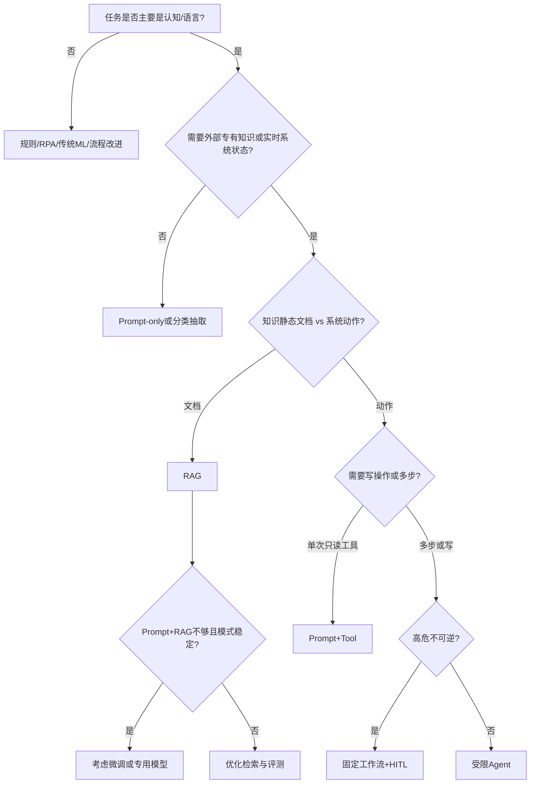

# 架构决策树

当客户说「我们要上 AI」时，用本决策树收敛到 **Prompt-only / RAG / 工作流工具 / Agent / 微调** 等路径。目标是**可解释的选择**，不是唯一正确答案。

---

## 1. 总决策树



---

## 2. 选项对照表

| 选项 | 优点 | 代价/风险 | 典型信号 |
|------|------|-----------|----------|
| 不用 LLM | 可控、便宜 | 灵活差 | 强规则、结构化 |
| Prompt-only | 快 | 易幻觉、无专有知识 | 改写、分类、格式转换 |
| RAG | 可更新知识、可引用 | 检索/权限复杂 | 制度、文档、百科 |
| Prompt + 工具 | 真数据 | 集成与权限 | 查订单、查库存 |
| 固定工作流 | 可控、可审计 | 灵活有限 | 企业默认 |
| 自主 Agent | 灵活 | 难控、难测 | 探索、工具少、可逆 |
| 微调 | 风格/格式/领域稳定 | 贵、数据与治理重 | 海量标注、稳定任务 |
| 私有化部署 | 驻留与管控 | 运维与硬件成本 | 强合规 |

---

## 3. 细规则

### 选 RAG 当…

- 答案必须来自企业内部文档  
- 文档会变，需要可更新  
- 需要引用与审计  

### 选工具当…

- 真相在业务系统（不是 PDF）  
- 需要动作（建单、改状态）  

### 选微调当…（更晚）

- 已穷尽 prompt/RAG/工作流  
- 有稳定输入输出分布与足够干净标签  
- 有持续评测与回滚  
- 清楚隐私：训练数据能否用  

### 选私有化当…

- 合同要求数据驻留或禁止第三方模型  
- 或延迟/可用性必须自控  

很多「要私有化」其实是 **RAG + 网关 + 日志管控** 就能过审——先澄清需求。

---

## 4. 组合型架构（常见最终态）

```text
用户 → 工作流编排 →（路由）
  ├─ 简单意图：小模型 / 规则
  ├─ 知识问题：RAG
  └─ 事务问题：工具 + HITL
       ↓
     输出护栏 → 业务系统写回
```

面试时画这种图，比「我们做一个 Agent」更像 Senior。

---

## 5. 练习题（先自己选再看提示）

**题 1**：客服要自动改用户套餐。  
提示：高危写 → 工作流 + HITL；先只读推荐。

**题 2**：HR 手册问答，季度更新。  
提示：RAG；权限按员工类型过滤。

**题 3**：从发票 PDF 抽字段进 ERP。  
提示：文档理解/抽取；关键字段校验规则；不一定要聊天 Agent。

**题 4**：公司希望「模型记住我们所有历史风格」。  
提示：先风格示例库 + prompt；微调靠后；注意数据治理。

**题 5**：开放域聊天陪护员工情绪。  
提示：强护栏与危机转介；评估是否该做；隐私极高。

---

## 6. 一页决策记录模板

```text
用例：
主模式选择：
备选：
选择理由（约束/指标/风险）：
不选其他的理由：
试点切片：
Eval 通过线：
复查日期：
```

---

## 7. 确定性优先，LLM 做判断

> 补充自 OpenAI FDE 公开供应链演示叙述（[访谈](https://www.youtube.com/watch?v=cBD7_R-Cizg)）：关税冲击 → 编排查询与模拟 → **约束表（如双供应商、交期）用确定性校验**，模型只负责需要细微判断的部分。

选型时多问一句：

| 必须 100% 成立的约束 | → 规则 / 模拟器 / 校验器（不信任模型自觉） |
| 需要权衡与叙事的部分 | → LLM + 强制「先展示推理/证据」 |
| 数据怎么给模型用 | → 常需「原始数据 ↔ 业务逻辑」的轻翻译层（指标/本体/API），而非只插 MCP 连接器 |

这与总决策树里「高危用工作流+HITL」一致，只是把「确定性护栏」写成一等公民。长期看好的能力方向（同访谈）：元数据/本体翻译层——省 FDE 集成时间，也民主化取数；短期慎投「只做编排或只做标注或只做护栏」的碎片工具链（企业要单一责任闭环）。

---

## 8. 读完马上做

- [ ] 用总决策树走完你的目标用例  
- [ ] 写下「不选 Agent / 不选微调」的理由  
- [ ] 列出本用例 3 条「必须确定性成立」的约束  
- [ ] 若备面：把一页决策记录练到 3 分钟讲完  

## 参考与来源

| 来源 | 链接 | 本篇用法 |
|------|------|----------|
| 本文主体 | — | 原创决策框架 |
| S03 / S05 | sources.md | RAG vs 微调等面试对照 |
| YouTube — OpenAI FDE 访谈 | https://www.youtube.com/watch?v=cBD7_R-Cizg | §7 确定性优先 / 翻译层 |
