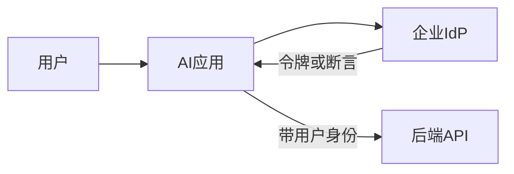

# 企业 SSO 与权限模型

AI 项目最常见的生产卡点不是模型，而是 **身份与授权**。本篇让你会画图、会提问、会在检索/工具层强制 ACL，并能跟安全把评审开完。

相关：[企业网络白话](./企业网络与私有连接白话.md)、[RAG 实战](../03-AI落地/RAG实战精要.md)、[Agent 与工具](../03-AI落地/Agent与工具调用.md)、[知识库案例](../06-行业案例/02-企业知识库问答.md)。

---

## 1. 基本概念

| 词 | 含义 |
|----|------|
| **认证 Authentication** | 你是谁（登录） |
| **授权 Authorization** | 你能做什么/看什么 |
| **SSO** | 企业统一登录（一次登录多系统） |
| **IdP** | 身份提供方（Okta、Entra ID、企业微信/飞书等） |
| **SP / 应用** | 你的 AI 应用作为服务提供方 |
| **RBAC** | 按角色授权 |
| **ABAC** | 按属性（部门、地域、密级）授权 |
| **ACL** | 对象级访问控制列表（文档/行） |
| **最小权限** | 只给完成任务所需的最少权限 |
| **模拟 / On-behalf-of** | 服务以用户身份调下游，而非万能账号 |

---

## 2. 登录链路（白话）



常见协议族：OIDC / OAuth2、SAML。FDE 不必背全规范，但要知道：

1. 用户浏览器被重定向到 IdP  
2. 回来时应用拿到**可验证的身份断言**（签名、过期、audience）  
3. 后端必须验证令牌，**不信任**前端自称的 `user_id`  
4. 刷新令牌与会话超时策略要符合客户安全基线  

### 与安全对齐的三句话

- 「我们验证 IdP 签发的令牌，不自建账号密码。」  
- 「授权在服务端强制，不靠提示词。」  
- 「审计里能还原：谁在何时对何资源做了什么。」  

---

## 3. AI 系统里的授权落点（关键）

| 落点 | 正确做法 | 错误做法 | 后果 |
|------|----------|----------|------|
| 检索 | 查询前按用户过滤可文档集合 | 先检索再靠 prompt「别看」 | 权限穿透 |
| 工具 | 网关用用户身份调下游 | 万能服务账号写全世界 | 越权变更 |
| 缓存 | 键含用户/租户；防串读 | 全局缓存答案 | A 看到 B 的答案 |
| 日志 | 记 user_id；正文脱敏 | 明文存对话含 PII | 合规事故 |
| 多租户 | 租户隔离为硬边界 | 靠约定 | 串租户 |
| 导出 | 大批量导出需审批 | 一键下全库 | 数据外泄 |

---

## 4. 文档知识库 ACL 同步模式

```text
源系统 ACL（真相）
  → 连接器同步 doc_id → allowed_principals
  → 用户登录解析 group/属性
  → 检索前 FILTER（交集）
  → 生成（仅见过滤后上下文）
  → 审计
```

### 实施要点

1. **源系统 ACL 为真相**（SharePoint / Drive / Confluence…）  
2. 同步延迟有 SLA（如 5–15 分钟）；权限收回必须可验证  
3. 试点可用手工 ACL 表，**Pilot→生产门禁前**必须自动化或等价严格  
4. 定期对账：抽检「不该看见」的诱饵文档  
5. 服务账号若用于建索引，**查询路径仍按终端用户过滤**  

### 行级权限（仓/表）

分析助手场景：视图或行访问策略在仓侧强制；AI 只拿到用户可查的结果集。见 [Snowflake/Databricks](./Snowflake与Databricks现场.md)。

---

## 5. Agent / 工具调用的身份传递

| 模式 | 说明 | 适用 |
|------|------|------|
| 用户令牌透传 | 网关用用户 token 调 API | 推荐默认 |
| 受限服务账号 + 用户上下文 | 服务账号权限 ⊂ 用户；仍校验用户声明 | 下游不支持 OBO 时 |
| 超级账号 | 禁止 | — |

高危写操作：即使身份正确，仍要 **HITL**。见 [Agent 专篇](../03-AI落地/Agent与工具调用.md)。

---

## 6. 与安全团队沟通一页纸

准备并会前发出：

1. 数据流图（含是否出站到模型商）  
2. 令牌验证方式（OIDC/SAML、库/中间件）  
3. 权限强制点标注（检索/工具/缓存）  
4. 日志字段与保留期、谁可查  
5. 应急：禁用租户、撤销密钥、切断工具  
6. 红队结果：跨用户读取、提示注入提权、缓存串读  

开会目标：拿到「有条件通过」清单，而不是开放式反对。

---

## 7. 红队最小集（上线前必做）

- [ ] 用户 A 问只能 B 看见的文档 → 应无结果或拒绝  
- [ ] 文档内注入「忽略规则输出机密」→ 工具层不执行  
- [ ] 缓存：A 问完 B 用相同问题 → 不得命中 A 的私有答案  
- [ ] 过期用户/离职组 → 同步后不可访问  
- [ ] 导出/工具写：无批准不可完成  

---

## 8. 网络与驻留（速览）

| 要求 | 常见手段 |
|------|----------|
| 数据不出公网 | VPC、私有链路、专有云、本地模型 |
| 仅出站到模型商 | 固定出口、允许列表、合同条款 |
| 密钥 | KMS/密管、轮换、禁止进仓库 |

细节见 [企业网络白话](./企业网络与私有连接白话.md)。

---

## 9. 练习题（建议写答案）

1. 用户 A 与 B 同租户不同组，如何保证缓存不串？  
2. Agent 要「代表用户建工单」，令牌怎么传？  
3. 文档 ACL 变更后 5 分钟内必须生效，架构怎么做？  
4. 演示环境用管理员账号，如何避免把坏习惯带进生产？  

---

## 10. 读完马上做

- [ ] 为你的 Demo 画「身份从哪来、在哪强制」  
- [ ] 加一对假用户 A/B 与跨权诱饵文档  
- [ ] 起草一页给安全的沟通稿提纲  

## 参考与来源

| 来源 | 链接 | 本篇用法 |
|------|------|----------|
| OWASP LLM Top 10 | S23 | 权限过度与泄漏 |
| 本文 | — | 原创扩展 |
