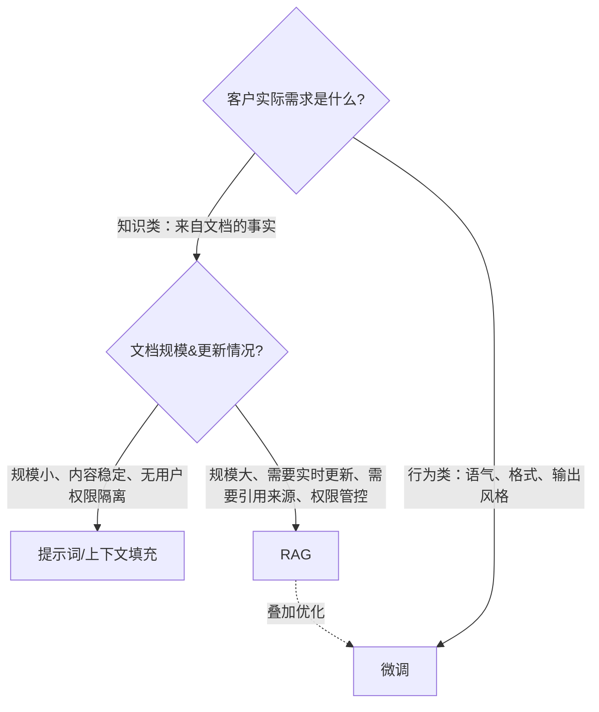

# 客户希望模型“掌握我们的文档”：提示工程、RAG、微调，该如何选择？
这是每一场AI面试中被问到最多的FDE（前端部署工程师）概念类问题。面试官不想要名词解释；他们希望听到**决策框架、成本测算、具备资深工程师水准的推荐优先级**。

**第11题**：客户希望模型“掌握我们的文档”。提示工程、RAG、微调，该如何选择？
> 难度：中等 | 核心必考题 | 标签：OpenAI、Anthropic、Cohere
> TL;DR（一句话总结）：**提示工程注入指令，RAG注入知识，微调注入行为**。“掌握我们的文档”本质是知识类问题，因此几乎总是优先选择RAG；按照从简单的提示填充开始逐级向上评估，最后再考虑微调，微调只适合叠加用来优化语气、输出格式。

## 解题思路
一个典型错误想法：客户CEO听说过“拿我们的文档做微调，模型就能懂文档”。听起来RAG成本更高，这是FDE面试头号高频错误认知。面试官要看你能否拆解推翻这个误区。本题考察的是决策框架，不是名词背诵。

先抛出澄清问题：文档库规模多大？更新频率如何？回答是否需要引用来源？是否存在用户权限隔离？问题根源是知识缺失，还是输出行为不符合预期？然后由最简单方案开始逐级评估。

### 优秀回答
我使用的框架：提示工程注入指令，RAG注入知识，微调注入行为。“掌握文档”几乎都是知识问题，优先考虑RAG，但要逐级评估方案。

> 流程图里的虚线箭头是绝大多数面试者会漏掉的关键点：RAG和微调不是二选一互斥。面试官期待的答案：检索获取事实，微调叠加优化输出风格，二者配合使用，这是生产环境常见落地方式。

#### 1）提示词与上下文填充
如果文档体量大约5万‑10万token以内，内容很少改动（定价表、固定政策），直接塞进系统提示词。**不需要额外基础设施**，修改文件就可以更新内容，提示缓存可以降低重复调用开销。很多场景下这就是最优解，资深工程师会优先评估这个最简方案。
缺点：一旦文档总量超出上下文窗口、文档频繁更新、或者需要按用户做权限隔离，这套方案就失效。

#### 2）RAG（检索增强生成）
把文档做向量化建立索引；每一次用户提问，检索出相关文档片段，交给大模型，基于检索到的内容生成回答。
面向企业级场景，要让模型掌握内部文档，RAG是默认首选方案。
优势：
1. 可以处理海量文档（百万级文档）
2. 知识时效性强：只更新向量索引，几分钟新文档就生效，不用重新训练模型
3. 支持引用溯源：检索出来的片段直接作为回答来源，提升用户可信度
4. 权限控制：检索阶段就可以过滤，不同用户只能访问有权限的文档。微调做不到这点，模型权重无法针对不同用户“选择性遗忘”部分知识。

代价：需要工程开发工作，包括文档分块、检索效果调优、构建评估测试集；同时新增了检索环节带来的故障风险。

#### 为什么微调不适合直接注入事实知识（面试核心得分点）
预训练学到的事实（比如“法国首都是巴黎”），是模型在成千上万份独立文档中反复见到才固化到权重。而你的合同终止条款，在微调数据集里可能只出现寥寥几次。梯度更新仅仅几次，只能轻微改动权重，**无法牢靠地把这份事实刻进模型**。
模型可能复述对、也可能错误改写、还会和预训练见过的其他类似合同条款混淆。训练流程本身无法区分这些对错输出。

RAG绕开这个痛点：回答的生成阶段直接把原始文档片段放进上下文窗口，模型注意力机制直接读取原文。
这也是RAG可以输出引用来源、微调做不到的根本原因：检索知道文本来自哪一份文档，模型权重本身没有来源信息。

> 论文佐证：Ovadia等人2023《微调还是检索？大模型知识注入方案对比》，在知识密集任务上，RAG效果持续优于无监督微调；想要微调牢靠记住一条事实，需要大量不同措辞的样本复现同一个事实，企业文档大多没有这么多变体。

#### 微调的适用场景
微调通过样本教会模型输出**风格、格式、任务行为**，并不擅长灌入全新事实。
拿文档做过微调的模型，可以学会你的行业术语、语气风格，但具体业务事实依旧会幻觉，也不能输出引用来源；文档一旦改动，就必须重新微调。

✅ 适合微调的场景：提示词少样本无法搞定的固定输出格式、领域专属语气；把大模型能力蒸馏压缩到更小低成本模型。

### 给客户的落地建议
优先搭建RAG，可以叠加提示工程调优；**微调不作为替代方案，后续叠加在RAG之上，优化语气与输出格式**。二者组合，经过检索拿到文档片段，交给微调过的模型做输出，是工业界标准落地方案。

## 面试官接下来常追问的问题
1. >客户坚持要做微调，这是他们CEO了解到的方案。
先挖掘客户底层诉求，提出低成本对照实验：一周快速搭建RAG原型，双方共同约定评估指标，用实测结果说话。定位成顾问，而不是单纯听从需求的执行者。

2. >什么场景微调会优于RAG？
高度受限的格式/风格任务；为降低延迟、压缩成本做模型蒸馏；完全没有可检索素材，任务只关乎输出行为，不依赖外部事实。

3. >文档每小时就更新一次，方案怎么变？
完全放弃微调；RAG侧改为增量索引，并且增加知识新鲜度监控。

4. >如何验证方案选型是正确的？
项目开发前就基于真实业务用户问题，构建评估测试集，用测试集做验证。

## 常见误区对照表
|大家容易想到的做法|错在哪|面试正确表述|
| ---- | ---- | ---- |
|“直接拿文档微调，模型就懂文档”|微调不能可靠学习新事实，不能做引用、权限管控，文档更新要重训|**提示工程注入指令，RAG注入知识，微调注入行为**|
|“上来直接上RAG”|小体量稳定文档直接塞提示词就够用，完全不用搭建RAG整套基建|从最简单的上下文填充开始逐级向上评估方案|
|“只要上下文窗口足够大，就不用RAG”|长上下文解决不了知识时效性、权限隔离、引用溯源的业务诉求|长上下文只是放宽单轮输入长度，不会改变整体架构选择|
|“二选一：要么RAG，要么微调”|生产环境经常组合使用；RAG拿事实，微调优化输出风格|优先RAG，微调叠加用来调语气和输出格式|

### 高频踩坑点
1. 只解释三个名词概念，没有给出决策流程。本题考察的是选型决策，不是名词背诵。
2. 声称微调可以可靠学习全新业务事实，这是面试头号扣分误区。
3. 忽略企业实际约束：文档时效性、引用溯源、用户数据权限。
4. 非黑即白，认为RAG和微调只能二选一。

## 边界特例：检索增强微调（Retrieval‑augmented fine‑tuning）
> “RAG注入知识，微调注入行为”这套框架，有一个边界特例：检索增强式微调。
也就是微调模型，让模型**更擅长阅读理解检索返回的上下文片段**（学会正确引用、学会基于检索内容拒绝回答）。
⚠️ 重点：这个场景下微调优化的是**阅读、使用检索内容的能力，而不是把文档事实存进权重**。
规则本身不变，只是很多客户会误解：“微调可以直接记住文档事实”。微调提升的是模型阅读检索片段的能力，事实来源依旧来自检索。

## 实际落地操作总结
1. 先确认：文档体量、更新频率、是否要引用来源、是否有多用户权限隔离。
2. 如果文档规模小、改动极少：直接用提示词/上下文填充，开启提示缓存，零额外架构。
3. 企业级、大文档库、高频更新、引用溯源、权限管控：落地RAG，提前构建业务评估集。
4. 如果输出格式、语气风格始终达不到预期：**不要替换RAG，把微调叠加在RAG上层**。
5. 如果客户执意做微调，快速原型对照实验，用评估指标结果说服对方。

---
### 核心要点总结
1. 先区分需求是**获取外部事实知识**，还是**调整模型输出行为风格**。
2. 知识需求：优先顺序：提示填充 → RAG，微调不能用来灌入业务事实。
3. 行为、格式、语气需求：微调。
4. 生产环境最佳实践：RAG负责拿文档事实，微调叠加优化输出风格，二者组合，不做互斥二选一。
5. 企业场景三个硬性约束：**知识新鲜度、引用溯源、用户权限隔离**，这三点几乎只能靠RAG解决。

> 边界特例：检索增强微调，微调提升模型阅读理解检索片段的能力，事实依旧来自检索，不是把事实存进模型权重。> 广为流传的观点“**RAG注入知识，微调注入行为**”存在一个值得注意的边界特例：检索增强微调。这种微调的目标是让模型更好地利用检索到的上下文（比如做到规范引用来源、上下文信息不足时选择不作答）。
>
> 这一类微调是为知识检索服务的。在知识类任务上做微调本身是合理的做法，但这会让听过“绝对不要用微调来灌输事实知识”的客户产生困惑。核心原则依然成立；关键的细微区别在于：此时微调优化的是**阅读理解能力**，而非事实本身。

### 术语注解
1. **RAG（Retrieval‑Augmented Generation）**：检索增强生成
2. **fine‑tuning**：模型微调
3. **retrieval‑augmented fine‑tuning**：检索增强微调
4. **abstain when context is thin**：上下文信息匮乏时拒绝输出答案（大模型领域常用表述）
5. **reading comprehension**：阅读理解（指模型对检索文本的理解、遵从能力，不是改写事实）
6. **facts**：事实知识

### 背景通俗解读
原句是大模型工程圈的经典辨析：
- 常规认知：不要靠微调硬塞事实，事实交给RAG；微调改的是模型说话风格、格式、行为习惯。
- 特例：可以微调模型，教会它**怎么读RAG拿回来的资料**（学会引原文、没资料就别瞎编），但依然不要靠微调把事实“刻进模型权重”。

