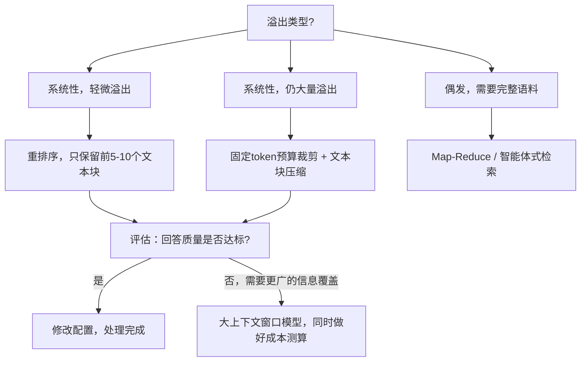

# 你的提示词加上检索到的文档超出了上下文窗口。你有哪些方案，各自要做哪些取舍？
直接截断？做摘要？重排序？Map‑Reduce？这是每一套RAG部署都会遇到的生产环境问题。本文整理了面试中面试官期望你权衡对比的各类解决方案，还有你首先要问的诊断问题。

## 第12题
**你的提示词加上检索到的文档超出了上下文窗口。你有哪些方案，各自要做哪些取舍？**

> TL;DR（一句话总结）：不要第一反应就选用更大上下文窗口的模型。先判断溢出问题是系统性问题还是偶发个案，之后从低成本方案逐步过渡到高侵入性方案。优先采用“少而精地检索”方案（重排序器，只取前5‑10个文本块），上下文溢出通常是检索质量差导致的现象，提升相关性往往就能免费解决该问题。

---

## 解题思路
首先做问题诊断：该问题是偶发情况（单个超大文档），还是系统性问题（每一次查询都会返回过多内容）？另外，是超出10%，还是超出10倍？对应的修复方案各不相同。

之后按**从低成本到高侵入性**的顺序给出方案，同时说明每个方案会牺牲什么。

### 完整流程图

---

## 可选用方案，按推荐优先级排序
### 1. 少而精地做检索
上下文溢出往往代表检索质量差：top‑k取值过大，或者文本块切分过大；因为检索相关性不足，就靠堆内容数量来补偿。

接入重排序器（交叉编码器，对前50个候选文档重新打分），仅传入相关性最高的5‑10个文本块。该方案往往既能修复上下文溢出，还能提升回答质量。
原因：无关的上下文会干扰模型，出现“中间丢失（lost in the middle）”现象。**少量高相关内容，优于大量充满噪声的内容**。
代价：额外调用一次模型，耗时大约50‑200毫秒。

### 2. 设置固定token预算，做裁剪
审查提示词本身：臃肿的系统提示词、完整对话历史、冗余的少样本示例。对历史对话做摘要，删减示例。很多团队发现，30%‑50%的上下文内容属于套话，没有实际价值。一次1小时的梳理就可以完成优化。

|组件|优化前token数|优化后token数|改动说明|
| ---- | ---- | ---- | ---- |
|系统提示词|2400|1500|删掉和模型默认提示重复的模板套话|
|少样本示例|1800|600|原来3个示例，保留1个即可说明输出格式|
|对话历史|6000|800|维护滚动摘要，仅完整保留最近两轮对话|
|用户问题|300|300|不作改动|
|检索返回的文本块|6400（8块）|4000（5块）|使用重排序器，降低top‑k取值（方案1）|
|**合计**|**16900**|**7200**|整体缩小57%，回答质量通常还会提升|

> 面试时讲这张表的核心点：这不是无奈妥协。被删掉的陈旧历史、冗余示例、噪声文本块，其实都在抢占模型注意力。

### 3. 对检索得到的内容做压缩
- 抽取式压缩：只保留和查询相关的句子
- 用大模型为每一个文本块生成摘要

取舍：额外调用一次模型；压缩有可能丢掉回答必需的精确细节。对合同等高精度场景有风险，适合只需要主旨大意的任务。

### 4. Map‑Reduce / 分层处理
当任务需要读取全部语料（例如“总结全部400通客户通话记录”），把文档分批次，分批处理，最后把各部分结果整合汇总。

取舍：需要N+1次模型调用，成本、延迟上升；跨批次的逻辑推理会受损，不同分片之间关联的事实信息容易丢失。

### 5. 多轮 / 智能体检索
让模型读取目录，调用搜索工具，按需拉取文档片段，而不是一次性把全部文档塞进提示词。处理超大文档效果很好。
取舍：延迟增加，智能体逻辑复杂度上升。

### 6. 使用更大上下文窗口的模型
切换至200k‑1M上下文窗口模型，报错直接消失。但是token用量上升会拉高成本，延迟也会增加；超长上下文下模型召回信息的能力会下降。
这是一个可行手段，但要经过成本测算，不能不假思索直接选用。

> **不推荐默认做法：直接静默截断**
在token上限直接截断文本，会丢掉末尾内容，往往就是最新检索的内容甚至用户的提问。模型基于残缺的上下文输出看似可信的答案。
如果实在不得不截断，**要按相关性排序来丢弃内容，绝对不能按文本位置截断，并且记录日志标记该事件**。

> 高级工程师的做法：修改方案前先跑评估集。
如果取top‑5的文本块就能保证回答质量，只需要改配置。如果任务要求更广信息覆盖，就选用Map‑Reduce或者长上下文模型，同时让业务方了解对应的成本差异。

---

## 面试官接下来常追问的问题
1. **长期来看，你怎么选择长上下文模型 vs RAG？**
要考虑语料规模、权限、引用溯源、信息时效性、单次查询成本。长上下文模型可以降低对检索的要求，但不能替代RAG。

2. **压缩操作丢掉了关键条款，导致回答出错，该怎么办？**
做事实一致性评估；高要求场景优先使用抽取式压缩而非生成式摘要；引用校验，一旦校验失败直接抛出异常。

3. **对话历史该怎么处理？**
滑动窗口+滚动摘要；固定保留系统提示词和关键实体。

## 常见错误
- 上来就直接说“换更大的模型”。方案可行，但当成唯一答案，代表你没有成本意识。
- 在给出解决方案前，不去区分溢出是系统性问题，还是偶发个案。
- 没意识到：上下文内容变多，回答质量反而会下降。能理解噪声会损害输出质量，会是面试加分点。
- 直接静默截断，还把它当成解决方案。

## 核心要点
1. 上下文溢出，很多时候本质是检索效果差。搭配重排序器，降低top‑k，往往既解决报错还提升质量。
2. 解决方案要按「低成本→高侵入性」排序，讲清每个方案要牺牲什么。大上下文模型是需要权衡成本的选择，而不是第一反应。
3. 绝对不要按文本位置截断；迫不得已截断时，按相关性丢弃，并且记录日志。

专门针对Map‑Reduce：文中提到的缺陷是**跨文本块推理失效**，而还有一个不那么显眼的同类问题：**归约（reduce）步骤自身也会发生上下文溢出**。

举个例子：任务“总结400通通话记录”，会生成400份局部摘要。这些局部摘要合在一起，同样可能超出上下文窗口。于是你不得不构建一棵**多层归约树**，而每一层都会损失信息保真度。

需要在前期就厘清任务类型：该任务是否真的属于可做归约聚合的类型（例如统计计数、提炼高频主题），还是需要全局综合推理。因为只有前者才能在Map‑Reduce模式下稳定、良好地完成。

---
### 术语注解
1. cross‑chunk reasoning：跨文本块推理，指不同分片里的信息需要关联起来推导结论
2. reduce step：归约步骤，Map‑Reduce里把分片结果汇总合并的阶段
3. multi‑level reduce tree：多层归约树，多次迭代汇总，类似归并树；每一轮把多份摘要再合并，层层向上收敛
4. loses fidelity：丢失保真度，信息细节丢失、产生偏差
5. associative：可结合/可聚合任务，结果可以分块计算再合并，比如计数、统计高频主题；不需要跨分片关联推理
6. global reasoning：全局推理，需要通读全部资料、跨分片比对信息才能得出结论