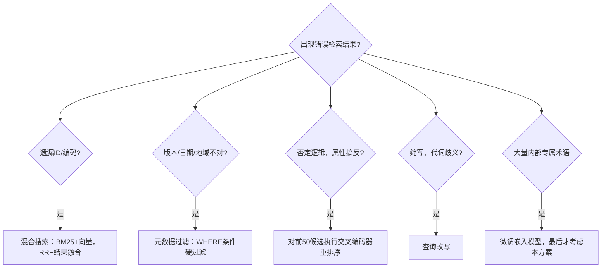

# 为什么向量搜索会返回“相关但错误”的结果？该如何解决？
余弦相似度衡量的是**主题相近度**，而非结果正确性。大部分RAG准确率问题背后都有一套故障分类体系，还有一套混合搜索+重排序器的解决方案栈，面试中面试官期望你能熟练掌握。

> **13 为什么向量搜索会返回“相关但错误”的结果？该如何解决？**

>
> **一句话摘要：嵌入向量衡量的是主题相似度，而非答案相关性。所以出现“相关但错误”本质上是系统按设计逻辑运行的结果。解决方案需要补齐缺失的信号：混合搜索（BM25+向量搜索）处理精确词条；元数据过滤器处理版本、地域；再使用交叉编码器重排序器解决否定逻辑、属性不匹配的问题。**

## 解题思路
先用一句精炼话讲清楚根本原因（嵌入向量衡量主题相似度，不是答案相关性），然后列举具体故障模式，并且为每一种故障匹配对应的解决方案。
这道题在检索导向型公司面试中高频出现，它可以区分真正调试过RAG系统的候选人和只看过教程的候选人。

### 高质量参考答案
**根本原因**：嵌入模型会把文本片段压缩成单个向量，优化目标是让主题相似的文本向量在空间上彼此靠近。出现“相关但错误”，恰恰是系统按设计目标运行。举个例子，查询“我们2024年的育儿假政策是什么？”，向量会把2021版政策片段、病假相关片段、加拿大员工手册片段判定为高度相似，即使用户身处美国。余弦相似度没有“正确、最新、适用”的概念，只判断向量空间距离远近。

**反复出现的故障模式**
- **精确匹配盲区**：嵌入模型对标识符处理效果差：零件编号、错误码、人名、内部缩写。例如查询“Error AX‑413”，向量会返回一堆泛泛讲错误的文本；而关键词搜索可以精准命中目标。
- **属性混淆**：实体正确，但属性/版本错误：2021版本 vs 2024版本、v2文档 vs v3文档、美国条款 vs 欧盟条款。
- **否定与方向不可识别**：“流失的客户”和“续约的客户”，二者生成的嵌入向量几乎一模一样。
- **领域行话词汇不匹配**：开箱即用的嵌入模型从未见过企业内部的产品名称，只能依靠周围通用词汇做聚类。

> 诊断思路：先看故障现象，再应用对应修复手段

## 部署优先级，按上线顺序排列修复方案栈
1. **混合搜索**：同时运行BM25关键词搜索与向量搜索，融合两套结果（倒数排名融合RRF是行业标准）。关键词搜索负责捕获精确标识符；向量搜索负责处理同义转述。这是生产环境标配，也是投入产出比最高的修复手段。
2. **元数据过滤**：版本、日期、地域、产品信息做硬性过滤条件，不能寄希望相似度算法自动分辨。2021与2024政策区分问题，应当交给WHERE过滤子句，而不是嵌入向量。
3. **重排序**：交叉编码器同时读取查询和候选文档（不再分别编码），对前约50条候选重新打分。交叉编码器能够识别双编码器嵌入无法捕捉的否定关系、属性不匹配。耗时约50‑200ms，对精度提升巨大。
4. **查询改写**：扩展缩写、解析对话历史代词、生成多种关键词变体，再送入检索模块。
5. **微调嵌入模型**：只有最后手段，用于大量内部专有术语场景；需要标注的【查询‑文档】配对数据，每次更新模型都需要对全部语料重新生成向量。优先尝试重排序器，微调嵌入运维成本很高。

> **兜底元方案**：构建检索评估数据集，包含50‑100条真实查询，标注哪些文本片段是相关的；持续跟踪Recall@k指标。所有改动必须靠指标量化，而不是凭主观感受。

### 面试官后续追问
- **为什么重排序器可以捕获嵌入模型漏掉的问题？**
双编码器（Bi‑encoder）先把两段文本各自独立压缩为向量，之后才做相似度比对；而交叉编码器让查询和文档之间可以做token级注意力交互，否定词、版本号这类细节不会被提前抹平。
以2024政策例子：双编码器中，“2024”只是众多token之一，被压缩合并进整条文本向量，和“2021”版本的向量角度几乎没有差别，阈值无法区分二者。
而交叉编码器中，查询的“2024”和文档的“2021”处在同一个注意力计算流程，token直接互相感知，模型直接看到二者矛盾。
> 核心差异：双编码器**先压缩，后比对**；交叉编码器**先交互，后压缩**。上面所有故障根源都来自这个架构差异。

- **什么场景才要去微调嵌入向量？**
领域术语大规模不匹配；评估集持续报大量同类错误；手上有标注好的查询‑文档训练对；同时要接受「全库重新向量化」带来的运维开销。

- **如何设定k值、文本块大小（chunk size）？**
基于检索评估集做实验调参，不存在通用万能值。

### 常见错误回答
1. 只换“效果更好的嵌入模型”作为唯一解法；更强的嵌入模型依旧做不到精确匹配，也解决不了版本过滤。
2. 不知道混合搜索、重排序器这些专有名词；2025年之后的面试，这会是明显减分项。
3. 试图靠相似度解决版本、日期混淆，而不用元数据硬过滤。
4. 不把检索环节单独评估，直接和大模型生成混在一起分析；混淆检索与生成，是调试RAG最经典误区。

## 核心要点总结
1. 余弦相似度衡量**主题相近**，不是结果正确性；解决思路是补充嵌入向量缺失的各类信号，而不是单纯换更好的嵌入模型。
2. 混合搜索+元数据过滤器处理标识符、版本问题；交叉编码器重排序处理否定逻辑、属性颠倒。
3. **一定要单独用评估集测试检索阶段，看Recall@k，不要只看最终大模型输出。**

> 补充重要提醒：修复方案栈本身是正确的，但诊断顺序和部署顺序同等关键。
> 在接入重排序器之前，先确认正确的文档片段是否已经出现在前50条候选结果中。
> 如果Recall@50本身很差，重排序器回天乏术。重排序器只能在**已经拿到合格候选集合的前提下提升精度**；它不能凭空生成混合搜索根本没有检索出来的文本片段。

