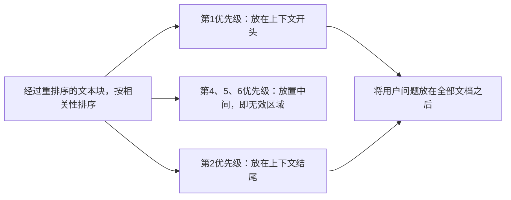

# 什么是“中间丢失（lost in the middle）”现象？它会如何改变RAG系统的上下文组装方式？
> 模型对上下文开头与结尾信息的读取效果远好于中间部分。这是一个已经实验证实的效应，会对分块顺序、检索数量k值以及提示词布局产生直接影响。下文讲解需要做出哪些改动，以及如何验证该效应。

**16 什么是“中间丢失（lost in the middle）”现象？它会如何改变RAG系统的上下文组装方式？**

> 一句话摘要：大模型对上下文开头和结尾信息的利用可靠性远高于中间部分（呈现U型准确率曲线）。因此需要用重排序器按照相关性对文本块排序，把最重要的内容放在上下文两端；把用户问题放在文档之后；不要盲目增大检索数量k——增大k只会把高价值内容推入无效中间区域。最后使用位置扫描评估法验证该效应。

## 解题思路
先定义该现象，同时说明对应的实验依据；因为这是前线工程师面试，大部分时间要讲工程层面带来的影响：上下文组装顺序、检索返回数量，以及如何基于用户真实业务场景评估该效应，而不是直接照搬论文结论。

## 高质量参考答案
“中间丢失”是经过实验证实的现象：**大模型对上下文窗口开头、结尾信息的利用可靠性，远高于埋藏在上下文中间的信息**。经典论文（Liu等人，2023）展示了U型准确率曲线：把包含答案的文档从检索结果的第一位挪到中间位置，问答准确率会急剧下降，有时甚至低于完全不提供文档的基线效果。即便新一代长上下文模型，该效应有所减弱但依旧存在；上下文越长，该问题越严重。

背后原理：注意力机制与位置编码的训练偏向序列两端。因此，在简单的“大海捞针”基准测试上拿到高分，不能直接迁移到多文档复杂推理的真实业务场景。

基于U型准确率曲线，衍生出**两端重点放置（bookend）组装模式**：

### 在实际工程中的改动
1. **基于相关性，策略性调整文本块顺序**
不要使用原始顺序或者数据源顺序拼接检索到的文本块。把相关性最高的内容放到模型注意力最强的位置：高优先级块放最前面；或者使用两端放置模式：最强相关块放在开头和结尾，相关性弱的放到中间。这一步需要重排序器精准判断块的相关性，这也是重排序器成为必备组件的原因。

2. **用户问题的摆放位置很关键**
将用户的查询放在**全部文档之后（提示词末尾）**，可以显著提升模型把问题和参考证据关联起来的效果。成本极低，但效果很好，很多项目没有用上。

3. **检索更多文档，反而会损害效果**
把检索数量k从5提升到25，会把很多有价值的内容推入中间无效区域，同时噪声会分散模型注意力。检索效果提升应当追求**精确度**（依靠重排序、混合检索），而不是盲目增加返回文档数量。如果看到团队试图单纯调大k来修复RAG效果，这是首要排查点。

4. **提示词布局**
关键指令放在提示词开头（系统提示），需要反复强调的约束放在靠近末尾。千万不要把“必须引用来源”这类要求埋进20k token提示词的中间，模型几乎看不到。该逻辑同样适用于长智能体对话，随着对话记录增长，关键信息会漂移到中间位置，因此需要做摘要、锚定关键信息。

### 评估验证步骤（必须做，不能只靠猜想）
需要在真实业务查询上做**位置扫描评估**：准备一批已知答案所在文本块的查询，把答案块分别放在序列第1位、中间k/2位置、末尾k位置，分别测量不同位置下的准确率。只需要一个下午就能完成。
这套实验可以确认：当前模型+上下文长度组合，是否存在中间丢失问题；同时验证重排序优化是否生效。不同模型表现不一样，一定要实测，不能主观假设。
实验会得到三组准确率数值，不同结果对应不同工程决策：

| 在位置1 / k/2 / k处的准确率 | 代表含义 | 采取动作 |
| ---- | ---- | ---- |
| 高 / 低 / 高（U型曲线） | 当前系统确实存在经典的中间丢失现象 | 使用两端放置排序方案，上线该优化 |
| 高 / 高 / 高（平坦） | 在当前k值下，这套模型‑上下文组合不受该效应影响 | 不用做重排序，把精力放在提升检索精确度 |
| 高 / 中等 / 低（单调下滑） | 末尾位置收益弱，开头占主导 | 优先把高相关内容放在最前面；把用户问题后置会更重要 |
| 全部位置准确率都很低 | 问题不是位置摆放导致的 | 属于检索故障、提示词bug，调整顺序没有任何帮助 |

> 最后一行可以帮团队节省数周无用工作：很多团队费力做两端重排序优化，但问题根源是检索本身失效，只要跑这三组测试第一天就能定位。

## 面试官接下来常追问的问题
- “那这和厂商发布的大海捞针基准测试高分不就矛盾了？”
大海捞针基准只是字面字符串查找；真实业务需要在大量语义相似干扰文档中做综合推理，U型曲线的负面影响恰恰体现在这类场景。

- “中间丢失和提示词缓存如何互相影响？”
提示词缓存依赖固定不变的前缀；而按相关性重排序后的文本块每个查询都不一样，无法放入缓存前缀。所以要把静态内容（系统提示、示例）放在缓存前缀，动态检索块放在后面。

- “智能体多轮对话场景，而不是RAG，该怎么理解？”
长对话轨迹中同样存在中间丢失；要对旧会话做摘要，把关键状态锚定在序列两端。

## 常见错误（面试扣分点）
1. 只背名词概念，说不出任何工程层面改动；面试中只给出定义是得不到分数的。
2. 一边大谈中间丢失，一边又建议“调大k获取更多文档”，没有把两点关联起来。
3. 把2023年论文结论当作永恒真理，不提需要针对当前模型做实测；面试看重“先评估，后优化”的思维。
4. 忽略“把用户问题放到文档之后”这个成本最低的优化手段。

## 核心要点总结
- U型中间丢失效应真实存在，上下文越长越严重，不要直接相信基准测试结果。
- 采用两端放置策略：高相关块放开头、结尾，弱相关放中间；用户查询放在全部参考文档后面。
- 不要靠增大k来提升效果；检索优化重点放在精确度，不是数量。
- 通过位置扫描评估做验证，区分问题到底来自排序，还是来自检索本身故障。

> 两端放置模式和提示词缓存存在直接冲突。每轮查询都重排序会破坏缓存，导致缓存命中率归零。对于高QPS、文档集合相对固定的线上业务，往往选择固定文本块顺序，接受中间位置带来少量性能损耗，换取缓存带来巨大成本收益，而不是每查询都重排序。