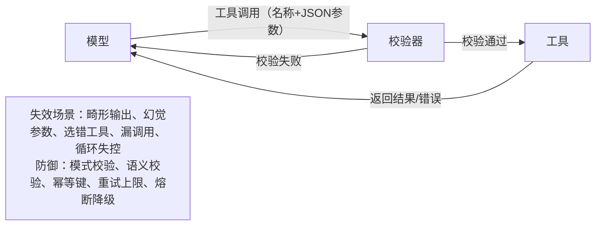

# 工具/函数调用有哪些失效模式？生产环境中如何处理？
> 畸形参数、调用错误工具、参数幻觉、重试死循环：完整失效分类，以及区分普通开发者和资深工程师的生产防御手段（校验、幂等、上限重试）。

**第17题：工具/函数调用有哪些失效模式？生产环境中如何处理？**

> 💡 一句话摘要：真正危险的失效不是JSON格式错误，而是**语法合法但内容是幻觉的参数**（比如用户从未提供的订单ID），这类调用会正常执行，但操作错误的数据。
> 分层防御：执行前先做模式校验，再做语义校验；鉴权放在工具层（不要放在提示词内）；有副作用的操作使用幂等键；限制重试次数；编写清晰、互不重叠的工具描述。

## 解题思路
不要只举零散案例；面试官希望看到你了解工具调用的多种独立失效场景，并且针对每一类都设计了防御方案。需要覆盖两个方向：模型错误调用工具，以及工具返回错误给模型。最后给出生产环境加固检查清单。

### 优秀回答参考
工具调用指模型输出结构化请求（工具名称+JSON参数），再由代码执行该请求。下面是生命周期中各个环节会出现的问题：

## 失效模式分类
### 模型侧失效
1. **输出格式畸形**：JSON无效、缺少必填字段、字段类型错误（需要整数的地方传入“30天”这类字符串）。使用原生工具调用API、开启严格模式/模式约束后，该问题发生概率会大幅降低，但不会完全消失。
2. **幻觉参数**：语法完全合法，但参数内容是模型编造的。例如编造一个用户从未给出的订单ID、猜测用户邮箱。**这是风险最高的一类故障**，调用会正常执行，但操作错误的数据。
3. **选错工具/多余调用**：用户咨询退款政策，模型却调用退款接口；或是本应直接回答，却错误调用工具。根源大多是工具描述模糊、工具之间职责边界不清，导致模型选择混乱。
4. **漏调用工具**：模型直接使用内部记忆输出答案（比如直接回复“你的订单周二已发货”），而没有调用查询工具获取最新真实数据。**这类故障静默发生，不会产生任何报错日志，危害极强。**
5. **循环与失控执行**：Agent反复调用同一个出错的工具，形成无限重试循环，消耗大量token、触发接口限流。

### 工具侧失效
1. **超时、500错误、接口限流**：下游服务不稳定，返回开发者友好度很差的原始报错。
2. **报错信息对模型不友好**：直接返回机器可读的错误码，模型无法理解，无法正确纠错。
    > 对比：
    > A版本：`{"err":403}`（模型看不懂）
    > B版本：`{"error":"该订单不属于当前用户，请核对订单编号"}`（模型可理解，可向用户转述）
3. **接口Schema漂移**：下游API字段发生变更，工具调用参数还沿用旧格式，导致静默失败。
4. **部分成功**：批量调用时，一部分子任务成功，一部分失败。

A版本给到模型一堆它完全无法解读的杂乱token。模型通常会做出这些行为：胡乱猜测（比如“看起来该订单不存在”）、含糊地道歉，或是进入高频死循环重试。
B版本会告诉模型发生了什么、可以尝试做什么、哪些内容绝对不能断言，模型就会遵照执行。因为**工具返回结果里的指令，会被模型当作权威信息**（正是这个特性会造成「工具结果注入」安全攻击，但在这里我们可以把该特性为我所用）。

改写错误返回报文，是整套故障分类里成本最低的可靠性优化手段：不需要重新训练模型，也不用大改提示词；只需要把工具返回的响应，按照它真正的阅读对象来措辞。自从你上线Agent智能体的那一刻起，工具响应的读者就不再是人了。

另外接口Schema漂移也会造成严重问题：API团队把字段改名之后，所有工具调用会一次性全部失效。

## 生产环境处理方案
1. **执行前校验模式**
    对每一次工具调用做JSON模式校验（可使用Pydantic、JSON Schema）。校验失败时，把校验错误返回模型，允许有限次数重试；重试上限设置为2‑3次。可以解决绝大多数JSON畸形问题。

2. **不止校验语法，还要校验语义**
    在真正调用工具执行逻辑前，检查参数引用的实体真实存在，并且属于当前用户。用来防御“幻觉订单ID”这类风险。**鉴权逻辑必须放在工具层代码，绝对不能放在提示词中。**

3. **面向故障做安全设计**
    - 所有有副作用的操作（退款、创建订单）必须携带**幂等键**，避免重复执行造成业务事故，比如避免一笔退款被多次执行。
    - 提供试运行/干运行模式。
    - 不可逆操作增加人工确认步骤。
    - 每个工具遵循最小权限原则。

4. **限制循环，设置熔断降级**
    设置单轮会话最大工具调用轮次；重复出现相同错误时停止重试，优雅降级，直接向用户报错，不要死循环。

5. **重写工具返回的报错信息**
    不要直接把原始后端报错丢回大模型。把机器错误码改写为大模型可以理解的自然语言报错，告诉模型哪里出错、应该如何修正。这是成本很低、收益很高的可靠性优化。

6. **观测与评估**
    - 完整记录每一次工具调用、入参、返回结果。统计每个工具的失败率。
    - 维护一套评估用例集，包含“本不该调用任何工具”的测试场景。每次修改提示词、切换模型版本，都跑一遍这套评估集。
    - 针对漏调用问题：统计每个用户意图下的工具调用率，一旦调用率发生下跌就告警。例如查询订单状态的请求，本应该调用查询工具；修改模型后调用率下降，就代表出现了漏调用的线上退化。

## 面试官后续追问方向
- “如何防止模型直接编造回答而跳过工具调用？”
  > 回答要点：增加显式提示词约束；在评估用例中加入必须调用工具的测试用例；线上监控各意图的工具调用率；已知实体必须在工具层做二次校验，不信任模型输出。
- “并行工具调用的坑有哪些？”
- “如何处理部分成功？”

## 常见错误回答（踩坑点）
- 只讲JSON格式畸形，回答流于表面；忽略“格式合法但是参数幻觉”这类真正会造成线上事故的问题。
- 将鉴权逻辑写在System Prompt提示词中。
- 重试没有设置上限，线上API故障时代理陷入整夜死循环。
- 完全忽略漏调用工具这一类故障——它不会产生任何错误日志。

## 核心要点总结
1. 失效分类比单一修复手段更重要，要区分模型侧失效和工具侧失效，重点强调**格式合法的幻觉参数是最高风险故障**。
2. 执行前做两层校验：模式校验 + 语义校验；鉴权逻辑写在工具层代码，永远不要依赖提示词做鉴权。
3. 生产环境加固的关键点：幂等键、重试上限、会话循环上限、清晰严谨的工具描述、重写报错信息、持续评估。

---

### 补充内容

> 漏调用工具这类故障需要专门的检测手段：正如原文所说，它不会输出任何错误日志。你需要在评估数据集里加入这些用例：正确行为必须调用工具，并且断言工具确实被触发。
> 在生产日志中无法捕捉“模型使用过时记忆回答，没有调用工具”，因为输出看起来完全正常。只有对照“已知真实答案已经变更”的标准测试用例，才能复现这个问题。

> 一个线上监控思路：统计每个用户意图下的工具调用率，调用率下降时触发告警。比如修改提示词或者切换模型之后，查询订单状态的请求不再触发查询工具。此时即使单条回复看起来正常，漏调用的线上退化也会体现为调用率指标下跌。

---

### 术语对照表
|英文术语|中文翻译|
| ---- | ---- |
|Tool/function calling|工具/函数调用|
|Malformed arguments|畸形参数/格式错误参数|
|Hallucinated parameters|幻觉参数|
|Retry loops|重试循环|
|Schema validation|模式校验|
|Semantic validation|语义校验|
|Idempotency keys|幂等键|
|Side effects|副作用（修改数据的操作）|
|Circuit breaker|熔断|
|Graceful degradation|优雅降级|
|Dry‑run|试运行、干运行|
|Least‑privilege|最小权限|
|Schema drift|模式漂移|
|Missing‑call mode|漏调用模式|