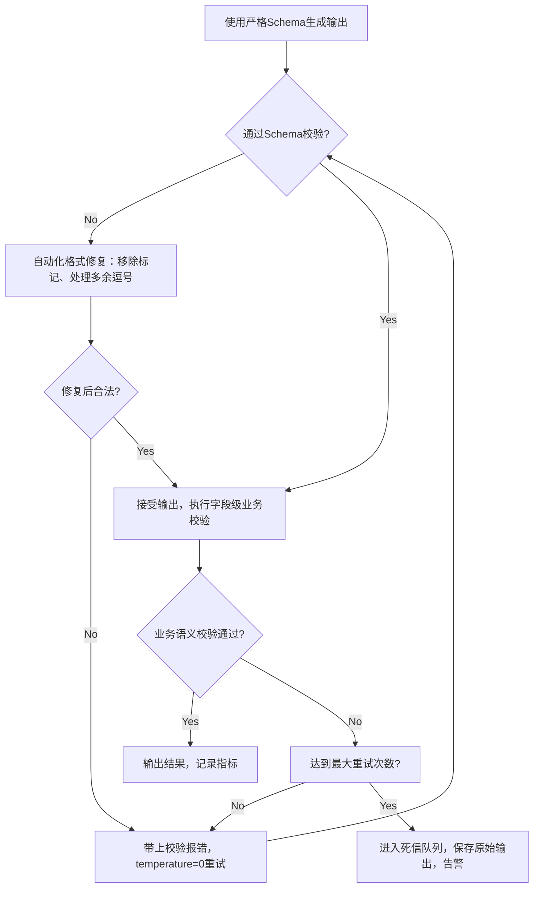

# 你需要大模型输出保证可用的JSON，但它总是破坏模式约束。你该怎么做？
JSON模式、严格模式、约束解码、校验‑然后‑重试：结构化输出的逐级处理方案，还有一个没人提及的坑：通过模式校验的JSON，事实层面依然可能出错。

## 18 你需要大模型输出保证可用的JSON，但它总是破坏模式约束。你该怎么做？

> **太长不看版：不要自己手写实现。使用原生结构化输出（约束解码会屏蔽无效token，几乎不可能生成格式错误的JSON），然后针对边界场景增加「校验‑修复‑重试」层；当失败率上升时简化模式定义。面试官等待你答出的关键点：通过模式校验不等于内容正确，要追踪字段级准确率，而不只是解析成功率。**

### 解题思路
把这件事看成一套逐级升级方案，优先使用平台原生能力，再做防御性工程实现；分清面试官容易混为一谈的两类问题：**句法错误**（JSON格式非法、违反模式约束）和**语义错误**（JSON格式合法，但内容错误）。二者修复手段不同，能主动说出这一点，你的回答档次直接提升。

### 高质量回答
优先使用平台提供的原生能力，很多团队会自己重复实现服务商已经内置好的功能：
1. **原生结构化输出与严格模式**。主流API支持传入JSON Schema，底层是**约束解码**：每一步生成时，会把违反语法规则的token屏蔽掉，从根源上几乎杜绝非法JSON。自托管场景可以用Outlines、vLLM的引导解码库。这套方案解决句法类问题，应当作为首选，而不是最后兜底手段。
> JSON模式是较弱的实现：JSON模式只能保证输出可被解析为JSON，不能保证符合你定义的Schema，字段依然可能缺失、类型错误。面试需要分清二者区别。

> 解码过程举例：直观理解“token被屏蔽”。假设模型已经输出`{"days":`，schema规定days必须是整数。模型下一个token的候选分布里可能有引号（它想输出`"thirty"`）、数字、null。基于schema编译出来的语法层，会和token候选分布做交集：只保留数字与负号，引号的生成概率被置为0，模型只能从合法候选里采样。约束解码从根源上不给模型输出句法错误内容的机会，这是靠提示词做不到的——提示词只能“劝导”，约束解码是强制约束。
> 注意：约束解码只能强制输出格式正确。语法层完全无法保证输出数字的业务真实性。

我们通过一次解码步骤，就能直观理解**token被掩码屏蔽**这一过程。假设当前已输出内容为`{"days":`，而模式定义days为整数类型。模型原始的下一个token概率分布可能更倾向输出引号（模型原本想输出"thirty"），数字和null的概率则相对更低。

由模式编译生成的语法层，会将该概率分布与此处合法可出现的字符做交集运算：仅保留数字与负号，把引号的概率掩码置为0，之后就在剩余候选里进行采样。模型从根源上就没有机会输出语法错误的内容，这就是为什么该方法的效果从底层架构上就优于提示词方案，而非只是程度上的改善。

请记住这套机制的逻辑，它也能解释下面存在的局限：掩码可以强制days的输出格式，但语法本身完全无法判断最终生成的数字是否符合事实。

接下来是防御层，因为各类保障机制都存在边界（不支持的模式特性、未开启严格模式的模型服务商、深度嵌套的模式），由此引出恢复处理流程：

2. **校验：永远做全量校验**。哪怕开启严格模式，每一轮返回结果都要用Pydantic/JSON Schema做校验，实现深度防御。同时还能捕获语法约束无法覆盖的语义规则：枚举值、数值范围、跨字段校验逻辑。

3. **修复‑重试循环**。校验失败时，先做自动化修复：剥离markdown代码块标记、修复末尾逗号这类简单格式问题。之后带上具体报错（例如`"days"字段应当是整数，但传入字符串`）重新调用模型，温度设为0；重试次数做限制。不要让格式错误直接流向下游。

4. **简化你的目标Schema**。失败率会随着Schema复杂度升高而上涨。减少嵌套层级，把一次复杂抽取拆成两次调用；真正可选的字段标记为可空；给每个字段补充描述（相当于内置提示词）。很多时候重新设计Schema，比反复调重试逻辑效果更好。

> ⚠️高级面试陷阱：**Schema校验通过 ≠ 内容正确**。约束解码会强制模型输出合法格式，但模型会编造内容来满足格式。举个例子：发票抽取，`po_number`是必填字符串，但原始文档根本没有采购单号。因为Schema强制该字段必填，模型就会编造一个看起来合理的假单号。整套流水线解析成功率100%，输出却是错的。
> 解决方案：拿不准的字段设置为可空，提示“没有就输出null”；准备小规模标注数据集（50‑100条）评估，统计**字段级准确率**，而不是只看JSON能不能解析。解析成功率只是好看的虚指标，字段准确率才是真实指标。

### 面试官后续追问方向
- **为什么严格模式能生效？到底什么被约束了？**
> 答：基于Schema编译出语法规则，在每一步token采样时做logit屏蔽。不符合语法的token直接置零概率。

- **结构化输出会不会损害输出质量？**
> 在强推理任务上确实可能；缓解方案：两步走，先自由输出推理内容，第二步调用结构化输出做格式化。或者在Schema里增加`reasoning`字段，让模型先写思考。

> 枚举类型的特殊坑：
> “Schema校验通过不等于内容正确”这个问题，在枚举场景会被放大。当真实答案不在枚举选项中，约束解码强制模型只能选枚举内最接近的一项。如果枚举没有设置`unknown`或`other`选项，系统就完全无法表达“不知道”。解析成功率依然是100%，但在边界案例上字段会系统性出错。

### 常见错误
1. 只靠提示词反复强调“必须输出JSON”，没有用约束解码；提示词劝导无法彻底杜绝格式崩坏。
2. 开启JSON模式，误以为等价于严格Schema校验；JSON模式只保证合法JSON，不保证字段类型。
3. 只统计JSON解析成功率，完全忽略语义、字段内容正确性。
4. Schema把未知字段强制必填，不给null/unknown兜底，迫使模型编造虚假内容。

### 核心要点总结
1. 句法错误优先用平台**结构化输出/约束解码**，而不是纯提示词；自托管使用Outlines/vLLM引导解码。
2. 即使开启严格模式，依然保留校验‑修复‑重试的防御层，设置最大重试次数，失败进入死信队列。
3. 区分句法错误（格式）与语义错误（业务内容）。约束解码解决格式，解决不了事实编造。
4. 不要迷信解析成功率指标；评估要落到**字段准确率**。枚举务必增加`unknown/other`；拿不准的字段设置为可空。

---

> “Schema校验通过不等于内容正确”，在枚举场景会被进一步放大。当真实答案属于“以上都不是”时，约束解码依然会强制挑选一个最接近的枚举值，因为语法规则不允许输出其他内容。如果枚举没有显式设置`unknown`或者`other`成员，这套系统在该字段上就彻底无法表达不确定性：JSON解析成功率看上去完美，但是遇到边界用例时，字段会系统性输出错误值。
