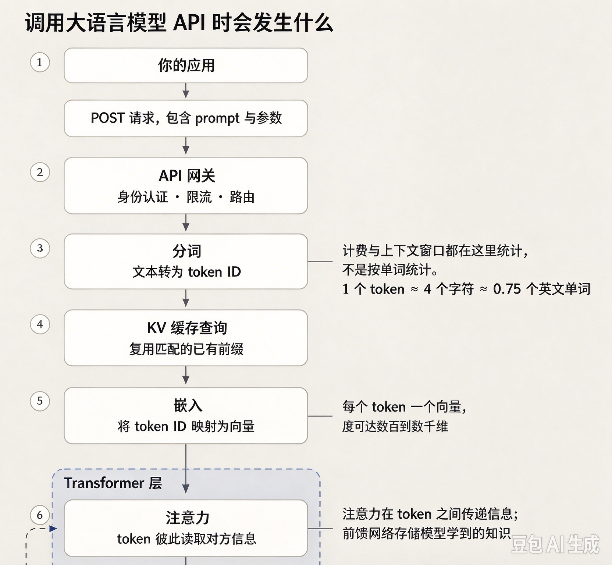
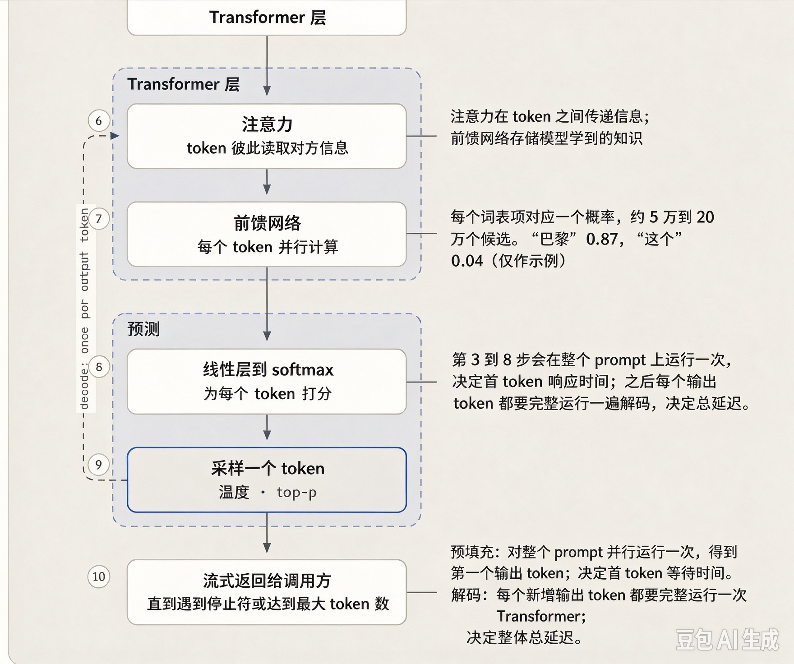

# 问题01：请为我完整讲解大语言模型生成回复时，到底发生了什么。

> 一句话总结：生成过程是**自回归循环**，不断预测单个token；从工程上分为两个阶段：
> 预填充（Prefill）：并行处理提示词，构建KV缓存，决定**首token响应时间(TTFT)**；
> 解码（Decode）：逐个输出token，决定整体总延迟。

## 答题思路
要避开那种会让你面试失分的回答：“模型在训练数据里查找最匹配的内容然后返回”。模型内部根本没有“查找”这个动作，你的回答要从原理上证明这个说法是错的。
这是一道能力校准题：面试官想看你是否具备清晰的运行逻辑认知，而不是凭模糊感觉作答。要站在系统层面，描述从收到请求到返回结果中间发生的事情，不要一头扎进注意力头的数学细节。
一个很好的开场话术：**“我会先讲解推理循环，如果需要，我可以深入讲讲底层架构。”**

## 高分参考答案
大语言模型本质是**下一个token预测器**。你的提示词会被切分成token，模型会对全部词表（约5万‑20万个token）计算出概率分布。采样策略（temperature温度、top‑p）从中选出一个token，把它追加到序列末尾，循环往复。生成就是一轮轮预测单个token的自回归循环。

举个直观例子：输入“法国的首都是”，前向传播会给词表里每一个token输出分数。经过softmax之后，得到类似下面的概率（仅举例）：“巴黎”0.87，“这个”0.04，“位于”0.02，剩下成千上万个token瓜分剩余概率。
温度为0时，每次都会选“巴黎”；温度等于1时会做随机采样，就有小概率选出“这个”，句子就跑偏。循环执行几百次，就生成一整段文本。
模型不会预先规划整篇段落，每一步只选下一个合理的片段，手机输入法的联想词就是一模一样的机制，只是模型规模不同。

工程上分为两个关键阶段：
1. **预填充Prefill**：并行处理全部输入提示词，构建KV缓存。决定首token响应时间TTFT，耗时随输入提示词长度增加。
2. **解码Decode**：串行逐个生成输出token，速度一般每秒30‑150个token，取决于模型大小与推理服务框架。总延迟主要由解码阶段决定，耗时随输出长度增加。
这就是为什么输出5000token的回答会很慢，哪怕输入很短；流式输出，就是把解码产出的token逐个推送给用户。

## 调用LLM API时发生了什么（流程）

1. 你的应用发出API请求
2. API网关鉴权、限流
3. **分词Tokenize**：文本转为token ID；计费、上下文窗口在这里统计（1个token约等于4个字符，0.75个英文单词）
4. KV缓存查询：如果有历史上下文，可以复用已计算好的KV缓存
5. **嵌入层Embed**：token ID映射成向量，每个token生成一个高维向量（几百到几千维）
6. Transformer层：多头注意力机制，token之间互相读取彼此信息；前馈网络存储模型学到的知识
7. 输出层：得到每个候选token原始分数logits
8. Softmax：把分数转为词表上的概率分布
9. 采样：根据temperature、top‑p选出下一个token
10. 返回给调用方，流式逐token输出，直到遇到停止符stop token或者达到最大生成长度

> 左侧虚线箭头代表解码循环的完整延迟：**每生成一个输出token，就要完整跑一遍6‑9步骤**，输出多少token，循环就跑多少次，和输入prompt长短无关。
> - 预填充：步骤3‑8，对整个提示词并行跑一遍，得到第一个输出token；决定首token等待时间TTFT
> - 解码：每新增一个输出token，就要完整走一遍Transformer，决定整体总延迟

> 一句话补充训练：预训练在海量互联网文本上学习下一个token预测；后续指令微调、RLHF把它调教成好用的对话助手，但**生成文本的底层机制完全不变**。

左侧的虚线箭头代表了整个延迟情况。它每个输出令牌触发一次，因此围绕它的往返次数就是答案的长度，提示信息本身不会改变往返次数。阶段 3 到 8 对于提示信息并行执行一次；第一个令牌之后的每个令牌都会再次单独支付整个堆栈的费用。

该模型解释了客户向功能描述引擎（FDE）提出的行为问题。该模型并非从数据库中检索事实，而是以统计学上最合理的方式继续文本，因此流畅、自信但错误的输出（幻觉）是一种自然的故障模式，而非程序错误。无论事实是否符合预期，它都会以绝对的自信完成输出。该模型还解释了为什么在温度高于 0 的情况下，相同的提示会产生不同的答案，以及为什么“模型是否读取了我的整个文档？”实际上是在询问哪些内容进入了上下文窗口。

这种两阶段拆分也解释了每个客户最终都会问到的一个问题：账单。看看任何一家供应商的价格表，输出令牌的成本都是输入令牌的数倍。这不是营销噱头，而是你刚才描述的机制。预填充功能只需一次并行处理即可完成整个提示，因此一千个输入令牌的成本大致相当于模型一次运行的成本。解码功能则需要为每个令牌支付完整的正向处理费用，串行执行，并且全程占用GPU资源。当客户希望降低LLM账单时，这就是为什么“缩短答案”通常比“缩短提示”更有价值的原因，而能够从基本原理出发，在现场推导出这一点，正是FDE（全功能开发工程师）与只会照本宣科念价格表的人之间的区别所在。

训练简述：预训练使用互联网规模的文本，教授下一个词元的目标；后训练（指令调整、RLHF）将其塑造成一个有用的助手。两者的生成机制完全相同。

## 高频追问&标准答案
1. **为什么同一个提示词，温度等于0还会得到不一样结果？**
温度0只是选概率最高token，但服务端批处理、浮点运算顺序会带来微小logits扰动，只能做到**近乎确定输出，无法做到100%完全可复现**。

2. **延迟是输入token还是输出token主导？**
首token等待时间TTFT由输入（预填充阶段）决定；**总耗时主要由输出token数量决定**，解码是串行。缩短输出长度，比缩短提示词对速度提升更明显。

3. **KV缓存到底干什么？**
没有KV缓存，每生成新token，都要把全部历史输入输出重新算一遍，第N步复杂度是N倍算力。KV缓存保存每一个token算好的Key、Value向量，解码阶段只需要计算最新token，实现增量推理。代价是占用显存；上下文越长，显存占用越高，长对话会把服务显存打满。

4. **批处理Batch应该在哪一层做？**
解码阶段是显存带宽瓶颈。把多个用户请求放到同一个batch，同一份模型权重可以同时服务多条请求，这是提升服务吞吐最有效的手段。主动聊这个话题，直接把面试从基础题拉升到系统工程深度。

## 常见错误认知对照表
|大家常说的错误说法|错在哪|正确表述|
|---|---|---|
|“模型在训练数据里查找答案”|模型没有检索动作；前向传播只输出下一个token的概率分布|“模型通过前向传播算出概率分布，从中采样，一次生成一个token”|
|“延迟由提示词长度决定”|提示词只影响首token等待；总耗时取决于输出，解码是串行|“预填充是并行运算；解码阶段每生成一个token就要完整跑一遍前向传播”|
|“温度设置0，输出就完全确定不变”|服务端批处理、浮点数计算顺序依然会扰动logits分数|“温度0只能做到近乎确定；服务侧仍存在非确定性来源”|
|“幻觉是模型bug”|模型目标是生成通顺合理的接续文本；编造通顺文本恰恰是目标达成|“幻觉是模型固有行为，需要靠检索增强、评测手段来约束它”|

## 面试高频坑点
❌ 说模型“查找/搜索训练数据”：直接减分，暴露原理理解错误
❌ 面试官问系统层面流程，你却一上来深挖QKV矩阵数学推导：层级不对
❌ 不理解输出token是串行生成：几乎所有延迟问题根源都在这里，面试官一定会考察
❌ 声称temperature=0可以做到跨平台100%完全确定性输出

## 核心要点总结
1. 文本生成循环：预测词表概率分布 → 采样选出一个token → 追加到上下文 → 重复循环。
2. **预填充Prefill**：决定首token时间TTFT，算力随输入长度增长；
   **解码Decode**：决定整体总延迟，算力随输出长度增长。
3. **幻觉不是bug**：模型目标是生成通顺接续文本，不是保证事实正确；幻觉属于预期行为，需要外部手段做约束。
4. 面试加分技巧：主动说出预填充/解码两阶段划分，再基于这套机制解释用户账单计费逻辑；把基础问答直接升级成工程系统讨论。

---

### 补充背景
> FDE/FDE：Field Deployment Engineer，现场部署工程师；
> TTFT：Time‑to‑First‑Token，**首token响应时间**，从发请求到收到第一个输出字符的耗时；
> KV Cache：键值缓存，Transformer推理最重要的优化手段；
> Autoregressive 自回归：每一步生成的结果，作为下一步输入；
> Token：词元，文本切分后的最小处理单元。

> 想要漂亮地答完这一轮问题，最好的做法就是**不等面试官提问，主动讲出预填充（prefill）和解码（decode）两个阶段的区别**，这一步就能直接预先回答一半关于成本与延迟的追问。
> 如果面试官紧接着追问：“那你会在哪个环节做批处理？”，就说明面试官已经不再是考察你的基础概念，而是开始评估你是否有能力搭建推理服务栈。
> 有一个循环机制的关键细节：模型每次只输出一个 token，并且会把刚生成的新 token 重新送回模型输入（自回归 autoregression）。有些候选人上来只说“模型预测下一个词”，就没有讲清楚：为什么延迟会随着输出长度增加而变大，以及流式输出的底层来源。

补充一个面试官很爱问的实操向跟进问题：**“为什么第一个 token 生成很慢，后面的 token 却很快？”**。如果你在这里能说出 prefill（预填充）与 decode（解码），就证明你理解了整套成本模型，而不只是懂抽象概念。

---
## 面试核心知识点拆解
1. **Prefill（预填充阶段）**
把用户完整输入提示词一次性做并行计算，处理全部输入token，计算KV缓存。
👉 这就是**第一个token慢**的根源：要一次性处理全部输入，做大量并行矩阵运算。

2. **Decode（解码阶段，自回归 autoregressive）**
每一步只输入上一轮刚生成的1个token，复用已经算好的KV缓存，逐一生成下一个token。
👉 后续每个token速度快；**输出越长，decode循环次数越多，总延迟越高**，这也是流式输出(streaming)的底层原理。

3. **批处理 batch 放在哪里？**
- **Prefill阶段非常适合批处理**：多个用户请求的输入可以并行，硬件利用率高。
- **Decode阶段批处理难度高**：各个请求输出长度参差不齐（长短请求混杂），也就是著名的“推理服务困境”，需要连续批处理（continuous batching）等技术优化。
> 面试官问`so where would you batch?`就是考察你对大模型推理服务部署的真实经验，不是纸上谈兵。

4. 面试踩坑提醒
❌ 错误回答：只简单说“大模型就是预测下一个词”，到此为止。
✅ 完整回答：点明**prefill/decode两阶段 + 自回归循环回送新token**，解释首token延迟、输出长度对延迟的影响、流式输出来源。
