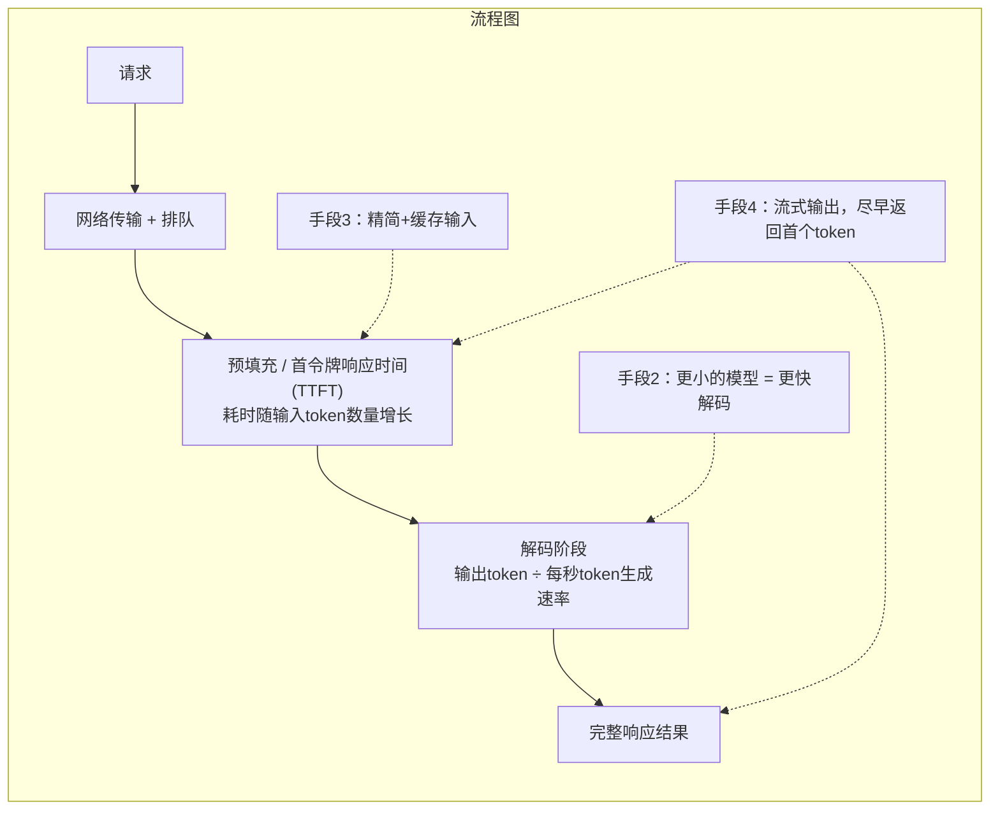

# 客户反馈你的大模型应用速度过慢。给出5种降低延迟的手段，以及各自的权衡取舍
首令牌响应时间（TTFT）与每秒生成token数，那个所有人都遗忘的输出长度调节手段，以及为什么流式输出是一项完全不改变实际延迟、但用户感知收益最高的优化手段。附带真实数值的五种优化手段完整答案。

> 第20题：客户反馈你的大模型应用速度过慢。给出5种降低延迟的手段，以及各自的权衡取舍。
> 要点速览：把延迟拆分为**首令牌响应时间（TTFT，预填充阶段，随输入长度变化）**和**解码阶段（输出token ÷ 每秒token数）**，先定位哪一部分是主要耗时项，再选用对应的优化手段：缩减输出长度、路由调用更小的模型、精简并缓存输入、优化用户感知速度的流式输出、并行计算。

## 答题思路
首先要把延迟拆解为两大组成部分：**首令牌响应时间TTFT（由输入长度与排队情况决定）**，以及**生成解码耗时（输出token数量，受每秒token生成速度影响）**。要先定位到底是哪一部分拖慢整体速度。这一点，正是普通提示词爱好者和专业工程师的答题分水岭。

举个基线示例：总耗时10秒，其中TTFT占4秒，解码生成占6秒。

[延迟对比](./yanchiduibi.png)

### 五种优化手段
1. **减少输出token生成数量**
解码过程是串行执行的，输出长度往往是总延迟的主要来源。举一组真实数值：生成速度60token每秒，800token的回答解码就要13.3秒。即便把模型速度翻倍，如果不控制输出长度，耗时也只是降到6.7秒；但如果直接限制输出为200token，耗时直接降到3.3秒。
实现方式：提示词要求模型简洁回答、设置`max_tokens`参数、去除模板套话（例如“当然！下面是……”）；UI端可以直接让模型输出JSON结构化数据，而非大段自然文本。
**权衡取舍：牺牲回答完备度，部分业务场景需要长文本输出。这是成本最低、却最容易被忽略的优化手段。**

2. **按需选用更小、速度更快的模型**
小型、轻量模型解码速度可以快数倍，同时调用成本也更低。按任务难度做路由分发：分类、信息抽取、简单任务不用调用旗舰大模型，复杂推理任务才交给大模型处理。
**权衡取舍：复杂推理场景下回答质量下降。需要一套评测集，用来验证小模型能否满足业务效果，不能只依赖公开基准评测。**

3. **精简输入内容 + 提示词缓存**
精简臃肿的系统提示词、压缩对话历史、检索时做重排序，只返回少量高质量片段，都可以降低预填充计算量，缩短TTFT。
提示词缓存：把固定不变的前缀内容（系统提示词、示例、输出schema）放在提示词开头，大模型服务商就可以复用这部分已经计算好的KV缓存。长且固定的前缀场景下，TTFT可以缩短2‑4倍，同时还能降低输入token开销。
**权衡取舍：提示词编写需要严格遵守顺序规范，动态可变内容必须放在提示词末尾。**

4. **流式输出（Streaming）**
⚠️流式输出**不会降低真实总延迟**，只改变用户感知延迟。用户大约500ms看到第一个输出token时，就会觉得系统响应迅速，哪怕完整回复依然需要8秒。相比加载转圈等待，用户对流式输出可以容忍长得多的总耗时。
**权衡取舍：需要额外开发前端UI；后置校验逻辑更难实现——已经展示给用户的内容无法撤回。通用实践：普通文本流式展示，结构化/涉及安全校验的内容做本地缓存，等全部生成完毕再处理。同时还要处理流式传输中途失败的异常。**

> 补充：流式输出存在质量代价：一旦token展示给用户，就无法收回校验。常见做法是面向用户的普通文本走流式，但是结构化、涉及安全策略校验的内容做缓存。流式输出和严格的输出校验二者会互相冲突，需要提前告知客户，同一条回复无法做到两者同时拉满。

5. **并行化与预计算**
把互相独立的步骤并行执行，比如检索向量库和文本分类同时跑，不要串行串联；用户输入还在录入的时候，就提前启动检索；针对高频重复查询，预计算、缓存完整回答结果；语义缓存拦截重复提问。
**权衡取舍：系统复杂度上升。语义缓存还存在误命中风险，相似但不等同的问题返回错误答案，需要谨慎设置相似度阈值。**

#### 额外补充可选优化（面试官追问时可以补充）
- 预留专属算力/预分配吞吐量，解决排队导致的P99高延迟（早高峰排队问题）；
- 自托管部署场景下的推测解码（speculative decoding）。

## 面试官后续追问方向
- “p50延迟达标，但p99延迟很差”：大概率是排队、限流、重试风暴，不是提示词或者模型本身的问题。需要看服务商限流、重试雪崩、预留算力、带降级策略的超时控制。
- 常见踩坑：只说五种手段，却不拆解TTFT和解码耗时，属于盲目优化。
- 高频错误：把流式输出说成是降低真实延迟，流式输出优化的是用户感知，不会缩短完整回复耗时。
- 极易遗忘：输出token数量本身就是最重要的调节杠杆。

# 常见误区
- 手握五类优化手段，但不对**首token响应时间(TTFT)/解码**做拆解分析：属于盲目优化。
- 忽视输出长度这个投入产出比最高的优化手段。
- 将流式输出描述成降低真实时延，而不是改善用户主观感受；这是面试官会关注的答题精准度要点。
- 不做优化前后指标对比；脱离性能分析就说“我会尝试方案X”，这只是主观猜测。

# 核心要点
- **先做性能剖析**：把TTFT（预填充阶段）和解码阶段分开，由占耗时主导地位的环节，来选择对应的优化手段。
- 输出长度是投资回报率最高的优化手段，也是面试者最容易遗忘的点；解码过程是串行执行的。
- 流式输出改变的是**用户主观感知**，不会改变物理墙上时钟的实际耗时；务必把这点明确讲出来。
- 任何为了提速而更换模型的操作，上线之前必须通过基准评测集的验证。

---
> 流式输出会带来隐性质量损耗：token一旦展示到界面，就无法撤回校验。通用实现模式：面向用户阅读的普通文本做流式，结构化内容、安全敏感内容做缓存。流式输出和严格输出校验两者存在冲突，需要告知客户：单条响应不能同时做到两者都拉满。

