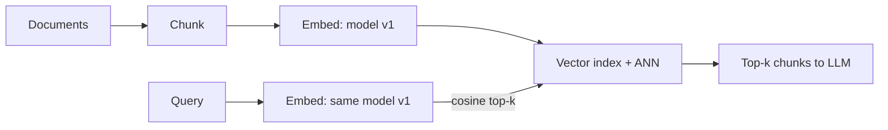

# 什么是嵌入（Embeddings）？它如何实现语义搜索？

> **一句话总结（TL;DR）**：嵌入是固定长度的向量，语义相近的文本会映射到向量空间中相近的位置。所以“查找相关文本”就变成了“查找邻近向量”（通常使用余弦相似度，常通过近似最近邻算法ANN，例如HNSW实现）。值得一提的局限：嵌入衡量的是主题相似度，而非内容正确性或精确标识符匹配，因此生产环境检索一般采用混合检索方案。

## 回答思路
先讲直观理解（把含义转化为几何空间），再讲原理细节（模型、维度、相似度度量），最后讲一线开发工程师实际接触到的落地细节：选用什么模型、成本、失效场景。Cohere的面试官尤其希望你像从业者一样讲解嵌入，而不是照本宣科。

## 优秀回答范例
嵌入是一组固定长度的数字向量，维度通常在256到3072之间，由神经网络训练得到；该网络的训练目标是让语义相似的文本在向量空间中位置靠近。“如何重置我的密码？”和“我的账号登不上了”几乎没有共用词汇，但二者的嵌入向量是近邻。核心原理就是：语义含义转化成几何空间中的位置，“查找相关文本”就等价于“查找邻近向量”。

我们用一个简化例子来具象理解这个几何逻辑。假设模型只有3个维度，大致对应“账号故障”、“寻求帮助”、“财务”（真实模型有成千上万未标注的维度，但计算逻辑完全一致）。“如何重置我的密码？”的嵌入向量可以是 `[0.9, 0.3, 0.1]`，“我的账号登不上了”是 `[0.8, 0.5, 0.2]`：二者余弦相似度0.97，哪怕没有共用关键词，也是近邻。而“分区域Q3营收”向量为 `[0.1, 0.2, 0.9]`，和密码查询语句相似度只有0.27。这些数值是根据示例向量计算得出，不是随便编造；这个例子的重点在于全程没有做任何字符串匹配，相似度完全由向量位置决定。向量数据库做的事情，本质就是把这种向量比对大规模化。

语义搜索的完整流程分为三步。**索引阶段**：把文档切分成文本块（chunk），为每个文本块生成嵌入向量，并存入向量索引（pgvector、Pinecone、Elasticsearch、FAISS）。**查询阶段**：用同一个模型对用户查询生成嵌入向量，执行最近邻搜索（一般用余弦相似度），取出Top-K个文本块。大规模场景下会使用近似最近邻算法（ANN，HNSW是最常用的），因为对数千万向量做精确搜索速度太慢；ANN牺牲一小部分召回率，换取数个数量级的速度提升。

> 图注：DIAGRAM

## 体现实操熟练度的补充要点
嵌入模型和生成模型相互独立，且成本低得多（每千个文本块仅零点几美分）；**查询文本和文档文本必须使用同一个模型、同一个版本做向量化**，混用模型会得到完全不可用的相似度分数。当你更换嵌入模型时，需要对全部语料重新向量化，这是容易被忽略的迁移成本，所以工程团队一般会固定模型版本。

能够口头估算向量索引占用空间，同样是实操能力的体现。举个例子：1000万个文本块，维度1536，每个浮点数占4字节，原始向量大小 = 10M × 1536 × 4 ≈ 61GB，这还没算ANN图结构本身的额外开销。这一行计算就能解释多个生产侧的取舍：为什么正式部署会关心向量维度（3072维模型会让存储开销翻倍，你必须要有证据证明质量提升值得这个成本）；为什么会有量化技术（量化到int8或者二进制，可以把内存占用降低4~32倍，代价是轻微损失召回率）；以及为什么当向量规模在一百万到一亿区间时，“直接放内存里”这个方案就不再可行。面试官很少直接考这个计算，但在讨论大规模场景时主动提到，就能区分你是从业者还是只读过课本。

核心局限：嵌入捕捉的是**主题相似度**，而非内容正确性、精确匹配。拿“2024定价”去检索，它很可能返回一段讲“2023定价”的内容——主题相关，但答案错误。嵌入在精确标识符（零件号、错误码、人名）场景表现弱，这类场景传统关键词搜索更占优。这就是为什么生产环境检索通常是混合检索：向量检索 + BM25关键词检索 + 重排器（reranker），而不是只靠嵌入向量。

## 面试官接下来会追问的问题
- “为什么选用余弦相似度？”余弦衡量向量夹角，不受向量模长影响，所以文档长度不会主导相似度结果；很多嵌入模型会做向量归一化，此时余弦相似度等价于点积。
- “如何评估检索质量？”使用标注好的「查询-相关文本块」数据集；常用指标召回率@k（recall@k）、MRR；不要盲目调chunk大小或者k值。
- “嵌入还有哪些用途？”聚类、去重、分类、推荐系统、日志/工单异常检测；展现这类广度会加分。
- “相同单词，不同含义，比如java（岛屿）和java（编程语言）怎么办？”文本块内的上下文会起到一部分作用；元数据过滤和重排器负责处理剩下的问题。

## 常见误区
- 能解释数学原理（点积、维度），但说不出任何向量数据库、ANN算法，或者大致成本：这就是一线开发工程师面试的典型失分点。
- 声称嵌入可以“理解”文本。夸大能力会直接掉进“相关但错误”的陷阱，面试官很清楚这个问题。
- 忘记查询和文档必须使用同一模型：这是真实生产环境里踩过的坑，很多候选人会漏掉这点。
- 认为纯向量搜索就足够。不提混合检索或者重排器，会让人觉得你没有在生产环境调试过检索系统。

## 核心要点总结
- 嵌入把语义转化为几何空间；近似最近邻（ANN/HNSW）让大规模检索变得可行。
- 查询文本和文档必须使用完全相同的模型与版本做向量化，否则所有相似度分数都毫无意义。
- 纯向量检索无法处理精确标识符、时效性信息；生产检索是混合方案：向量检索 + BM25 + 重排器。

面试官很喜欢问：**“为什么用2024年的查询，检索出来了2023年的文档？”**，这个问题用来考察你是否理解：嵌入计算的是**主题相似度**，而不衡量时效性，也不校验内容正确性。

“查询与文档必须使用同一套模型”这条规则，在Glean这类公司里是真实出现过的线上故障：嵌入模型版本悄无声息升级，直接导致检索相关性大幅下降，直到有人对全部数据重新做索引才修复问题。

---
### 面试要点拆解
1. 题目考察核心
> Embeddings 只判断主题是否相关，**不会理解时间、不会校验事实对错**。
查询“2024定价”，2023定价文档主题高度接近，向量距离很近，就会被召回，这是向量检索原生缺陷，不是系统bug。

### 中文翻译（完整直译）
**同模型同版本规则，还有比版本升级更隐蔽的坑：非对称模型。**
有不少嵌入API提供独立的查询编码器和文档编码器（或者要求添加任务类型前缀）。如果把文档编码器拿来处理查询，相关性会悄悄变差，而且不会抛出任何报错。在想当然认为同一套嵌入调用可以同时处理查询与文档之前，一定要先查阅模型卡片（model card）。

---
### 简要解读（方便你面试理解）
1. **asymmetric models 非对称嵌入模型**
    这类模型训练时就做了区分：
    - document encoder：专门用来编码文档片段
    - query encoder：专门用来编码用户查询语句
    二者属于同一个模型套件，但编码器权重不一样，不能混用。
2. 坑点：不会报错，只是检索结果质量无声下降，很难排查。
3. 部分模型不区分两套编码器，但要求你在文本前面加固定前缀（例如`query: xxx`、`passage: xxx`）来区分任务，不加也会导致效果变差。
4. **model card（模型卡片）**：模型官方说明文档，里面写清楚模型使用规范，必须看。

> 对比前面原文重点：之前只强调「同一个模型+版本」，这段补充了一个容易忽略的边界情况：就算模型版本没变，**查询和文档的编码器本身就不是同一个**，混用依然失效。

