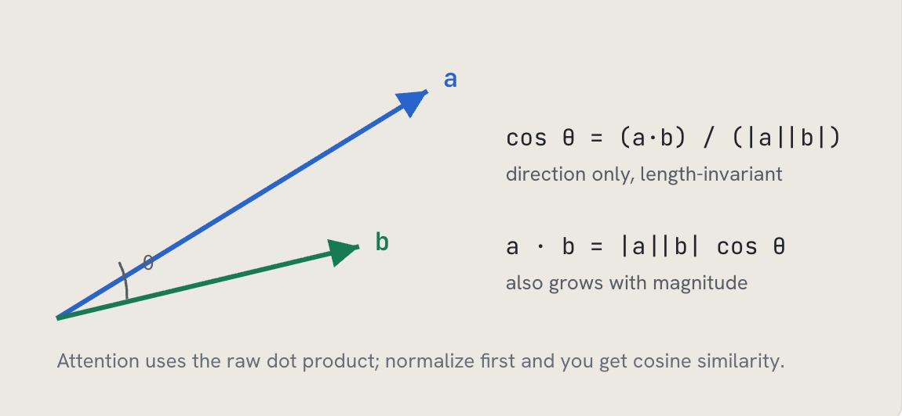

# 为什么点积是注意力机制与嵌入向量中的相似度得分？什么时候需要归一化来计算余弦相似度？
同一种运算，既用于计算注意力得分，也用于给RAG检索结果排序。只有真正理解点积衡量的是什么，以及什么时候点积的模长项会悄悄破坏你的检索效果，你才能区分出一套可用的流程，和一套结果莫名糟糕的流程。

> **一句话总结：** 点积同时融合方向与模长（$a \cdot b = |a||b|\cos\theta$）；余弦相似度只保留方向。指标要和嵌入模型的训练方式匹配：归一化向量模型中，点积和余弦相似度等价；如果对未归一化的向量直接使用原始点积，模长（通常就是向量长度）会干扰排序结果。

---
$$\cos\theta = \frac{a \cdot b}{|a||b|}$$
仅保留方向，不受向量长度影响

$$a \cdot b = |a||b|\cos\theta$$
结果会随模长增大而变大

> 注意力机制使用原始点积；先做归一化，得到的就是余弦相似度。

## 如何理解这个问题
先从点积实际的计算逻辑入手，再联系它的两个应用场景：模型内部的注意力得分，以及向量数据库里的相似度排序。面试官考察的是：你是把相似度指标当作刻意选择的参数，还是从教程里直接照搬的默认配置。高分回答要把指标选择和嵌入模型的训练目标关联起来——决定用点积还是余弦相似度的，不是个人偏好，而是模型训练方式。

### 优质回答参考
两个向量的点积等于二者模长的乘积，乘以向量夹角的余弦值：$a \cdot b = |a||b|\cos\theta$。因此它同时包含两层信息：**方向**（向量是否指向同一方向，代表语义是否对齐）和**模长**（每个向量自身的长度）。余弦相似度通过除以两个向量的范数，剔除了模长信息，只保留方向。这就是二者核心的区别。

在模型内部，注意力机制使用查询向量与键向量的**缩放点积**计算token得分：$QK^{T}/\sqrt{d_k}$。缩放操作至关重要：如果不除以头维度的平方根，高维向量的点积数值会变得很大，把softmax推到接近独热编码的状态，导致梯度消失。注意力机制这里选用点积，是因为模长是有意义的：模型会学习让部分信号的“音量更大”。

在检索场景，选用哪种指标取决于你的嵌入模型。很多现代嵌入模型（OpenAI的嵌入模型、大部分sentence-transformers、Cohere Embed）训练完成后输出归一化向量，也就是所有向量长度都为1。当所有向量模长都是1时，**点积等价于余弦相似度**：二者给出的排序完全相同，最大内积搜索（MIPS）只是点积更高效的实现方式。这就是很多向量索引提供内积作为归一化向量快速检索方案的原因；不同产品默认指标不一样（例如Chroma默认使用平方L2距离），所以你需要核对索引配置的指标是否匹配你的嵌入模型，而不是凭想当然。

举个二维例子，直观看到两种指标结果会不一致（这里是真实计算值，不是草图）。查询向量 $q = [1, 0]$。文档 $d_1 = [0.9, 0.4]$，方向几乎一致，范数0.985。文档 $d_2 = [2.0, 2.0]$，夹角45度，但向量很长，范数2.83，冗长的通用文本块经常会生成这类向量。原始点积计算：$q \cdot d_1 = 0.9$，$q \cdot d_2 = 2.0$，此时方向不匹配的文档仅凭向量长度就拿到更高分。余弦相似度：d1是0.914，d2是0.707，方向匹配的文档排名更高。同一组三个向量，排序结果完全相反，唯一变量就是是否允许模长参与打分。放到1536维、数百万文本块的场景下，这就会变成生产环境的线上bug。

坑点：对未归一化的嵌入向量直接使用原始点积。此时模长会混入得分，而模长通常和token数量、词频相关，越长、越泛化的文档，不管相关性高低，得分都会更高。现象：你的RAG系统总是反复返回少数冗长的文本块。解决办法：对嵌入向量做归一化（归一化后点积和余弦结果一致），或者直接使用余弦相似度。反过来，如果你的模型是基于原始内积目标训练的，做归一化会丢掉模型原本希望保留的信号。

一句话准则：**指标要匹配模型训练目标**。现在主流模型都是余弦目标训练的，用余弦相似度（或者归一化点积）；只有模型本身基于原始内积目标训练时，才使用原始内积。

---
### 面试官接下来常追问的问题
- **注意力机制为什么要除以 $\sqrt{d_k}$ 做缩放？**：保证向量维度增加时点积的方差保持稳定，避免softmax饱和，防止梯度失效。
- **余弦相似度和归一化点积的排序结果完全相同，为什么还要二选一？**：单位向量下二者排序一致；内积计算速度更快，FAISS、ScaNN这类MIPS索引都是针对内积优化的，所以我们存储归一化向量，检索时用点积计算。
- **检索结果总是优先返回长文档，是什么原因？**：未归一化嵌入向量，模长主导了相似度得分；解决方法：归一化向量，或者切换为余弦相似度。
- **什么时候应该选用欧氏距离，而不是余弦？**：当向量的绝对位置有意义，而不只是向量夹角；对于归一化向量，L2距离和余弦相似度是单调相关的，所以几乎不会改变排序结果。

### 常见错误
- “永远用余弦相似度”：余弦是安全的默认选择；但向量已经归一化时，余弦和点积结果一样，余弦计算更慢；而对于内积目标训练的模型，使用余弦甚至会出错。
- 建索引和查询阶段混用指标，或者只在其中一端做归一化；这会悄无声息污染所有相似度分数。
- 忽略注意力缩放因子，对softmax的作用含糊带过；大厂实验室的面试官很看重这点。
- 把模长当成噪声。在注意力机制中，模长是模型学到的有效信号；但在检索场景中模长通常是噪声。分清场景，才是核心。

## 核心要点
- 点积 = 方向 × 模长；余弦相似度剔除模长，只保留方向信息。
- 在归一化向量上，二者给出完全相同的排序；所以存储归一化向量，检索时使用开销更低的点积。
- 在注意力机制里，模长是模型学到的有效信号；但检索场景中模长一般是噪声；检索里长文本块偏向高分，就是未归一化向量带来的典型问题。

# 编者按
核心观点需要开门见山讲清楚：**选用哪种相似度指标，取决于嵌入模型的训练方式，而非个人偏好**。因此“一律用余弦相似度”只是照搬过来的默认配置，并非经过审慎分析得出的选择。

一个很常见的坑：**检索结果总是返回篇幅冗长的文本块，原因是什么？**
根源在于向量没有做归一化，向量模长会和文本的token数量挂钩。有些工程师不去排查归一化这个底层问题，上来就调用重排序器，这恰恰暴露他们从来没有完整调试过这套检索链路。

补充一个实操调试判断方法：如果你怀疑未归一化的向量导致检索偏向长文本块，直接画出全部已存储嵌入向量的L2范数。
- 如果范数紧密聚集在1.0附近：说明模型输出本身已经归一化，长文本偏向问题来自其他环节（分块策略、BM25融合权重等）；
- 如果范数大小随文本块长度波动巨大：那问题就出在这里。

只需两行numpy代码，就能解决这个问题；否则大家就会陷入盲目迷信重排序器的“工具崇拜”。

---
### 关键术语注解
1. embedding model：嵌入模型
2. un‑normalized vectors：未归一化向量
3. magnitude：向量模长
4. token count：token数量
5. reranker：重排序器
6. normalization bug：归一化缺陷/归一化问题
7. L2 norms：L2范数
8. cargo cult： cargo‑cult programming，直译“货船崇拜”，技术语境指**盲目套用工具、不理解底层原理的教条式开发**
9. chunk：文本块、切片（RAG里把文档切分后的片段）
