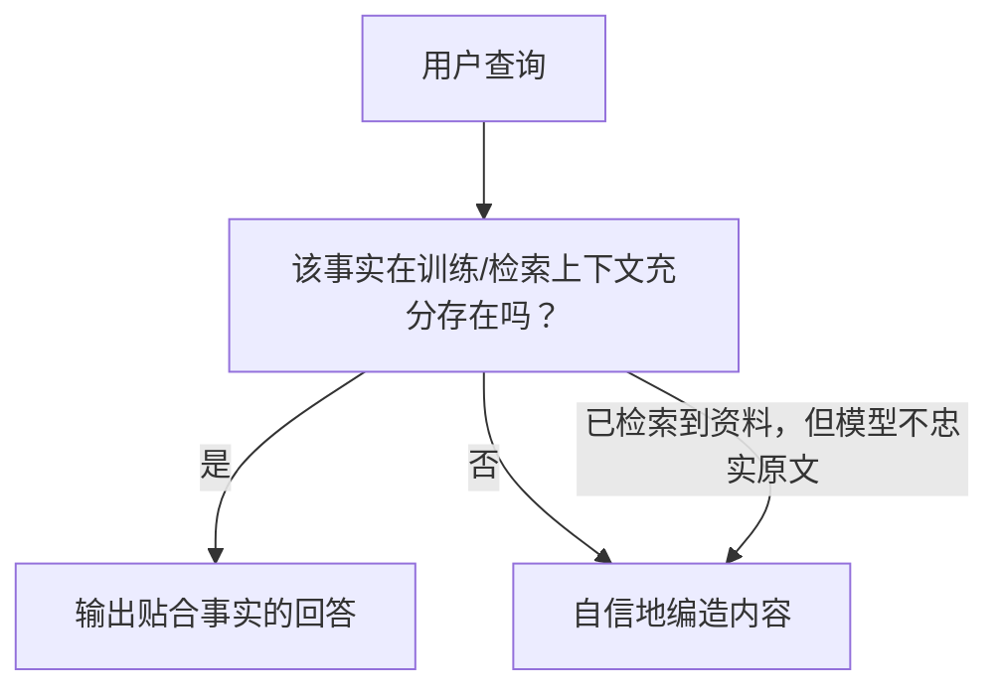

# 大模型为什么会产生幻觉？
每一位**前向部署工程师（FDE）**都会遇到愤怒的客户提出这个问题。面试官希望得到一套机理性解释：**幻觉是模型的默认行为，而非程序bug**，同时还要有一套话术，用来安抚客户、避免事态升级。

## 09 大模型为什么会产生幻觉？

> **简而言之：幻觉是训练目标按设计运行的结果**。模型的目标是生成听起来合理的接续文本，而不是输出经过核验的客观事实；同时RLHF（基于人类反馈的强化学习）会奖励自信笃定的输出。幻觉无法仅靠提示词彻底消除，只能通过工程手段来规避：事实锚定、引用溯源、允许模型坦诚“不知道”，以及针对事实一致性做评估。

### 答题思路
❌错误做法：不要替模型辩解，说“模型有时候会糊涂，下个版本就好了”——客户会把这当成无法兑现的承诺。
✅正确思路：从底层机制切入，机制问题可以被界定范围、可以量化；而主观“模型犯糊涂”不行。
答题结构：
1. 训练目标原理
2. 该目标如何造成自信式编造输出
3. 加剧幻觉的各类因素
4. 部署场景下的工程启示

Anthropic面试中还有客户场景变体考题：“客户说Claude出现幻觉，请你完整推演处理过程”，需要同时掌握技术解释、客户沟通两套表述。

#### 高质量参考答案
幻觉是模型训练目标带来的必然结果。模型被训练的目标是生成**符合上下文、统计上通顺合理的接续文本**，而不是输出经过核验的真实陈述。模型内部没有数据库查询，也没有一套“事实真理判断器”。模型做回答时，只是生成概率最高的文本序列。
当训练数据里充分包含某条事实时，通顺就等价于真实；当没有对应事实时，这套“追求通顺”的机器就会输出编造出来、但读起来流畅的内容。

> 流程图解读：“自信编造”有两条输入路径。
> 第一条：检索完全没拿到对应信息；
> 第二条：虽然拿到参考资料，但是模型输出不忠实于原文。
> 这也就是为什么RAG只能降低幻觉率，却不能彻底根除幻觉。

可以逐token观察模型编造的过程：让模型给出判例法条，它会生成当事人姓名、“诉”、卷宗号、年份，每一步token预测都只遵循一个标准：**这个token接在这里是否通顺合理**。每一步预测本身都完全符合模型训练目标，但组合出来的引用可以是完全虚构的。
幻觉不是低置信度输出从过滤器漏出来，而是：**模型在解决一个和用户预期不一样的任务，并且把这个任务完成得很好**。

### 加剧幻觉的因素
- **知识缺口，同时模型没有“我不知道”的本能**
预训练不会教会模型区分“这条内容我见过成千上万次”和“我靠临近文本模式拼接出来的内容”，两种情况输出的文本表现几乎一模一样。

- **训练后对齐奖励“自信笃定的语气”**
RLHF优化人类偏好，人类更喜欢流畅完整、语气笃定的回答，不喜欢模棱两可的话术。训练会主动奖励输出听起来很确定的回答。Kalai等人2025年论文《为什么大模型会产生幻觉》点明：很多基准测试本身打分逻辑，也会鼓励模型宁可瞎猜，也不要说不知道。

- **引导性/预设前提的模糊提示词**
比如提问“总结2022年Smith诉Acme案判决”，哪怕这个案件根本不存在，提示词已经预设案件真实存在，模型就会顺着这个前提编造。

- **冗长、互相冲突的上下文**
检索返回的片段互相矛盾，或是关键事实埋藏在很长文本中间，模型就会退回到自身先验知识，产生编造。

- **精确细节最容易出错**
引用、URL、数字、人名属于高精确度内容，“大概说得通”在这里就是完全错误。伪造判例、虚假参考文献就是这类幻觉最典型案例。

### 部署落地启示（面试一定要说出来）
> 幻觉不能靠提示词彻底消除，要靠工程手段约束：
1. 使用检索到的源材料锚定模型输出，强制附带引用来源
2. 限制模型可以断言输出的内容范围
3. 明确允许模型回答“我不知道”
4. 基于业务自有语料，构建评测集，专门评测输出和源材料的事实一致性。

面向客户沟通话术：模型不是在说谎，它只是生成通顺文本。我们的工作就是划定边界，控制“通顺”和“客观真实”之间可以偏离的范围。

## 客户现场故障处置（真实业务场景）
当幻觉问题变成客户升级投诉，解释就要变成一套可落地处理流程，讲清楚这套流程，才能体现部署实战经验。

带上客户那边真实出错的最坏案例开会，而不是一味维护模型。做核心排查：**正确的事实信息，有没有出现在模型看到的上下文里？**
1. 如果上下文压根没有正确信息：属于检索/数据摄入故障，优化检索、数据导入链路。
2. 如果上下文已经包含正确信息，但模型依然输出错误：属于输出忠实度故障。解决手段：强制引用溯源、收紧事实锚定约束、允许模型拒绝回答。

不要口头承诺“以后会变好”，要给出量化指标：在客户真实的100条查询上，测出幻觉率；每次版本迭代汇报该指标。开会离场时给出**数字指标和风险边界，不要空口许诺零幻觉**。

### 面试官高频追问清单
1. 问：把温度参数设置为0就能解决幻觉吗？
> 答：不能。温度为0只是消除采样随机性，但模型依然会基于错误先验确定性输出错误答案，会一本正经地、确定地编造内容。

2. 问：RAG是不是可以彻底解决幻觉？
> 答：RAG只能降低幻觉率，不能根除。会出现“拿到参考资料，但是模型改写歪曲原文”，也就是忠实度失效。

3. 问：如何衡量幻觉率？
> 答：基于真实业务查询构建评测集，使用经过校准的大模型裁判，评测输出与源材料之间的事实一致性，跟随版本持续跟踪指标。

|大众常见误区|正确表述|
| ---- | ---- |
|“模型在撒谎、犯糊涂”|模型只生成通顺接续文本，没有主观欺骗，是训练目标使然|
|“调提示词就能彻底消除幻觉”|提示词缓解有限，必须配套检索、引用、评测、允许拒答|
|“RAG可以彻底消灭幻觉”|RAG减少幻觉，但会出现拿到资料却歪曲原文的忠实度故障|
|“更大的模型就不会幻觉”|大模型幻觉模式不一样，但不会完全消失|

### 面试高频踩坑
1. ❌拟人化描述：“模型会糊涂、模型记错了”，避免拟人。要讲训练目标、token预测。
2. ❌许诺可以做到零幻觉，面试官会直接扣分。生产环境要默认幻觉率大于0。
3. ❌遗漏RLHF和自信输出之间的关联点，这是区分死记答案和真正理解机制的关键点。
4. ❌只讲理论，没有落地部署方案。FDE面试，回答结尾必须落到：**所以在生产环境中，我们要……**

### 生产环境实际操作步骤
1. 拿着客户真实出错样例做分析，不要空泛辩解模型能力。
2. 排查：正确事实是否已经给到模型上下文。
    - 没有：修复检索、文档摄入管道
    - 已有：强化事实锚定、强制引用、开放“我不知道”的输出权限
3. 使用客户真实业务查询集，量化评测事实一致性，版本迭代持续上报指标。
4. 对外输出风险边界和量化数据，拒绝“以后就不会出错”这类口头承诺。

### 核心要点总结
1. 幻觉是训练目标正常运行带来的现象（追求通顺文本接续），属于预期行为，**不是程序bug**。
2. RLHF会奖励自信笃定语气，所以编造出来的内容读起来流畅笃定，而不是模棱两可。
3. 我们只能约束幻觉范围，不能彻底根除幻觉。手段：检索锚定事实、强制引用溯源、允许模型说不知道、持续做事实一致性评测；始终默认会存在一定幻觉率。

> 编者补充笔记：
> 能区分背诵答案和深度理解的关键点，就是RLHF和输出自信度之间的联系。后训练对齐奖励人类偏好，人类偏爱笃定流畅回答，所以编造内容往往言之凿凿，不会含糊其辞。
> 面试陷阱追问：“那RAG是不是就搞定幻觉了？”要提前准备“忠实度失效”这个点：就算检索拿到源文档，模型依然会篡改、曲解原文。

---
### 评论区

RLHF与自信输出这个联系，引申出一个可观测现象：**提问的句式会改变幻觉率**。
> 句式A：“2019 Acme反垄断裁决作出了什么判决？”（直接预设裁决真实存在，极易触发编造）
> 句式B：“是否存在2019 Acme反垄断裁决？如果存在，请说明判决内容。”（给模型合理路径输出“不存在”）

仅仅修改提示词，还没改动检索，幻觉发生率就发生变化。

这也说明评测集必须加入这类预设错误前提的对抗样例。如果评测集全部都是客观上存在答案的问题，就永远测不出：**当前提本身为假时，模型编造答案的倾向**，而恰恰是这类场景，会在生产中产出大量虚假法条、虚假引用。

