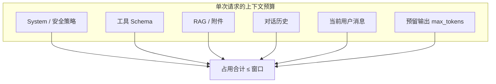

# 上下文窗口

一句话直觉：上下文窗口是模型「一次前向能看见」的 token 预算；超了不是变笨一点，而是被截断、拒识或静默丢信息。

## 直觉讲解

**Context window（上下文窗口）** 指单次推理中，模型可处理的 token 上限，通常包含：系统提示、工具/函数 schema、检索片段、对话历史、当前用户输入，以及（计费上）即将生成的输出预算。

直觉上把它当成**有限工作内存**：

- 不是无限聊天记录；  
- 不是「模型训练过的全世界知识」；  
- 是**这一次请求里显式放进序列的内容**。

长窗口（128k、200k+）降低了「塞不下」的频率，但带来新问题：注意力稀释、位置偏差（lost in the middle）、预填充（prefill）延迟与费用随输入近似线性上涨。

**「看见」≠「用好」**：窗口够大只保证物理上能进序列；是否被正确引用，取决于提示结构、检索质量与位置编排。

## 工作示例（数字/场景）

**预算表（示意，窗口 = 32k）**

| 槽位 | 分配 token | 说明 |
|------|------------|------|
| System + 安全 | 1.5k | 稳定前缀，适合缓存 |
| 工具定义 | 2.0k | 工具一多立刻膨胀 |
| RAG top-k | 12k | 最大变量 |
| 历史摘要/最近 N 轮 | 8k | 需滚动策略 |
| 当前问题 | 1k | |
| 输出预留 | 2k | 常被遗忘 |
| **合计** | **26.5k** | 仍留余量防尖刺 |

**场景：客服机器人「突然忘记订单号」**  
日志显示历史被从头部截断，最早的订单号消息被丢掉。根因不是模型坏了，是**FIFO 截断策略选错了优先级**。正确做法：结构化状态（订单号）进系统侧「状态块」，历史只留最近对话。

**场景：长 PDF QA**  
200 页 PDF 全塞 128k 窗口：TTFT 从 1s 级升到数秒甚至十秒级，且答案仍可能漏掉中间章节。更稳的是检索 + 引用，而不是「有长窗口就全塞」。

## 面试常问取舍

1. **更大窗口 vs 更好检索**  
   - 大窗口：实现简单、适合短文档全读。  
   - RAG：可扩展到百万字库，但有检索失败模式。多数企业知识库仍以检索为主、长窗为辅。

2. **截断策略：丢最旧 vs 丢中间 vs 摘要**  
   - 丢最旧：实现简单，易丢约束与 ID。  
   - 摘要：省 token，可能丢失关键数字。  
   - 状态外置（DB/会话对象）：工程成本高，生产最稳。

3. **输出预留要不要从窗口里扣？**  
   - 要。很多「生成到一半断掉」是 `input + max_tokens > limit`。

4. **长上下文模型是否取代 RAG？**  
   - 产品叙事上常被夸大。FDE 回答：互补——热数据/短文档可全进窗；冷数据/大库仍检索；并监控「中间丢失」类错误。

## FDE 现场怎么用

- 画一张**上下文预算表**进设计文档，数字比口号管用。  
- 关键模型先做：同一业务轨迹的 token 占用对比 + TTFT 对比。  
- 给关键实体（用户 ID、工单号、权限角色）独立「状态通道」，不依赖模型记忆。  
- 超窗告警：在网关层拒绝或降级，而不是让供应商静默截断。  
- Demo 时主动展示「塞满 vs 检索」的延迟与正确率对比，管理客户预期。

## 与本库其他篇的链接

- 概念：[01-Tokenization与Token](./01-Tokenization与Token.md)、[16-KV-Cache](./16-KV-Cache.md)、[22-推理时计算Inference-Time-Compute](./22-推理时计算Inference-Time-Compute.md)  
- 面试题：[1.什么是上下文窗口](../../09-面试题/1.LLM和AI基础/1.什么是上下文窗口.md)、[12.超出上下文窗口](../../09-面试题/1.LLM和AI基础/12.超出上下文窗口.md)、[16.rag系统上下文组装](../../09-面试题/1.LLM和AI基础/16.rag系统上下文组装.md)

## 深入：预算治理与长上下文误区

### 位置编排实务
即使窗口够大，模型对序列中部指令的遵循也可能变弱。实务编排建议：
- **硬约束**（安全、权限、输出契约）放系统区且保持短；
- **检索证据**用列表/编号，避免大段散文；
- **当前任务**靠近用户消息末尾再重申一次成功标准；
- **历史**优先保留结构化状态，其次才是原话。

### 「静默截断」危险
某些栈在超限时截断最早内容且不报错。表现是偶发忘设定。防护：
- 网关侧预检 token；
- 超限返回明确错误码给应用层；
- 应用层决定摘要、拒答或升窗模型。

### 多租户下的窗口策略
同一助手服务多个客户时，系统提示可能不同。不要假设共享 128k 就可以把所有客户手册常驻；应按租户加载，并计量前缀缓存隔离。

### 评测集设计
长上下文评测至少含三类：
1. Needle：随机位置插入事实再询问；
2. 多跳：答案需两处证据；
3. 抗干扰：大量无关条文夹杂。

只做「能塞进去」的 demo，不足以支撑采购决策。

### 与输出预留的交互
`max_output_tokens` 过大时，看似「窗口很大」仍可能无法放下完整输入。产品上应暴露「还可输入约 N token」而不是「还可以打字」。

## 课堂小结

窗口是工作内存，不是永久记忆。交付时同时管理硬窗口、有效窗口与输出预留；状态外置优先于赌超长上下文。与 RAG、KV Cache、截断策略联动设计，才能避免「偶发失忆」类事故。

## 参考与来源

- 原创综述：强调预算表、截断优先级与「看见≠用好」。  
- Liu et al., *Lost in the Middle*, 2023.  
- 各模型卡片中的 context length / max output 官方说明。  
- Anthropic / OpenAI / Google 关于长上下文的公开博客与 API 文档（以最新版为准）。
