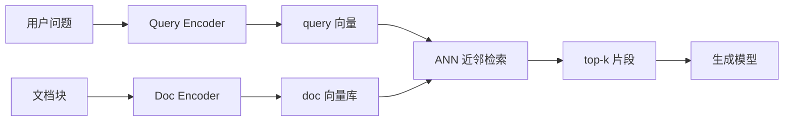

# Embedding 与向量表示

一句话直觉：Embedding 把文本（或图、音）变成可算距离的向量，让「意思相近」变成「空间里靠近」——它是语义检索与聚类的底座，不是生成答案本身。

## 直觉讲解

**Embedding（嵌入 / 向量表示）** 是一个映射 \(f(x) \rightarrow \mathbb{R}^d\)：把离散对象压到固定维实数向量。训练目标通常让语义相近的样本在某种相似度（余弦、点积、L2）下更接近。

在 GenAI 系统里常见角色：

| 用途 | 做法 | 注意 |
|------|------|------|
| 语义检索 | query 与 doc 同空间近邻 | 非对称双塔 vs 对称 |
| RAG | 召回候选再交 LLM | 召回差则生成再强也救不了 |
| 聚类/去重 | 向量距离阈值 | 阈值依赖域 |
| 路由/护栏 | 意图向量分类 | 可解释性弱于规则 |
| 缓存键 | 语义相似命中 | 见「语义缓存」篇 |

**点积 / 余弦** 既出现在检索打分里，也是 Attention 里 Q·K 的亲戚——都是「对齐程度」的几何故事，但训练目标与尺度不同，不要混为一谈。

维度 \(d\)（如 384/768/1024/3072）影响存储与速度；更高维不自动等于更好——取决于模型和微调数据。

## 工作示例（数字/场景）

**场景：企业 Wiki RAG**

- 语料 50 万块，每块平均 500 token，embedding 模型输出 768 维 float32。  
- 存储粗估：\(5\times10^5 \times 768 \times 4\) ≈ 1.5 GB（未计索引结构）。  
- 若改 int8 量化，体量约降到 1/4，需回归召回率。

**非对称检索**：问题短、文档长时，用「问题–段落」对训练的双塔，往往优于拿同一句向量模型硬套。若只有通用对称模型，可对 document 做 title + summary 再 embed。

**失败模式数字直觉**：召回@5 = 60% 时，后面 LLM 再「聪明」，端到端正确率也很难稳定超过这条天花板（除非模型靠参数记忆补全——那又引入幻觉与过时风险）。

## 面试常问取舍

1. **通用 embedding vs 领域微调**  
   - 通用：快上线。  
   - 微调/领域模型：专有名词、内部代号更稳，但要维护与版本对齐。

2. **稀疏检索（BM25）vs 稠密向量 vs 混合**  
   - BM25：精确关键词、SKU、错误码强。  
   - 向量：同义改写强。  
   - 混合 + 重排：多数生产默认答案。

3. **切块大小**  
   - 太短：缺上下文；太长：噪声大、向量「平均掉」主题。  
   - 常见从 200–800 token 做网格搜索，用业务查询集评估。

4. **相似度阈值做缓存/去重**  
   - 过高：该命中未命中；过低：错误复用答案。必须按意图分层阈值。

## FDE 现场怎么用

- 先交付 **评测集**（50–200 条真实问法），再谈模型品牌。  
- 索引与 embedding 模型版本绑定；换模型 = 全量重嵌，写入运维手册。  
- 对「ID/错误码/精确专名」查询强制混合检索，避免纯向量翻车。  
- 监控：空召回率、人工点踩、top-1 文档点击率。  
- 向客户解释：embedding 负责「找得到」，LLM 负责「写得清」——两段指标分开看。

## 与本库其他篇的链接

- 概念：[05-Attention与Self-Attention](./05-Attention与Self-Attention.md)、[12-微调vs-RAG-vs-Prompt](./12-微调vs-RAG-vs-Prompt.md)、[28-Prompt缓存与语义缓存](./28-Prompt缓存与语义缓存.md)  
- 面试题：[6.什么是embedding语义搜索](../../09-面试题/1.LLM和AI基础/6.什么是embedding语义搜索.md)、[7.点积是注意力机制与嵌入向量中的相似度得分](../../09-面试题/1.LLM和AI基础/7.点积是注意力机制与嵌入向量中的相似度得分.md)、[13.rag搜索准确性](../../09-面试题/1.LLM和AI基础/13.rag搜索准确性.md)

## 深入：索引、重排与评测

### 双塔与交互重排
召回阶段追求召回率与速度（ANN）；重排阶段可用交叉编码器或小 LLM 打分，提高精确率。典型漏斗：
1. BM25 + 向量各取 50；
2. 融合到 30；
3. 重排到 5；
4. 交生成模型。

重排一贵，就只对候选集跑——这是成本控制关键。

### 版本与漂移
文档更新后，旧向量变成「谎言索引」。需要：
- 文档 `content_hash`；
- 变更增量重嵌；
- 查询侧监控「点击后否定」反馈。

### 多模态向量
图文统一空间可做以图搜文。但企业单据场景里，OCR 文本向量往往比「整图向量」更稳。先定任务再选模态。

### 负例与困难样本
微调 embedding 时，随机负例太易，模型学不会区分近义政策。应用挖掘困难负例（同产品不同条款）。

### 上线门禁指标
- Recall@k、nDCG
- 空结果率
- 延迟 P95（含 ANN）
- 与业务正确率的联动（端到端）

没有门禁的「换了更火的 embedding 模型」常是空忙。

## 深入：何时该微调向量模型

当内部代号、SKU、故障码在通用空间里互相干扰，或同义问法召不回时，考虑域内对比学习微调。微调前先保证：
- 有查询–好文档–坏文档三元组；
- 与生成模型评测隔离；
- 接受全量重嵌成本。

若问题只是「关键词精确匹配差」，先加 BM25 往往比微调便宜。

## 课堂小结

Embedding 负责找得到，不负责写得对。混合检索、重排、版本化索引与评测门禁，是 FDE 把「语义搜索」做成可运营系统的最小闭环。

## 参考与来源

- 原创综述：检索–生成分工与生产取舍。  
- Reimers & Gurevych, *Sentence-BERT*, 2019.  
- Karpukhin et al., *Dense Passage Retrieval (DPR)*, 2020.  
- Facebook AI / 社区 Faiss、各云向量库公开文档。
