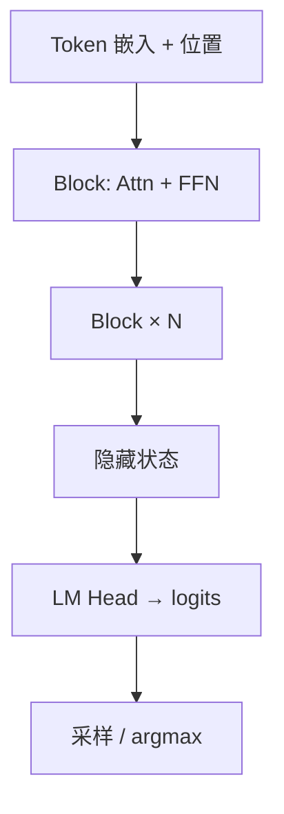

# Transformer 直觉

一句话直觉：Transformer 用「可并行的注意力」让序列里每个位置都能直接对齐其他位置，叠多层后形成可训练的上下文表征，再接到预测头上。

## 直觉讲解

**Transformer**（Vaswani et al., 2017）用 **Self-Attention + 前馈网络（FFN）** 堆叠，取代了此前 RNN 逐步传递的主路径。对 LLM 而言，常见是 **Decoder-only**：因果掩码（causal mask）保证位置 \(t\) 只能看 \(\le t\) 的 token，从而做下一词预测。

一层里的主干直觉：

1. 每个 token 先变成向量（embedding + 位置信息）。  
2. **Attention** 混合「我该听谁」的信息。  
3. **FFN** 在每个位置上做非线性变换（可理解为 token 级 MLP）。  
4. 残差与 LayerNorm 让深层可训。  
5. 顶层输出 logits → 词表分布。

和 RNN 对比（面试高频）：

| 维度 | RNN/LSTM | Transformer |
|------|----------|-------------|
| 并行训练 | 难（时序依赖） | 训练时可并行（有掩码） |
| 长程依赖 | 易衰减 | 直连任意位置（复杂度另说） |
| 推理解码 | 逐步 | 仍逐步生成，但预填充可并行 |
| 实现生态 | 经典 | 当前 LLM 主流 |

「直连」有代价：标准注意力对序列长度 \(n\) 是 \(O(n^2)\) 内存/算力量级，这正是长上下文贵、需要 KV cache / 稀疏注意力等工程的根源。

## 工作示例（数字/场景）

**深度与宽度**：7B 级模型常见几十层、隐藏维数千、多头注意力。参数量大致来自：注意力投影、FFN（往往占大头）、词表矩阵。

**预填充 vs 解码**（与现场延迟强相关）：

- Prefill：一次吃进已有 prompt，算完整注意力，出第一个 token —— 决定 **TTFT**。  
- Decode：每步只追加一个 token，复用 KV —— 决定 **tokens/s**。

**场景：为何「提示很长就慢」**  
不是网络差，而是 prefill 随输入 token 变重；若再每次请求重算共享前缀，没有前缀缓存就会重复付钱与等待。

## 面试常问取舍

1. **Encoder-only / Decoder-only / Encoder-Decoder**  
   - Encoder-only（BERT 类）：双向上下文，适合理解与分类。  
   - Decoder-only：生成主流。  
   - Seq2Seq：翻译、昔日 T5 路线；现在许多任务被 decoder-only + 指令化覆盖。

2. **更深 vs 更宽 vs 更多数据**  
   - 见 Scaling Laws；现场更常被问「为何不直接上更大模型」——还要看延迟、成本、部署约束。

3. **全注意力 vs 高效变体**  
   - 全注意力：实现简单、质量基线。  
   - 滑动窗口 / 稀疏 / 线性注意力：换长度与速度，可能伤质量，需评测。

## FDE 现场怎么用

- 向非ML客户画「预填充 / 解码」两段，比堆名词有效。  
- 选型时问清：权重格式、上下文长度、是否支持前缀缓存、吞吐曲线。  
- 性能事故先分类：是 prefill（输入过长/未缓存）还是 decode（模型太大/输出太长）。  
- 不需要在客户会议推导矩阵公式；需要能指出瓶颈落在哪一类算子。

## 与本库其他篇的链接

- 概念：[05-Attention与Self-Attention](./05-Attention与Self-Attention.md)、[06-RoPE与位置编码](./06-RoPE与位置编码.md)、[16-KV-Cache](./16-KV-Cache.md)、[26-自回归解码](./26-自回归解码.md)  
- 面试题：[3.从头到尾梳理transformer](../../09-面试题/1.LLM和AI基础/3.从头到尾梳理transformer.md)、[2.大语言模型生成回复时发生什么](../../09-面试题/1.LLM和AI基础/2.大语言模型生成回复时发生什么.md)

## 深入：模块角色与工程映射

### FFN 为何参数多
在许多 LLM 里，FFN 维度是隐层的数倍，参数占比常超注意力。MoE 主要替换的也是 FFN 专家。理解这一点，有助于听懂「激活参数」叙事。

### 残差的产品含义
残差连接让深层可训，也意味着信息可以「抄近路」保留。提示中的明确字段若被噪声淹没，仍可能在表层被忽略——结构清晰的输入比更深的模型有时更管用。

### 训练目标与推理行为
因果 LM 训练「猜下一词」，并不会内建「先检索再回答」；那是系统工程加的。别把预训练目标神话成产品行为保证。

### 从模块映射到故障
| 现象 | 优先怀疑 |
|------|----------|
| 首字极慢 | Prefill / 长输入 / 无前缀缓存 |
| 后续字慢 | 模型宽度、显存带宽、并发 |
| 突然忘前文 | 截断、窗口、位置外推 |
| 格式不稳 | 解码参数、缺约束 |

### 讲解话术模板（给业务）
「模型像一个只看本页草稿的写作者：你塞进页里的材料它才能用；页有长度上限；它一次写一个词，所以写得越长越慢。」

## 深入：Encoder-Decoder 还在吗

机器翻译与部分语音/视觉系统仍见 Encoder-Decoder。但对纯文本助手，Decoder-only + 指令微调已成为默认。选型时不必教条，看任务：需要强双向编码的嵌入模型与生成模型可以分离部署。

### 参数量粗估话术
「词表矩阵 + L 层（注意力投影 + FFN）」——够向业务解释「为什么 70B 比 7B 贵且慢」，无需现场展开公式。

## 课堂小结

Transformer 提供可并行训练的上下文融合骨架；线上痛点多落在预填充、解码与内存，而不是「有没有注意力这个词」。能把现象映射到阶段，就已经具备 FDE 排障语汇。

## 补充场景：从论文图到服务链路

把 Transformer 画进客户架构师白板时，建议三层：
1. **训练侧**：海量文本 → 下一词目标 → 得到通用权重；
2. **对齐侧**：SFT/RLHF 等 → 得到可对话检查点；
3. **服务侧**：Tokenizer → Prefill → Decode → 流式返回。

客户真正付费与投诉发生在第 3 层。因此 FDE 讲解应快速穿过第 1–2 层名词，把时间留给：批次、缓存、限流、超时与降级。

### 小练习
任选一次线上慢请求，标注：输入 token、输出 token、TTFT、解码时长。若无法从日志取出这四项，先补可观测性，再谈换模型。

| 观测字段 | 用途 |
|----------|------|
| model_id | 版本钉扎 |
| input_tokens | 预填充与费用 |
| output_tokens | 解码与费用 |
| ttft_ms | 体感与缓存 |
| cache_hit | 前缀是否命中 |

## 参考与来源

- 原创综述：服务 FDE 的系统直觉与延迟分解。  
- Vaswani et al., *Attention Is All You Need*, 2017.  
- Radford et al., GPT 系列论文；Touvron et al., LLaMA 系列技术报告。  
- 公开课程与框架文档中的 Transformer 实现说明（PyTorch / 推理引擎）。
