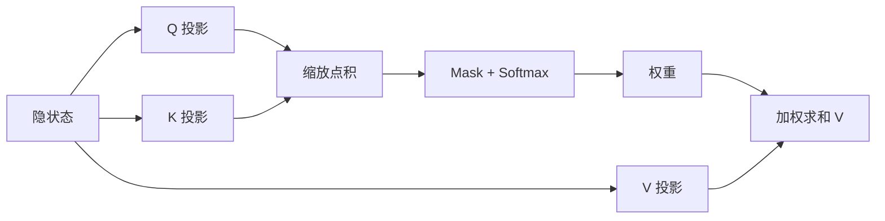

# Attention 与 Self-Attention

一句话直觉：Attention 用「查询去对齐键、再加权值」决定每个位置该听谁；Self-Attention 的 Q/K/V 都来自同一序列。

## 直觉讲解

**Attention（注意力）** 的计算骨架：

\[
\mathrm{Attention}(Q,K,V)=\mathrm{softmax}\left(\frac{QK^\top}{\sqrt{d_k}}\right)V
\]

- **Query（Q）**：我在找什么。  
- **Key（K）**：我有什么可被对齐的标签。  
- **Value（V）**：对齐之后真正混合的内容。  
- \(\sqrt{d_k}\)：缩放，避免点积过大导致 softmax 饱和。

**Self-Attention（自注意力）**：\(Q,K,V\) 由同一层输入线性变换得到。  
**Cross-Attention**：\(Q\) 来自一侧（如解码器），\(K,V\) 来自另一侧（如编码器/图像特征）——多模态与经典 Seq2Seq 常见。

**Multi-Head Attention（多头注意力）**：切成多个子空间并行做注意力，再拼回，让模型同时捕捉不同关系类型（句法、指代、最近实体等——这是解释性说法，非严格可分）。

因果解码里加 **mask**：未来位置的注意力权重置为 \(-\infty\)，softmax 后为 0，保证自回归合法。

与 embedding 检索的类比：都是相似度加权；差别在于注意力在每一层、每个样本内动态算，检索是库外静态近邻。

## 工作示例（数字/场景）

**复杂度直觉**：序列长 \(n=4k\)、头数与维固定时，注意力分数矩阵量级约 \(n\times n\)；\(n\) 从 4k 到 128k，仅此一项就可差数量级，这就是长上下文贵的数学来源之一。

**指代消解场景**：句子「把 *它* 寄到账单地址」。上层注意力往往把「它」对齐到先前的「包裹/订单」。若关键先行词被截断出窗口，模型只能猜——表现为幻觉或错实体。

**多工具调用**：模型需要在 schema 字段名与用户口语间对齐；注意力负责这种跨段对齐，但若 schema 巨长且噪声字段多，对齐更容易偏——所以工具集要剪枝。

## 面试常问取舍

1. **点积注意力 vs 加性注意力**  
   - 点积：高度优化、硬件友好，是主流。  
   - 加性：早期常见，现较少作 LLM 默认。

2. **更多头一定更好吗？**  
   - 不必然；头数与头维、总宽度联动，需整体缩放，而非只加头。

3. **可视化注意力能否当解释？**  
   - 可作直觉，不可当法律级归因；生产解释更靠引用文档、日志与中间约束。

4. **Softmax 注意力 vs 线性注意力近似**  
   - 精确 softmax 质量稳；近似换长度与速度，任务敏感。

## FDE 现场怎么用

- 客户问「模型怎么知道该看哪」：用 QKV 一句话 + 截断导致看不见的例子。  
- 优化上下文：把关键字段放在更易被引用的结构位置（列表、XML/JSON 字段），减少散文噪声。  
- 长上下文方案评估：除准确率外，看 prefill 时延与 $/请求。  
- 与检索联调：注意力不能补救「根本没检索进来的事实」。

## 与本库其他篇的链接

- 概念：[03-Embedding与向量表示](./03-Embedding与向量表示.md)、[04-Transformer直觉](./04-Transformer直觉.md)、[06-RoPE与位置编码](./06-RoPE与位置编码.md)  
- 面试题：[7.点积是注意力机制与嵌入向量中的相似度得分](../../09-面试题/1.LLM和AI基础/7.点积是注意力机制与嵌入向量中的相似度得分.md)、[3.从头到尾梳理transformer](../../09-面试题/1.LLM和AI基础/3.从头到尾梳理transformer.md)

## 深入：多头、掩码与系统后果

### 头间分工是解释不是保证
可视化里常见「某头对齐引号/括号」，有教学价值，但不可写成合规审计依据。交付解释应依赖引用片段与工具日志。

### 因果掩码与双向模型
Decoder-only 用因果掩码；若你用双向编码器做检索，它看全句，这是另一类模型。混用时注意：embedding 模型与生成模型的「看见范围」不同。

### 软注意力的均分问题
当证据很多且相似，softmax 可能把权重摊薄，关键句得不到足够质量。缓解：少而精的检索、重排、或把关键句提升到指令区复述。

### 与安全的关系
提示注入常试图在用户区写入「高权重」指令。注意力本身不区分信任级——**信任边界要靠系统架构**（工具鉴权、指令分层），不能指望模型「自己分清」。

### 计算优化地图（概念）
- FlashAttention 类：减少内存读写
- KV 量化：减缓存
- 稀疏/窗口注意力：减 n²
- 线性注意力近似：换质量风险

选型跟推理引擎能力，不自造内核。

## 深入：Cross-Attention 在企业场景

在经典绘本式讲解之外，企业里更常见的 cross-attn 是：
- 多模态：文本 Query 对齐图像 Key/Value；
- 旧式 RAG 研究架构：解码器交叉注意检索编码器。

现代 RAG 多为「拼接进上下文 + Self-Attention」，实现简单。若听到客户提 cross-attn RAG，问清是否有定制结构，避免假设都是拼接法。

## 课堂小结

Attention 是动态选择信息源的几何机制；系统后果是平方复杂度、截断即失明、以及不可单独充当安全边界。与检索、窗口、KV 三篇对照阅读效果最好。

## 补充场景：长工具列表下的注意力稀释

当工具数量从 5 增到 40，schema 文本膨胀，模型更易选错工具或编造参数名。治理：
- 按意图动态挂载工具子集；
- 工具名与描述保持短而可区分；
- 用允许列表在服务端再鉴权。

这说明 Attention「能看全局」不等于「在噪声全局里选得对」。

### 与点积检索的对比表

| 项目 | Self-Attention | 向量检索 |
|------|----------------|----------|
| 作用域 | 单次序列内 | 外部语料库 |
| 是否动态 | 每层每步 | 查询时一次 |
| 失败模式 | 稀释/截断 | 召回缺失 |
| 治理 | 减噪、结构化 | 混合检索/重排 |

## 参考与来源

- 原创综述：几何直觉 + 工程后果。  
- Vaswani et al., *Attention Is All You Need*, 2017.  
- Bahdanau et al., 加性注意力经典工作（NMT）。  
- 关于注意力解释性的批判性论文与博客（提醒勿过度解读）。
