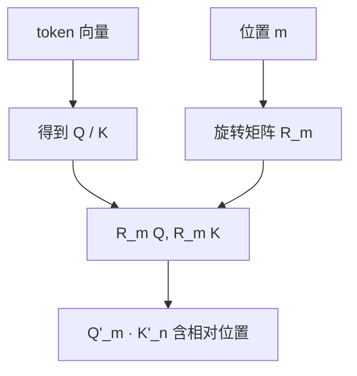

# RoPE 与位置编码

一句话直觉：没有位置信息，Self-Attention 会把序列当成「词袋」；RoPE 用旋转把相对位置写进 Q/K，让模型既知远近，又利于外推与实现。

## 直觉讲解

Transformer 的点积注意力本身对位置置换近似不敏感（在无位置项时）。因此需要 **Positional Encoding（位置编码）**，告诉模型「谁在前、谁在后、相距多远」。

常见流派：

| 类型 | 代表 | 直觉 |
|------|------|------|
| 绝对正弦/余弦 | 原版 Transformer | 每个位置加固定向量 |
| 可学习绝对位置 | 早期 BERT/GPT | 位置 embedding 表 |
| 相对位置偏置 | T5、部分变体 | 注意力logits加相对距离偏置 |
| **RoPE** | LLaMA、多数现代开源 LLM | 旋转 Q/K，内积含相对位置 |

**RoPE（Rotary Position Embedding，旋转位置编码）** 核心想法：把 Q、K 向量两两分组，按位置角 \(\theta\) 做二维旋转。位置 \(m\) 与 \(n\) 的 Q·K 只依赖相对距离 \(m-n\)（在理想形式下），从而自然表达相对位置。

为何工程上受欢迎：

- 实现可与矩阵乘融合，推理友好；  
- 对长度外推有一系列扩展（NTK-aware、YaRN、位置插值等）；  
- 与因果 LM 生态契合，成为开源默认之一。

**外推（extrapolation）**：训练最大长度 4k，推理跑 32k——不是免费午餐。RoPE 基频、插值策略、续训数据都会影响「变长后是否崩」。现场应看模型卡的「训练长度 / 声称长度 / 有效长度」。

## 工作示例（数字/场景）

**场景 1：长合同审查**  
模型卡写 128k，但质量评测在 16k 后引用准确率明显掉档。你应向客户区分：

- *硬窗口*：API 不报错的最大 token；  
- *有效窗口*：关键任务指标仍可接受的长度。

**场景 2：从 Model A（RoPE）迁到 Model B（另一套位置方案）**  
同一套「把重要指令放在末尾」的提示技巧，效果可能变化；迁移时要重做长文与「中间放置关键句」测试（lost in the middle）。

**场景 3：位置插值上线**  
团队用线性插值把 4k 推到 16k，基准 QA 尚可，但代码补全在文件后部错位。说明外推问题是**任务相关**的，不能只跑一种评测。

数字直觉（示意）：若注意力对相对距离的敏感度被插值「压扁」，模型可能更难区分「相距 10」与「相距 1000」，表现为长程依赖题准确率下降。

## 面试常问取舍

1. **绝对位置 vs 相对位置 / RoPE**  
   - 绝对：直观、早年常见，长窗外推弱。  
   - RoPE/相对：更契合「相对距离很重要」的语言结构，现代 LLM 主流。

2. **直接宣称超长上下文 vs 续训 + 严谨评测**  
   - 前者适合营销；交付要看针织测试（needle-in-haystack）、真实文档任务、以及中后部放置。

3. **ALiBi 等偏置方案 vs RoPE**  
   - 都可做长度外推叙事；选型跟随权重生态与推理栈支持，而不是抽象谁「更正确」。

4. **要不要在应用层模拟位置（重复提示、滑动窗口）？**  
   - 应用层滑窗是工程补偿；与模型位置编码是不同层。该滑窗时滑窗，别指望提示术改写 RoPE。

## FDE 现场怎么用

- 读模型卡时记录：位置类型、训练长度、官方推荐最大长度、是否有 YaRN/NTK 等标记。  
- 长文档方案评审强制包含「有效长度」评测，而不是只看广告数字。  
- 换底座模型时，把长上下文回归列入发布门禁。  
- 向客户解释失败时：可用「尺子刻度被拉伸」类比插值副作用，避免空谈数学。  
- 与 RAG 分工：超过有效长度的知识，优先检索，而不是赌超长窗。

### 补充：和 KV Cache、推理的关系

位置编码作用在 Q/K 上，缓存的是已算好的 K/V（含位置影响后的结果）。解码新 token 时只对当前位置施加旋转。这解释了为何「前缀固定」可缓存，而任意插入中间文本会破坏后续位置对齐——插入等于改写后方所有相对位置关系。

### 补充：多模态中的位置

VLM 里图像 patch 也有二维位置方案（可分离 RoPE、2D 插值等）。图像分辨率一变，patch 序列长度变，位置策略是否稳健会直接影响「看图指哪打哪」。做多模态 PoC 时，分辨率与裁剪策略要冻结进实验记录。

## 与本库其他篇的链接

- 概念：[04-Transformer直觉](./04-Transformer直觉.md)、[05-Attention与Self-Attention](./05-Attention与Self-Attention.md)、[02-上下文窗口](./02-上下文窗口.md)、[23-多模态与VLM](./23-多模态与VLM.md)  
- 面试题：[1.什么是上下文窗口](../../09-面试题/1.LLM和AI基础/1.什么是上下文窗口.md)、[12.超出上下文窗口](../../09-面试题/1.LLM和AI基础/12.超出上下文窗口.md)

## 深入：Needle 测试的正确打开方式

Needle-in-haystack 能暴露「是否还找得到」，但不能替代业务文档任务。补充：
- 多针：两个事实都要引用；
- 对抗针：相似干扰项；
- 生成负荷：找到后还要计算/比较。

若销售只用单针绿色热力图推销 1M 上下文，FDE 应要求业务任务复测。

## 课堂小结

位置编码让序列有序；RoPE 用相对旋转成为当代默认。交付只认有效长度与任务指标，不认广告窗口。

## 补充：外推方法的产品沟通

当你说「我们启用了 YaRN/NTK 扩展」时，业务听不懂。应翻译为：
- 训练长度；
- 现网允许长度；
- 超过后质量降级策略（拒答/摘要/检索）。

把三个数字写进运行手册，比写进技术雷达重要。

### 检查表
- [ ] 训练长度来源（模型卡）
- [ ] 内部有效长度评测结论
- [ ] 超长请求的产品行为
- [ ] 位置策略变更的回归集

## 参考与来源

- 原创综述：相对位置直觉、有效长度与交付评测。  
- Su et al., *RoFormer: Enhanced Transformer with Rotary Position Embedding*, 2021.  
- Press et al., *ALiBi*（Train Short, Test Long 相关思想）。  
- 开源模型技术报告中关于 context extension / YaRN / NTK-aware 的章节。  
- Liu et al., *Lost in the Middle*（长上下文利用问题）。
