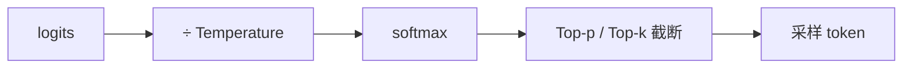

# Temperature、Top-p 与采样

一句话直觉：模型先给出词表上的概率分布；Temperature 与 Top-p 决定你从这盘菜里「多冒险还是多保守」地夹下一筷子。

## 直觉讲解

自回归每一步产出 **logits**，经 softmax 成概率分布 \(P(w)\)。解码策略决定如何抽下一个 token：

| 策略 | 做什么 | 典型用途 |
|------|--------|----------|
| Greedy | 每次取 argmax | 抽取、分类、稳定字段 |
| Temperature | 用 \(T\) 缩放 logits 再 softmax | 调「平滑/尖锐」 |
| Top-k | 只保留概率最高 k 个再归一化 | 截断长尾 |
| **Top-p（nucleus）** | 保留累计概率达 p 的最小集合 | 自适应截断长尾 |
| Beam search | 保留多条候选序列 | 传统 MT；聊天少用 |

**Temperature（温度）**：

- \(T \to 0\)：分布更尖，接近贪心，重复风险↑、创意↓。  
- \(T = 1\)：保持模型原始分布（相对而言）。  
- \(T > 1\)：更平，多样性↑，胡言与离题风险↑。

**Top-p**：按概率从高到低累加，直到质量达到 p（如 0.9），丢掉长尾「怪词」。它比固定 top-k 更适应「有时分布很尖、有时很平」的步骤差异。

二者常组合：先温度缩放，再 nucleus 截断。不同厂商默认值不同，**不要假设跨 API 默认一致**。

## 工作示例（数字/场景）

**场景 A：发票字段抽取**  
要稳定 JSON：`temperature=0`（或极低）+ 强 schema / 约束解码。若 \(T=0.9\)，同一发票可能抽到两种日期格式，下游解析抖动。

**场景 B：营销文案三选一**  
\(T=0.8\)–\(1.0\)，`n=3` 候选，用规则或小模型重排。此处多样性是功能，不是缺陷。

**场景 C：客服话术**  
中等温度（如 0.3–0.5）避免机械重复，但工具参数字段仍应低温或单独结构化调用。

**对比实验（示意）**：同一提示跑 50 次：

| 配置 | 唯一答案比例 | 格式违规 | 主观新鲜度 |
|------|--------------|----------|------------|
| T=0 | ~95%+ | 低 | 低 |
| T=0.7, p=0.9 | 中 | 中 | 中 |
| T=1.2, p=1.0 | 低 | 高 | 高但不稳定 |

生产要的是「任务指标」，不是「看起来聪明」。

## 面试常问取舍

1. **只要 T=0 是否就完全确定？**  
   - 多数情况更稳定，但实现层浮点、并行、稀有 race、或厂商未严格 greedy，仍可能极低概率差异。关键链路要幂等键与结果缓存。

2. **Top-p 与 Temperature 哪个先调？**  
   - 先定任务要不要多样性；要稳定则降 T 并考虑约束解码；要创意再交替扫 T 与 p，用固定评测集。

3. **Beam search 为何聊天少用？**  
   - 贵、偏安全套话、与聊天多样性目标冲突；结构化生成也逐渐被约束解码/JSON mode 替代。

4. **高 T「更聪明」吗？**  
   - 不。T 不增加知识，只改变采样 entropies。难题应靠更好模型、工具、RAG 或推理时计算，而不是加热。

## FDE 现场怎么用

- 配置按**路由分任务**：抽取/工具调用低温；头脑风暴高温。  
- 把采样参数打进可观测性字段，复现线上「偶发胡话」。  
- PoC 阶段用同一随机种子（若 API 支持）做对比，避免口头争论。  
- 与产品经理对齐：稳定性 SLA 优先时，多样性是受控开关而非默认。  
- 文档中写清默认值来源（厂商默认 vs 我们覆盖）。

### 频率惩罚与存在惩罚

部分 API 提供 `frequency_penalty` / `presence_penalty` 抑制重复。它们与 T/p 正交：重复回路（「是的是的是的」）可先加轻微惩罚，再考虑改提示。过度惩罚会伤专有名词复现——法律与医疗文本要小心。

### 与 max_tokens、stop 的协作

采样再花也会在 `stop` 或长度上限处停。现场常见 bug：温度很高 + 很大 `max_tokens` + 弱停止条件 = 费用暴涨。要对齐：停止词、结构化结束、以及网关级输出封顶。

## 与本库其他篇的链接

- 概念：[08-约束解码Constrained-Decoding](./08-约束解码Constrained-Decoding.md)、[26-自回归解码](./26-自回归解码.md)、[30-结构化输出与Schema校验](./30-结构化输出与Schema校验.md)  
- 面试题：[5.解释temperature和top-p](../../09-面试题/1.LLM和AI基础/5.解释temperature和top-p.md)、[18.JSON破坏模式问题](../../09-面试题/1.LLM和AI基础/18.JSON破坏模式问题.md)

## 深入：A/B 时如何控制变量

比较采样参数时固定：
- 模型版本与种子（若可得）；
- 提示与工具定义；
- 评测集；
- 温度扫参步长（如 0/0.3/0.7）。

一次只动一个旋钮。业务侧「手感」可记录，但不进发布门禁。

### 与安全采样
有些栈对敏感类别强制降温度或改安全模型。你在应用层设 T=1.0，实际可能被覆盖——排障时看完整响应元数据。

## 课堂小结

采样旋钮改变的是分布形状与多样性，不增加知识。按任务路由参数，并用评测说话，是专业与业余的分界。

## 补充：参数预设模板

| 场景 | temperature | top_p | 备注 |
|------|-------------|-------|------|
| 字段抽取 | 0–0.2 | 1 或 0.9 | 配 Schema |
| 客服答复 | 0.3–0.5 | 0.9 | 防重复可加轻微惩罚 |
| 创意文案 | 0.8–1.0 | 0.9–1.0 | 多候选重排 |
| 代码生成 | 0.1–0.4 | 0.9 | 单测为王 |
| 数学题 | 0–0.3 | 0.9 | 或走工具 |

模板仅起点，需用金标校准。禁止全站一个全局温度。

## 参考与来源

- 原创综述：任务导向的采样参数取舍。  
- Holtzman et al., *The Curious Case of Neural Text Degeneration*（nucleus sampling）, 2020.  
- 各厂商 Chat Completions / Messages API 参数文档。  
- 公开评测中关于 decoding 对数学/代码任务影响的讨论。
