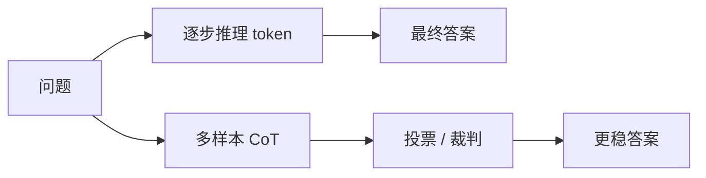

# 思维链 CoT

一句话直觉：CoT 让模型先写「可检查的中间推理」，再给结论——常能抬高多步推理正确率，但也会暴露过程、增加 token 与延迟。

## 直觉讲解

**Chain-of-Thought（思维链，CoT）** 指促使模型产出中间推理步骤，而非直接跳到答案。经典触发：「逐步思考」「let's think step by step」；更稳的是**结构化步骤模板**（先列已知、再列公式、再计算、再检查单位）。

为何有效（直觉）：多步题需要工作记忆；把步骤写出来，相当于在上下文里外置草稿，减少一步跳变错误。这也与「推理时计算」相关：多花生成 token，换更高正确率。

变体光谱：

| 变体 | 要点 |
|------|------|
| Zero-shot CoT | 一句话激发步骤 |
| Few-shot CoT | 示范带步骤的例子 |
| Self-Consistency | 多样本推理投票 |
| Least-to-Most | 题拆子题 |
| 隐藏/摘要 CoT | 内部想、对外只给结论（产品常要） |

注意：步骤**看起来像推理**不等于逻辑正确；流畅的错步是高危失败模式。关键业务要验算、工具或符号执行。

## 工作示例（数字/场景）

**场景：返利计算**  
政策：满 1000 返 10%，会员多 5%，运费不参与。  
无 CoT：模型常漏「运费除外」。  
带检查清单 CoT：先分离商品额与运费，再算——错误率下降（以你们金标集为准）。

**成本**：平均多生成 300–800 token 推理。若 QPS 高，费用与延迟显著。可对「简单题」关掉 CoT，路由器见专篇。

**场景：对外用户是否展示过程**  
B2C 展示长推理可能泄露策略或显得不可信；可内部 CoT、外部短答 + 引用。合规行业更要小心过程文本落日志。

**Self-Consistency 示意**：T=0.7 采 5 条推理，多数票选答案；数学题常升点，但费用×5。适合离线或高价值交易，不适合每次闲聊。

## 面试常问取舍

1. **CoT 是否总是更好？**  
   - 否。分类、抽取、短事实问答可能无增益甚至更吵。按任务开关。

2. **过程公开 vs 隐藏**  
   - 公开：可解释、可调试。  
   - 隐藏：安全与体验。可用「结论 + 可验证依据」代替满屏内心独白。

3. **CoT vs 工具调用**  
   - 算术、库查询、编译，优先工具；CoT 负责规划与编排。

4. **与微调关系**  
   - 可用带步骤的数据微调「安静地更好推理」；仍要防学到虚假步骤文风。

## FDE 现场怎么用

- 评测集分成「需推理 / 不需推理」，分别报分。  
- 高价值链路：CoT + 校验器（公式、单位、阈值）。  
- 延迟敏感链路：默认直接答，疑难再触发「慢思考」二次调用。  
- 日志策略：推理字段加密或截断，满足合规。  
- Demo 慎重展示丑陋或错误的中间步——会打击客户信任。

### 写好 CoT 提示的实务

- 要求**编号步骤**，最后单独一行 `ANSWER:`。  
- 要求显式列出假设；假设不足则问清，而不是硬算。  
- 对表格题，要求先抄关键单元格再算，减少抄错。  
- 禁止「因为我是 AI所以」类空话步骤。

### 失败模式

- **合理化**：先有结论后编步骤。低温 + 工具可缓解。  
- **步骤过长失控**：限制步数或阶段化（计划 / 执行 / 检查 三次调用）。  
- **语言切换混乱**：步骤与答案语言策略固定。

## 与本库其他篇的链接

- 概念：[09-Prompt工程](./09-Prompt工程.md)、[22-推理时计算Inference-Time-Compute](./22-推理时计算Inference-Time-Compute.md)、[11-LLM为何幻觉](./11-LLM为何幻觉.md)  
- 面试题：[2.大语言模型生成回复时发生什么](../../09-面试题/1.LLM和AI基础/2.大语言模型生成回复时发生什么.md)、[14.幻觉缓解方案](../../09-面试题/1.LLM和AI基础/14.幻觉缓解方案.md)

## 深入：过程监督何时值得

若步骤可自动验（算术、编译、规则），优先工具与过程奖励思路；若只能人看，过程展示要克制。企业客服多数情况「结论 + 依据引用」优于满屏内心独白。

### 与 o1 类产品
厂商可能隐藏原始思考或只给摘要。集成时确认：日志里有什么、计费算什么、能否关闭思考以省钱。

## 课堂小结

CoT 是推理时计算的一种，能换正确率也能换风险与成本。任务化开关、校验器与展示策略，三件套决定它是否值得打开。

## 补充：CoT 评测协议

对每个需推理题：
1. 记录是否使用 CoT；
2. 记录输出 token；
3. 记录最终正确与否；
4. 抽查步骤是否与结论一致（防合理化）。

报表输出「正确率/千 token」而不是只报正确率，才能看见性价比。

| 模式 | 适用 | 警惕 |
|------|------|------|
| 短 checklist | 业务规则题 | 清单过长占窗 |
| 长自由 CoT | 竞赛数学 | 成本与泄露 |
| 隐藏思考 | 对外产品 | 日志合规 |

> 阅读提示：本篇可与相邻概念文对照；现场讨论时优先画表，再陷细节。

## 参考与来源

- 原创综述：何时开关 CoT、成本与展示策略。  
- Wei et al., *Chain-of-Thought Prompting Elicits Reasoning in Large Language Models*, 2022.  
- Wang et al., *Self-Consistency Improves Chain of Thought Reasoning*, 2022.  
- 后续 o1 类「推理时计算」产品博客与技术报告（概念延续，实现各异）。
