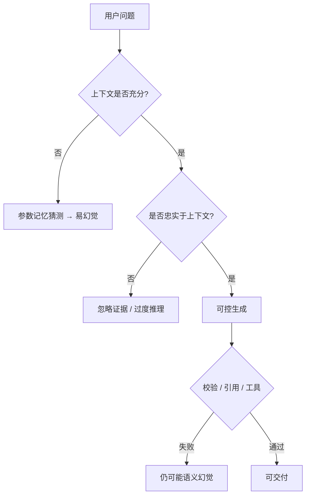

# LLM 为何幻觉

一句话直觉：幻觉不是「模型坏了的偶发 bug」，而是下一词预测在信息不足、目标错位或解码过自信时，仍会流畅编造看似合理内容的系统性倾向。

## 直觉讲解

**Hallucination（幻觉）** 在 LLM 语境里通常指：输出与事实、给定上下文或用户约束不一致，但表面流畅、语气笃定。它不是传感器噪声，而是**生成式目标**的副产品。

根因分层（便于治理，而非玄学）：

| 层级 | 机制 | 例子 |
|------|------|------|
| 训练目标 | 最大化似然，不保证真值 | 常见共现被当成事实 |
| 知识边界 | 参数知识过时/缺失 | 编造新政策条款 |
| 上下文利用 | 没检索到或没读到 | 无视材料瞎答 |
| 对齐与解码 | 讨好用户、过高温度 | 硬给答案不肯说不知 |
| 评价错位 | 流畅度被奖励 | RLHF 讨喜但错 |

要把「事实幻觉」「忠实性幻觉」「归因幻觉」（假引用）分开度量，否则优化会打错靶。

## 工作示例（数字/场景）

**场景 1：无检索开放问答**  
问：「你们 2024 年 Q3 退货率？」模型可能给一个「看起来专业」的百分数。  
治理：无工具则拒答或转查询；有工具必须走数仓 API。

**场景 2：RAG 忠实性**  
检索到正确政策，模型仍合并了另一产品的条款。  
指标：`groundedness`（断言是否被引用片段支持）。示意：仅提示「根据材料」→ 78%；强制引用 ID + 无依据则说不知道 → 93%。

**场景 3：假引用**  
模型输出「参见《安全手册》第 14.3 节」，手册根本无此节。  
治理：引用必须来自检索返回的 ID 列表；禁止自由书名页码。

**场景 4：代码幻觉**  
捏造不存在的库函数。  
治理：对接语言服务器 / 测试；或检索内网代码索引。

## 面试常问取舍

1. **「加大模型」能否消除幻觉？**  
   - 通常降低某些事实错误，但消灭不了；且可能更擅长「圆谎」。要系统层治理。

2. **拒答 vs 尽量答**  
   - 拒答伤体验；瞎答伤信任与合规。按风险分级：高风险默认保守。

3. **温度 0 是否无幻觉？**  
   - 否。只是更稳定地重复同一可能错误。

4. **微调能否治幻觉？**  
   - 可改善风格与「愿说不知」；对动态事实不如 RAG/工具。过度拟合也可能背诵训练集噪声。

## FDE 现场怎么用

- 建立幻觉类型学与标注手册，评审才有共同语言。  
- 高风险域：引用、工具、人工闸门三件套。  
- 产品文案避免「AI 保证正确」；改为「AI 草拟 + 系统校验」。  
- 看板：用户举报、抽检幻觉率、无依据断言率。  
- 客户期望管理：演示专门做一题「材料不足应拒答」。

### 缓解工具箱（概念级）

1. RAG + 忠实性约束  
2. 工具调用拿实时事实  
3. 自评/二次核查（成本↑）  
4. 约束解码保证结构，不保证真假  
5. 人类审核工作流  
6. 校准：鼓励「不确定」token / 拒答类

无银弹；组合拳按风险配置。

### 与「创造性」的边界

营销文案需要想象；法律结论需要依据。同一底座，不同产品策略。别用一套温度和提示打天下。

## 与本库其他篇的链接

- 概念：[10-思维链CoT](./10-思维链CoT.md)、[12-微调vs-RAG-vs-Prompt](./12-微调vs-RAG-vs-Prompt.md)、[13-RLHF对齐](./13-RLHF对齐.md)  
- 面试题：[9.什么是LLM幻觉](../../09-面试题/1.LLM和AI基础/9.什么是LLM幻觉.md)、[14.幻觉缓解方案](../../09-面试题/1.LLM和AI基础/14.幻觉缓解方案.md)、[13.rag搜索准确性](../../09-面试题/1.LLM和AI基础/13.rag搜索准确性.md)

## 深入：度量口径

建议至少分开统计：
- 无依据断言率；
- 与检索冲突率；
- 假引用率；
- 数字/日期错误率。

综合一个「幻觉率」过粗，优化时会顾此失彼。

### 沟通话术
对客户：「我们不是消灭想象，而是在高风险通道禁止无依据断言。」比「我们模型不幻觉」更可信。

## 课堂小结

幻觉来自目标与信息条件，不是玄学。分层归因 + 引用/工具/拒答 + 分类型指标，才是可交付的治理。

## 补充：高风险域的默认策略

| 域 | 默认 |
|----|------|
| 医疗诊断 | 拒答+转人工+免责 |
| 法律结论 | 检索+律师审 |
| 金融建议 | 工具取数+披露 |
| 内部政策 | RAG+引用 |
| 闲聊 | 可放宽 |

策略写进系统配置，不靠模型「自己小心」。

## 参考与来源

- 原创综述：分层根因与指标拆分。  
- Ji et al., 幻觉综述类论文（Survey of Hallucination in NLG）。  
- RAG / groundedness 评测公开框架与厂商护栏文档。  
- RLHF 相关论文中关于 sycophancy、overconfidence 的讨论。
