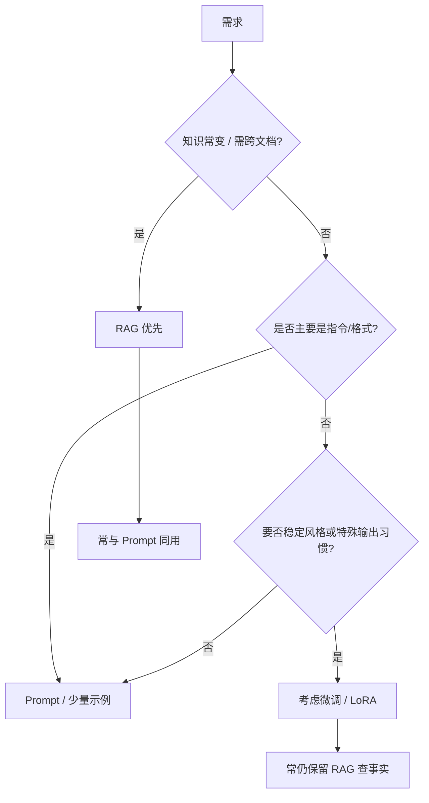

# 微调 vs RAG vs Prompt

一句话直觉：Prompt 调行为、RAG 补知识、微调改分布——三者解决不同痛点，叠用常见，互相替代少见。

## 直觉讲解

面对「模型不会按我们的方式做事 / 不知道我们的私有事实」，三条主杠杆：

| 杠杆 | 改什么 | 擅长 | 不擅长 |
|------|--------|------|--------|
| **Prompt** | 运行时输入 | 格式、角色、流程、快速迭代 | 海量私有知识、极端稳态延迟 |
| **RAG** | 检索注入上下文 | 可更新事实、可引用、可审计 | 检索失败即失败；深层技能迁移有限 |
| **Fine-tuning（微调）** | 权重 | 风格、格式、领域用语、特定推理格式 | 新事实仍过时；训练与治理成本高 |

决策口诀：**动态事实 → RAG；行为与格式 → Prompt；系统性分布偏移且数据充足 → 微调**。

## 工作示例（数字/场景）

**场景 A：内部政策问答**  
政策月更。选 RAG + 引用。微调把政策写进权重，下月就过时，还难审计。

**场景 B：一律输出公司 XML 方言**  
Few-shot 已 95% 合规，但每请求多 2k token 示例，延迟差。LoRA 微调后去掉示例，合规 97% 且更便宜——微调胜在**稳态成本**。

**场景 C：医疗建议**  
即使用微调语气像医生，仍必须检索指南 + 免责声明 + 人工。三者不是选一，是分层。

**粗糙成本对比（示意）**

| 方案 | 一次性成本 | 边际成本 | 更新事实 |
|------|------------|----------|----------|
| Prompt | 人天 | token | 改文本即更新 |
| RAG | 索引管道 | 检索+更长上下文 | 重嵌/更新库 |
| 微调 | 数据与训练 | 通常更短提示 | 需再训练/再对齐 |

## 面试常问取舍

1. **有了长上下文还要 RAG 吗？**  
   - 要看库规模、TTFT、有效长度与引用需求。大库仍 RAG。

2. **微调能否替代 Prompt？**  
   - 不能完全。安全策略与产品条款仍宜显式；微调后还要提示定任务。

3. **何时上微调？**  
   - Prompt/RAG 到瓶颈；有稳定数据；指标能量化；有版本与回滚。见「何时微调优于少样本」面试题。

4. **Agent 算第四杠杆吗？**  
   - Agent 是编排；其下仍落在工具、RAG、提示与可能的微调上。别用 Agent 名词跳过选型。

## FDE 现场怎么用

- 立项一周内出「杠杆图」：每条需求贴 Prompt/RAG/FT/工程规则。  
- 先耗尽 Prompt+RAG 的评测增益，再提微调预算。  
- 微调数据治理：隐私、同意、污染、评测隔离。  
- 向采购解释：RAG 运维费 vs GPU 训练费是不同科目。  
- 成功标准先写清，避免「全都要」。

### 组合模式

- **RAG + Prompt**：默认企业搜索问答。  
- **FT + RAG**：领域语言 + 最新事实。  
- **FT + 约束解码**：极稳结构输出。  
- **规则引擎 + LLM**：合规动作规则定，语言层模型定。

### 反模式

- 用微调背诵每周价格表。  
- 用超长 Prompt 塞整库。  
- 无金标就微调「感觉更好」。  
- 把检索失败甩锅给「模型不够大」。

## 与本库其他篇的链接

- 概念：[09-Prompt工程](./09-Prompt工程.md)、[17-LoRA与参数高效微调](./17-LoRA与参数高效微调.md)、[03-Embedding与向量表示](./03-Embedding与向量表示.md)  
- 面试题：[11.prompt-rag微调选择](../../09-面试题/1.LLM和AI基础/11.prompt-rag微调选择.md)、[15.微调何时优于少样本提示](../../09-面试题/1.LLM和AI基础/15.微调何时优于少样本提示.md)、[16.rag系统上下文组装](../../09-面试题/1.LLM和AI基础/16.rag系统上下文组装.md)

## 深入：决策会议 30 分钟议程

1. 10 分钟：需求贴便签到三列杠杆；
2. 10 分钟：每列写成本与风险；
3. 10 分钟：定两周证据计划。

若会议在争论模型品牌中开始，先拉回杠杆图。

## 课堂小结

Prompt 改行为，RAG 补知识，微调改分布。先穷尽前两者的评测增益，再花微调预算；组合拳多于单选题。

## 补充：反例库（给评审用）

1. 「把百科微调进去代替搜索」——更新成本爆炸。  
2. 「系统提示粘贴 200 页 PDF」——窗口与稀释双杀。  
3. 「没有金标先微调」——无法证明增益。  
4. 「Agent 能自己决定是否微调」——范畴错误。  

把反例库贴会议室，能缩短一半无效争论。

## 实践作业（可选）

1. 用本篇概念，在自己项目里找出一个对应决策点（或事故）。  
2. 写下当时的选项与取舍，补一张三人能看懂的表或流程图。  
3. 给该决策点配 5 条回归用例（含 1 条对抗/边界）。  
4. 标明与相邻概念文的依赖（上游/下游）。  
5. 若存在对应面试题，用本篇术语重答一遍并对照缺口。

## 术语表（本篇）

将文中首次出现的中英对照术语收录到团队词表，避免同一概念多种译名（如「幻觉/幻觉生成」「对齐/校准」混用）。译名统一本身就是协作效率问题。

## 参考与来源

- 原创综述：杠杆分工与组合反模式。  
- Lewis et al., *Retrieval-Augmented Generation for Knowledge-Intensive NLP*, 2020.  
- 指令微调 / LoRA 公开论文与云厂商微调文档。  
- 企业内部架构评审中的常见决策树（本文抽象为通用版）。
