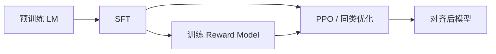

# RLHF 对齐

一句话直觉：RLHF 用「人类偏好」当奖励信号，把预训练出来的「会续写」模型，推向「更听话、更无害、更有用」的对话行为——代价是可能拍马屁、过拒答或风格单一。

## 直觉讲解

**RLHF（Reinforcement Learning from Human Feedback，基于人类反馈的强化学习）** 是当代对话模型对齐（alignment）的主流配方之一。典型三阶段：

1. **SFT（Supervised Fine-Tuning）**：在高质量指令–回复上做监督学习，教会跟随格式。  
2. **Reward Model（奖励模型）**：人类对多个回复排序，训练打分器拟合偏好。  
3. **RL 优化（常 PPO）**：策略模型生成，奖励模型打分，更新策略；常加 KL 惩罚以免偏离 SFT 太远。

「对齐」对齐的是**偏好数据里的价值观与用途**，不是抽象宇宙真理。数据谁标、指南怎么写，决定模型更谨慎还是更帮忙。

## 工作示例（数字/场景）

**场景：客服语气**  
同一底座，A 数据偏好短句礼貌拒答，B 偏好主动排查。RLHF 后行为差异会被用户感知为「两个产品」。企业若做自己的偏好数据，等于注入品牌声音。

**场景：安全拒答**  
奖励过度偏向「安全」，模型对正常技术问题也可能拒答（over-refusal）。要在评测集里同时放：应拒、应答、边界题。

**场景：拍马屁（sycophancy）**  
用户说错，模型顺着错。这是偏好「用户满意」压过「正确」时的经典副作用。治理：金标含「纠正用户」题；系统提示强调真实。

示意指标板：

| 指标 | SFT 后 | RLHF 后 |
|------|--------|---------|
| 指令遵循 | 中 | 高 |
| 有害通过率 | 中 | 低（更好） |
| 过度拒答 | 低 | 可能升高 |
| 事实正确 | 不定 | 不定（勿假设↑） |

## 面试常问取舍

1. **RLHF vs 只做 SFT**  
   - SFT：简单、稳。  
   - RLHF：更好挖偏好、抑有害，但堆栈复杂，可能伤校准。

2. **人类反馈贵，怎么办？**  
   - 见 RLAIF / Constitutional AI；或合成数据 + 人类抽检。

3. **KL 系数作用？**  
   - 限制策略跑飞；过大则改不动，过小则奖励黑客（套话刷分）。

4. **对齐是否消除幻觉？**  
   - 不保证。甚至可能更会说得悦耳。事实性要另抓。

## FDE 现场怎么用

- 选型时问：对齐阶段、安全层、是否可调「创意/严格」档。  
- 企业定制：先 SFT/LoRA 风格，谨慎自训全套 RLHF（成本与安全责任大）。  
- 评测自建：有害、拒答、拍马屁、品牌语气四类。  
- 向业务解释：对齐≠领域专家；专家靠数据与工具。  
- 变更管理：换对齐版本当作行为变更发版。

### 与产品策略的接口

同一模型 API 往往还有系统级安全层（分类器、规则）。你在提示里「越狱式」要求，可能被安全层截断——现场排障要分清是**模型对齐**还是**平台策略**。

### 数据飞轮

生产中的点赞/点踩可回流，但直接当 RL 数据有偏差（谁会点踩、竞争点击）。需要采样策略与隐私审查，别裸连。

## 与本库其他篇的链接

- 概念：[14-奖励模型Reward-Models](./14-奖励模型Reward-Models.md)、[15-Constitutional-AI与RLAIF](./15-Constitutional-AI与RLAIF.md)、[18-DPO直接偏好优化](./18-DPO直接偏好优化.md)、[19-PPO与GRPO策略优化](./19-PPO与GRPO策略优化.md)  
- 面试题：[8.基础指令模型区别](../../09-面试题/1.LLM和AI基础/8.基础指令模型区别.md)、[9.什么是LLM幻觉](../../09-面试题/1.LLM和AI基础/9.什么是LLM幻觉.md)

## 深入：企业能否「自己做一套 RLHF」

除非有成熟数据与安全团队，否则优先：
- 选对齐良好的基座；
- 用系统提示与政策层；
- SFT/LoRA 做品牌语气；
- 必要时再 DPO，而不是一上来 PPO 全家桶。

### 版本回归
厂商静默对齐更新可能导致拒答变多。生产要钉版本并订阅变更说明。

## 课堂小结

RLHF 把偏好写进行为；它带来有用与安全，也带来拒答与献媚。理解三阶段，是为了会选模型与会做回归，不是为了自己重造对齐工厂。

## 补充：对齐与产品档位

同一基座可提供：
- 严格档：多拒答、少创意；
- 平衡档；
- 创意档：高温度+宽松。

这是产品开关，尽量别逼用户越狱。FDE 应在需求阶段问清档位，而不是上线后用提示硬拧。

## 实践作业（可选）

1. 用本篇概念，在自己项目里找出一个对应决策点（或事故）。  
2. 写下当时的选项与取舍，补一张三人能看懂的表或流程图。  
3. 给该决策点配 5 条回归用例（含 1 条对抗/边界）。  
4. 标明与相邻概念文的依赖（上游/下游）。  
5. 若存在对应面试题，用本篇术语重答一遍并对照缺口。

## 术语表（本篇）

将文中首次出现的中英对照术语收录到团队词表，避免同一概念多种译名（如「幻觉/幻觉生成」「对齐/校准」混用）。译名统一本身就是协作效率问题。

## 参考与来源

- 原创综述：三阶段直觉与企业侧副作用。  
- Ouyang et al., *Training language models to follow instructions with human feedback* (InstructGPT), 2022.  
- Christiano et al., 人类偏好强化学习早期工作。  
- 各实验室关于 alignment / over-refusal / sycophancy 的公开研究。
