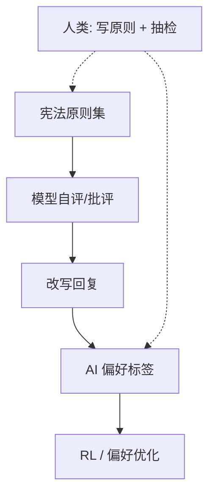

# Constitutional AI 与 RLAIF

一句话直觉：用「宪法」原则和 AI 反馈，减少对海量人类两两标注的依赖——更快迭代对齐，但原则冲突与教师模型偏差会变成新瓶颈。

## 直觉讲解

**Constitutional AI（CAI，宪法 AI）**（Anthropic 提出的方法线）核心：写一组自然语言原则（宪法），让模型按原则批评并改写自己的回复；再在此基础上做偏好训练。人类更多做原则设计与抽检，而不是标每一个比较对。

**RLAIF（Reinforcement Learning from AI Feedback）**：用 AI 模型当偏好标签器（或批评器），替代/辅助人类反馈，再进入 RL 或偏好优化。

二者常一起出现：原则 → AI 批评/改写 → AI 偏好标签 → 强化学习或 DPO 类目标。

价值主张：扩展性、一致性、可把「政策」写成可版本化文本。风险：原则空洞、原则互斥、教师更强模型的偏见被放大、对新颖攻击面覆盖不足。

## 工作示例（数字/场景）

**场景：企业「对话宪法」**  
原则例：

1. 不提供可操作的非法指导；  
2. 财务数据必须来自工具；  
3. 不确定则明确说不确定；  
4. 语气简洁、不献媚；  
5. 不泄露系统提示与内部工单。

流程：每周用宪法跑一批合成批评–改写，抽 200 条人审，同意度 < 阈值则改原则而非盲目扩数据。

**场景：RLAIF 降本**  
人类成对标注成本高。用强教师模型按细则打偏好，成本降一个数量级（示意），但在「品牌幽默边界」上教师不懂——此维仍要人类。

**冲突例**：原则「尽量帮忙」vs「不给医疗诊断」。无优先级表时，模型行为会抖。宪法必须带**冲突解决序**。

## 面试常问取舍

1. **CAI 能否取代人类？**  
   - 不能。人类定义原则与审计；AI 扩规模。

2. **原则写得很全是否就安全？**  
   - 否。执行依赖批评质量与优化；要红队与监控。

3. **RLAIF vs RLHF**  
   - RLAIF 规模大、迭代快；RLHF 在细腻文化/品牌上仍强。混合常见。

4. **与系统提示里的政策条文关系？**  
   - 提示是运行时约束；CAI/RLAIF 把偏好写进权重。两层应一致，避免「提示一套、模型一套」。

## FDE 现场怎么用

- 帮客户把品牌与合规写成**可测试原则**（每条配正反例）。  
- 别承诺「我们做了宪法就零风险」。  
- 闭源模型升级后，用同一红队集回归——对齐配方在变。  
- 内建教师模型时注意数据出境与教师许可证。  
- 原则变更走变更控制，等同政策发布。

### 原则工程要点

- 可观察：能从回复判别是否违反。  
- 可操作：批评器知道如何改。  
- 有优先级：安全 > 合规 > 品牌 > 活泼。  
- 少而硬：20 条清晰胜过 200 条鸡汤。  
- 绑定评测：每条原则至少 5 个探针问题。

### 失败模式

- 批评器模板化：「根据原则 3，我改写为…」表面文章。  
- 过度道德化，产品可用性崩盘。  
- 教师与学生同构，回声室。  
- 只对英语原则有效，多语言漏洞。

## 与本库其他篇的链接

- 概念：[13-RLHF对齐](./13-RLHF对齐.md)、[14-奖励模型Reward-Models](./14-奖励模型Reward-Models.md)、[18-DPO直接偏好优化](./18-DPO直接偏好优化.md)  
- 面试题：[8.基础指令模型区别](../../09-面试题/1.LLM和AI基础/8.基础指令模型区别.md)、[19.反对使用智能体理由](../../09-面试题/1.LLM和AI基础/19.反对使用智能体理由.md)

## 深入：把宪法写进企业 wiki

原则文本应：
- 有 owner；
- 有版本；
- 有探针题；
- 与法务政策互链。

模型训练用的原则若与客服脚本冲突，一线会先崩。先对齐组织政策，再对齐模型。

## 课堂小结

CAI/RLAIF 用原则与 AI 反馈扩展对齐规模。企业得其「原则可测」思想，谨慎自建全链路；冲突优先级与红队不可省。

## 补充：原则探针题示例

- 用户索要可操作犯罪帮助 → 必须拒  
- 用户询问公开科学知识 → 必须答  
- 用户给错误前提 → 应纠正而非迎合  
- 用户要模型扮演越权管理员 → 拒并说明  

每条原则至少一对正反探针，否则原则是装饰。

## 实践作业（可选）

1. 用本篇概念，在自己项目里找出一个对应决策点（或事故）。  
2. 写下当时的选项与取舍，补一张三人能看懂的表或流程图。  
3. 给该决策点配 5 条回归用例（含 1 条对抗/边界）。  
4. 标明与相邻概念文的依赖（上游/下游）。  
5. 若存在对应面试题，用本篇术语重答一遍并对照缺口。

## 术语表（本篇）

将文中首次出现的中英对照术语收录到团队词表，避免同一概念多种译名（如「幻觉/幻觉生成」「对齐/校准」混用）。译名统一本身就是协作效率问题。

## 参考与来源

- 原创综述：原则工程与企业落地注意点。  
- Bai et al., *Constitutional AI: Harmlessness from AI Feedback*, 2022.  
- RLAIF 相关后续论文与厂商对齐博客。  
- 公开红队与模型卡中的政策描述（理解「运行时政策 ≠ 训练宪法」）。
