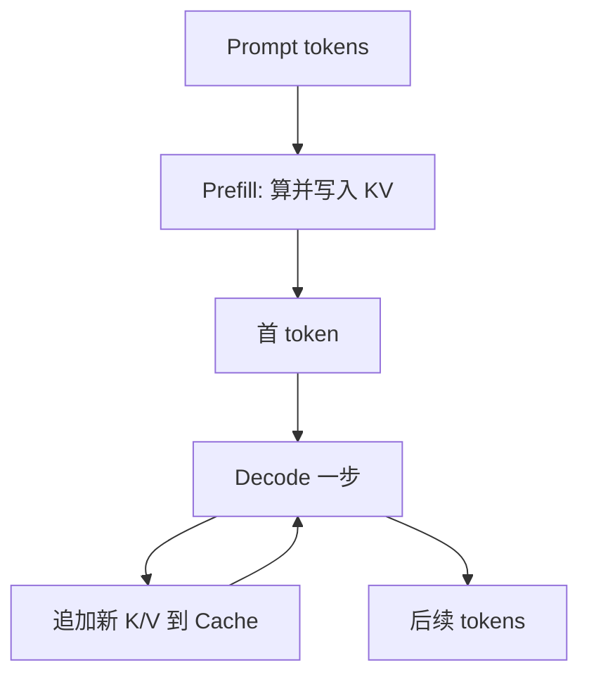

# KV Cache

一句话直觉：解码时 K/V 不必每步从零重算——缓存起来，用空间换时间；这也是长对话显存涨、前缀缓存能省钱的根源。

## 直觉讲解

自回归每步都要做 Attention。对已生成（或已预填充）位置的 **Key / Value**，若每步重算整段，复杂度灾难。**KV Cache（键值缓存）** 存下过去位置的 K、V，新步只算新 token 的 K/V，并与缓存拼接做注意力。

两阶段：

1. **Prefill（预填充）**：并行处理输入 prompt，写入完整 KV，产出首 token → 影响 **TTFT**。  
2. **Decode（解码）**：逐步追加，读缓存 → 影响 **tokens/s**；缓存随输出变长而增长。

显存粗估直觉：与层数、头数、头维、序列长、batch、精度相关。序列或并发一大，KV 往往先于权重成为瓶颈——于是有量化 KV、分页缓存（PagedAttention 一类）、前缀共享等工程。

**前缀缓存 / Prompt Cache**：多请求共享同一系统提示前缀时，复用 KV，降 TTFT 与费用（见专篇）。

## 工作示例（数字/场景）

**场景：并发客服**  
batch 内多用户历史长度不同。朴素连续存储会 padding 浪费；分页 KV 按块分配更高效——这是推理引擎差异，不只是「模型大不大」。

**场景：系统提示 3k token 不变**  
无前缀缓存：每次预填充 3k。有缓存：命中后 TTFT 显著下降。注意：提示**任意字节变更**通常使缓存失效。

**场景：显存 OOM**  
不是权重放不下，而是 8k 上下文 × 高并发把 KV 打爆。缓解：降并发、降上下文、KV 量化、滑窗注意力、更小模型。

示意对比：

| 优化 | 主要收益 | 代价 |
|------|----------|------|
| KV 复用（相对重算） | 解码可行 | 占显存 |
| KV int8/fp8 | 显存↓ | 可能微损质量 |
| 前缀缓存 | TTFT/费用↓ | 工程与失效规则 |
| 截断历史 | 显存↓ | 丢上下文 |

## 面试常问取舍

1. **KV Cache 是否改变数学结果？**  
   - 理想上等价于重算；实现数值差通常可忽略。量化 KV 则可能有可见差。

2. **更大上下文是否只是算力问题？**  
   - 也是内存问题；线性增序列对 KV 近线性增内存。

3. **多轮对话一律塞满历史？**  
   - KV 与计费双杀；要摘要/状态外置。

4. **与「模型参数量化」区别？**  
   - 权重量化省权重内存；KV 量化省激活侧缓存。可并存。

## FDE 现场怎么用

- 延迟投诉先拆 TTFT vs 解码；对应 prefill/KV 与模型宽度。  
- 选托管 API 问：是否 prompt caching、命中计费、失效条件。  
- 自托管问引擎：PagedAttention、连续批处理、前缀共享。  
- 架构上把稳定长前缀设计为可缓存块（工具表也可版本化前缀）。  
- 压测要扫「上下文长度 × 并发」曲面，不只扫 QPS。

### 多模态与额外缓存

图像 token 的 KV 更胖：一张图可能抵成千上万文本 token。VLM 会话里「带图多轮」要特别估内存与缓存策略；有的栈对视觉前缀单独缓存。

### 安全备注

共享前缀缓存的多租户系统需防缓存侧信道与错误命中（前缀归属）。企业私有化部署要问清隔离粒度。

## 与本库其他篇的链接

- 概念：[02-上下文窗口](./02-上下文窗口.md)、[26-自回归解码](./26-自回归解码.md)、[28-Prompt缓存与语义缓存](./28-Prompt缓存与语义缓存.md)、[04-Transformer直觉](./04-Transformer直觉.md)  
- 面试题：[20.降低延迟和成本方法](../../09-面试题/1.LLM和AI基础/20.降低延迟和成本方法.md)、[2.大语言模型生成回复时发生什么](../../09-面试题/1.LLM和AI基础/2.大语言模型生成回复时发生什么.md)、[1.什么是上下文窗口](../../09-面试题/1.LLM和AI基础/1.什么是上下文窗口.md)

## 深入：连续批处理与公平性

连续批处理提高 GPU 利用率，但长请求可能堵住短请求。推理网关需：
- 最大长度分队列；
- 超时与取消；
- 租户配额。

只盯模型，不盯调度，线上仍会「有时奇慢」。

## 课堂小结

KV Cache 让解码可行，也让显存随上下文与并发涨。前缀缓存、量化、分页与队列策略，是性能方案的正文。

## 补充：容量规划草算

设：层 L，KV 头 h，头维 d，序列 s，精度字节 b，batch n。  
粗体量 ∝ L · h · d · s · b · n（再乘 K 与 V）。  
不必记公式系数，要记：**s 与 n 是杠杆**。降并发或降历史，往往比换 GPU 型号更快止血。

## 实践作业（可选）

1. 用本篇概念，在自己项目里找出一个对应决策点（或事故）。  
2. 写下当时的选项与取舍，补一张三人能看懂的表或流程图。  
3. 给该决策点配 5 条回归用例（含 1 条对抗/边界）。  
4. 标明与相邻概念文的依赖（上游/下游）。  
5. 若存在对应面试题，用本篇术语重答一遍并对照缺口。

## 术语表（本篇）

将文中首次出现的中英对照术语收录到团队词表，避免同一概念多种译名（如「幻觉/幻觉生成」「对齐/校准」混用）。译名统一本身就是协作效率问题。

## 参考与来源

- 原创综述：TTFT/解码拆解与容量规划。  
- vLLM PagedAttention 论文与文档。  
- 各云「prompt caching」产品文档。  
- 推理引擎（TensorRT-LLM、Hugging Face TGI 等）KV 相关说明。
