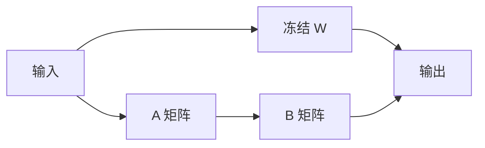

# LoRA 与参数高效微调

一句话直觉：别每次都训全量千亿权重——用低秩适配器抓住任务增量，使微调更便宜、可插拔、可多租户并存。

## 直觉讲解

**PEFT（Parameter-Efficient Fine-Tuning，参数高效微调）** 冻结大模型主体，只训少量附加参数。**LoRA（Low-Rank Adaptation）** 是代表：对某权重矩阵 \(W\)，学习 \(\Delta W = BA\)，其中 \(B,A\) 为低秩（rank \(r \ll\) 原维），推理时可合并回 \(W\) 或作插件。

为何有效（直觉）：任务偏移常落在低维子空间；全量微调既贵又易破坏通用能力（灾难性遗忘）。

| 方法 | 思路 | 备注 |
|------|------|------|
| 全量微调 | 更新全部参数 | 效果上限高、贵、难多版本 |
| Adapter | 插小瓶颈层 | 略增深度 |
| Prefix / Prompt tuning | 调软提示 | 极轻，能力有限 |
| **LoRA / QLoRA** | 低秩旁路 | 生态最常用 |
| QLoRA | 量化基座 + LoRA | 消费级显存也可训 |

## 工作示例（数字/场景）

**场景：品牌客服语气**  
基座 7B，LoRA rank=16，目标模块 q/v 投影。数据 2 万高质量对话。结果：语气达标，事实仍走 RAG——符合「微调行为、检索知识」。

**场景：多租户**  
十个客户十套 LoRA，基座一份，热插拔适配器。注意：推理批处理混租户时引擎要支持 adapter 切换，或分服务池。

**场景：QLoRA**  
单卡 24GB 训 7B–13B 级可行（视序列长与 batch）。代价：训练慢一点、需认真选量化与学习率。

失败例：用 LoRA「背」产品价格表——价格一变全失效。应 RAG。

## 面试常问取舍

1. **LoRA vs 全量**  
   - LoRA：成本、多版本、回滚。  
   - 全量：极大分布切换或研究追 SOTA 时考虑。

2. **rank 是否越大越好？**  
   - 过大近全量成本、易过拟合；过小欠拟合。用验证集扫 8/16/32。

3. **合并 vs 不合并**  
   - 合并：推理零额外结构。  
   - 不合并：多适配器灵活。

4. **微调后还要不要对齐？**  
   - 域数据可能带出有害模式；要安全回归。

## FDE 现场怎么用

- 先证明 Prompt/RAG 不够，再申请微调预算与数据工时。  
- 数据卡片：来源、许可、PII、评测隔离。  
- 发布：适配器版本 + 基座版本 + 提示版本三位绑定。  
- 回滚：一键卸适配器比回滚全量权重爽。  
- 成功衡量：任务指标、通用能力抽检、安全探针三者。

### 训练实务要点

- 学习率通常高于全量微调经验值区间需重扫。  
- 正则与 early stopping 防背诵。  
- 指令格式与推理时聊天模板必须一致。  
- 长文本任务注意训练 max length 与推理不一致造成落差。  
- 评估「遗忘」：留通用能力小集。

### 与 DPO/RLHF

LoRA 也可训于 DPO/PPO 阶段，降低对齐训练成本。企业自对齐多从「SFT-LoRA」起步，再评估是否上偏好阶段。

## 与本库其他篇的链接

- 概念：[12-微调vs-RAG-vs-Prompt](./12-微调vs-RAG-vs-Prompt.md)、[18-DPO直接偏好优化](./18-DPO直接偏好优化.md)、[13-RLHF对齐](./13-RLHF对齐.md)  
- 面试题：[15.微调何时优于少样本提示](../../09-面试题/1.LLM和AI基础/15.微调何时优于少样本提示.md)、[11.prompt-rag微调选择](../../09-面试题/1.LLM和AI基础/11.prompt-rag微调选择.md)

## 深入：评测防遗忘套件

每次发布跑：
- 域内任务集；
- 通用指令 50 条；
- 安全拒答 50 条；
- 格式/工具调用 50 条。

域内涨点但安全崩，禁止上线。

## 课堂小结

LoRA 让微调可负担、可插拔。它擅长行为与格式，不擅长当价格数据库。数据治理与三位版本绑定是职业化标志。

## 补充：LoRA 超参起点（需重扫）

| 项 | 常见起点 |
|----|----------|
| rank | 8–16 |
| alpha | 与 rank 同量级 |
| dropout | 0.05–0.1 |
| 目标模块 | q/v 或 q/k/v/o |
| 学习率 | 比全量微调更高的量级试探 |

起点不是最优；没有验证集扫参 = 凭感觉发布。

## 实践作业（可选）

1. 用本篇概念，在自己项目里找出一个对应决策点（或事故）。  
2. 写下当时的选项与取舍，补一张三人能看懂的表或流程图。  
3. 给该决策点配 5 条回归用例（含 1 条对抗/边界）。  
4. 标明与相邻概念文的依赖（上游/下游）。  
5. 若存在对应面试题，用本篇术语重答一遍并对照缺口。

## 术语表（本篇）

将文中首次出现的中英对照术语收录到团队词表，避免同一概念多种译名（如「幻觉/幻觉生成」「对齐/校准」混用）。译名统一本身就是协作效率问题。

## 参考与来源

- 原创综述：企业多租户与数据治理视角。  
- Hu et al., *LoRA: Low-Rank Adaptation of Large Language Models*, 2021.  
- Dettmers et al., *QLoRA*, 2023.  
- Hugging Face PEFT 文档；各云「自定义模型」微调指南。
