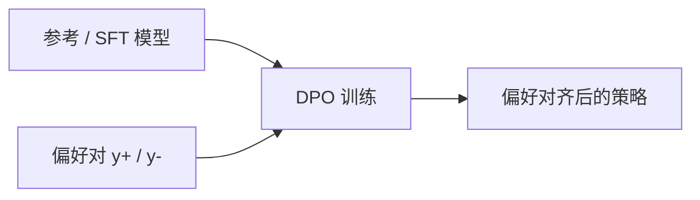

# DPO 直接偏好优化

一句话直觉：DPO 把「让人类更喜欢的回复更可能」写成可直接对策略做的损失，绕开显式奖励模型与 PPO 环——实现更简单，但仍极度依赖偏好数据质量。

## 直觉讲解

**DPO（Direct Preference Optimization，直接偏好优化）** 从 RLHF 目标出发，推导出一种分类式损失：在参考策略 \(\pi_{ref}\) 下，提升赢回复相对输回复的似然比。无需先训 RM，再跑强化学习循环。

直觉步骤：

1. 有 SFT / 参考模型；  
2. 收集同提示下的 \((y^+, y^-)\)；  
3. 最小化 DPO loss，使模型更偏向 \(y^+\)；  
4. \(\beta\) 等超参控制偏离参考的程度（类似 KL 温度）。

变体生态：IPO、KTO、ORPO、SimPO 等——细节不同，现场抓住共性：**偏好数据 + 偏离约束 + 评测防崩**。

## 工作示例（数字/场景）

**场景：更少空话**  
标注：冗长套话为负，直接有依据的短答为正。DPO 后平均长度↓，引用率↑。若负例质量差（随便截短），模型可能学会「过短而不答」。

**场景：从 API 日志构造偏好**  
用点赞/点踩自动成对。偏差：点赞可能只是「运气好答对」或「语气甜」。需过滤与人工复核。

**对比 RLHF 工程量（示意）**

| 项目 | PPO-RLHF | DPO |
|------|----------|-----|
| 训练 RM | 要 | 不要（显式） |
| 采样环 | 复杂 | 无在线采样也可 |
| 实现难度 | 高 | 相对低 |
| 上限/稳定性 | 调得好可很强 | 数据敏感，可能过拟合偏好 |

## 面试常问取舍

1. **DPO 是否严格更好？**  
   - 否。它是效率与简洁的工程胜出；极端任务上 PPO/GRPO 等仍可能更优。

2. **没有 SFT 能否直接 DPO？**  
   - 通常先 SFT 再偏好；否则不稳定。

3. **\(\beta\) 怎么理解？**  
   - 类似「多听偏好 vs 多留在参考」；过大过小都有典型失败（改不动 / 崩语言）。

4. **偏好平局与噪声？**  
   - 噪声对 DPO 很伤；宁可少而干净。

## FDE 现场怎么用

- 开源域适配：SFT-LoRA → DPO-LoRA 是常见可交付路径。  
- 偏好指南与 RLHF 同样重要。  
- 监控：KL/偏离、长度、安全探针、任务金标。  
- 向客户解释：DPO 不是「自动变聪明」，是「按你们的口味拉分布」。  
- 法律风险：偏好数据含用户内容时的授权。

### 数据配方建议

- 每个提示一条清晰赢/输，差距可辨。  
- 覆盖边界：拒答、纠正用户、工具失败时的行为。  
- 避免只拿「更长」当赢。  
- 保留 held-out 人评，防自我骗分。  
- 多语言分别抽样。

### 与推理时 Best-of-N

DPO 改权重；Best-of-N 用 RM 在推理期挑。可组合：DPO 模型 + 少量 Best-of-N 冲高价值请求。

## 与本库其他篇的链接

- 概念：[13-RLHF对齐](./13-RLHF对齐.md)、[14-奖励模型Reward-Models](./14-奖励模型Reward-Models.md)、[19-PPO与GRPO策略优化](./19-PPO与GRPO策略优化.md)、[17-LoRA与参数高效微调](./17-LoRA与参数高效微调.md)  
- 面试题：[8.基础指令模型区别](../../09-面试题/1.LLM和AI基础/8.基础指令模型区别.md)

## 深入：构造 y+/y- 的合法来源

- 人工标注；
- 强教师模型比较（需抽检）；
- 规则可判定的对错（测试通过/失败）；
- 用户反馈（偏差最大，慎用）。

混合来源时记录比例，出问题可追溯。

## 课堂小结

DPO 简化偏好优化工程，但不简化对「什么叫更好」的定义。数据干净程度决定上限。

## 补充：过拟合偏好的症状

- 突然极度啰嗦或极度简短  
- 安全上过度拒答  
- 语言能力崩坏（重复循环）  
- 只对训练集提示风格有效  

出现则回滚、降 β 影响、清洗数据后重训。

## 实践作业（可选）

1. 用本篇概念，在自己项目里找出一个对应决策点（或事故）。  
2. 写下当时的选项与取舍，补一张三人能看懂的表或流程图。  
3. 给该决策点配 5 条回归用例（含 1 条对抗/边界）。  
4. 标明与相邻概念文的依赖（上游/下游）。  
5. 若存在对应面试题，用本篇术语重答一遍并对照缺口。

## 术语表（本篇）

将文中首次出现的中英对照术语收录到团队词表，避免同一概念多种译名（如「幻觉/幻觉生成」「对齐/校准」混用）。译名统一本身就是协作效率问题。

## 参考与来源

- 原创综述：工程简化与数据质量红线。  
- Rafailov et al., *Direct Preference Optimization*, 2023.  
- 后续 IPO/KTO/ORPO 等偏好优化论文。  
- 开源训练框架中的 DPO 实现文档（TRL 等）。
