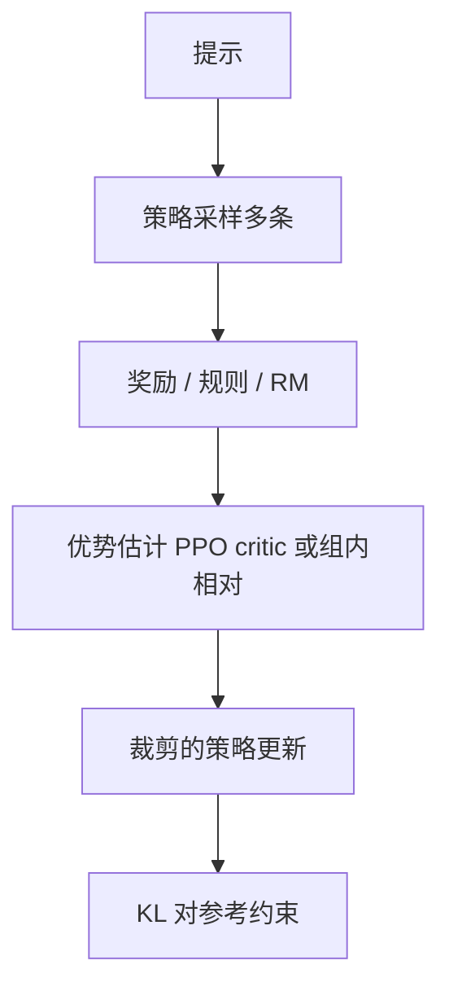

# PPO 与 GRPO 策略优化

一句话直觉：PPO 用「裁剪的策略梯度」稳健地靠奖励学习；GRPO 一类方法用组内相对比较简化价值基线——都是对齐与推理强化阶段的优化器选项，不是业务 API 名。

## 直觉讲解

在 RLHF 第三阶段，模型是**策略（policy）**，生成 token 当动作，奖励来自 RM 或环境（测试通过/答对）。

**PPO（Proximal Policy Optimization）**：通过裁剪（clip）目标，限制新旧策略比率过大，避免一步更新把语言模型写崩。常配合：

- 价值模型（critic）估基线；  
- GAE 等优势估计；  
- 与参考模型的 KL 惩罚或约束。

**GRPO（Group Relative Policy Optimization）** 等近年变体：对同一提示采样一组输出，用组内相对奖励标准化优势，弱化对独立 critic 的依赖，在推理模型训练叙事里常见。细节以对应论文/报告为准；FDE 直觉抓住——**相对比较 + 策略梯度家族**。

对业务听众一句话：这些缩写是「怎么用反馈更新模型」的算法名；产品交付看数据、奖励设计与评测，而不是追名词。

## 工作示例（数字/场景）

**场景：代码 RL**  
奖励 = 单元测试通过。PPO/GRPO 可把通过率从 SFT 基线抬高。奖励黑客：模型写「空实现骗测试」——测试覆盖不足时高发。

**场景：数学推理**  
组采样 8 条，相对更好的轨迹拉高概率。计算极贵：每条轨迹完整生成。适合离线训练，不是在线每次用户请求都跑。

**场景：对话 RLHF**  
奖励 = RM 分 − \(\lambda\) KL。\(\lambda\) 太小：花样套话；太大：等于没训。

示意工程对比：

| 项目 | PPO | 组相对类（如 GRPO） |
|------|-----|---------------------|
| Critic | 常要 | 可简化 |
| 实现复杂度 | 高 | 相对低一些 |
| 样本需求 | 多 | 仍多（组采样） |
| 适用叙事 | 经典 RLHF | 推理强化常见 |

## 面试常问取舍

1. **为何不用 vanilla policy gradient？**  
   - 方差大、易崩；PPO 等更稳。

2. **PPO vs DPO**  
   - PPO：在线采样、显式 RM/环境奖励，灵活吃可执行奖励。  
   - DPO：离线偏好对，工程轻。  
   - 选看奖励是否可形式化、团队栈、数据形态。

3. **奖励稀疏怎么办？**  
   - 过程奖励、课程学习、先 SFT 再 RL。

4. **企业必须自训 PPO 吗？**  
   - 多数 FDE 项目不需要；用好对齐好的基座 + RAG + 规则即可。自训发生在要做「推理模型」或深度品牌对齐时。

## FDE 现场怎么用

- 客户追问 o1/R1「怎么训的」：用本篇给框架，避免不懂装懂背公式。  
- 真要上 RL：先把**奖励可黑客性**审一遍（安全、测试、业务规则）。  
- 预算：RL 阶段的算力往往远超 SFT，单独立项。  
- 交付物：奖励定义文档比「我们用了 GRPO」更重要。  
- 风险：RL 后回归通用能力与安全。

### 实操检查清单

1. 参考模型冻结与版本。  
2. 奖励尺度与裁剪。  
3. 采样温度与组大小。  
4. KL 曲线监控。  
5. 人评 + 硬指标双门禁。  
6. 红队集每轮必跑。

### 和推理时计算的分工

训练期 RL 教模型「更会想」；推理期尚可 Best-of-N / 更长思考预算。两者预算要在方案里分开写清，避免重复计费叙事混乱。

## 与本库其他篇的链接

- 概念：[13-RLHF对齐](./13-RLHF对齐.md)、[14-奖励模型Reward-Models](./14-奖励模型Reward-Models.md)、[18-DPO直接偏好优化](./18-DPO直接偏好优化.md)、[22-推理时计算Inference-Time-Compute](./22-推理时计算Inference-Time-Compute.md)  
- 面试题：[8.基础指令模型区别](../../09-面试题/1.LLM和AI基础/8.基础指令模型区别.md)

## 深入：何时向赞助人说「别做 RL」

若奖励不能自动算、黑客空间大、数据少于「能讲清故事」，应推动规则 + SFT + 评测。RL 不是高级的同义词，而是高成本工具。

## 课堂小结

PPO/GRPO 是用反馈更新策略的算法族。FDE 重在奖励设计、成本与回归；多数项目停在用好已对齐模型即可。

## 补充：奖励设计工作坊问题单

1. 奖励能否自动计算？  
2. 能否被无意义文本刷高？  
3. 稀疏到什么程度？  
4. 与安全目标冲突吗？  
5. 单次轨迹成本多少美元？  

五问有两个答不清，就不应进入 PPO/GRPO 工程。

## 实践作业（可选）

1. 用本篇概念，在自己项目里找出一个对应决策点（或事故）。  
2. 写下当时的选项与取舍，补一张三人能看懂的表或流程图。  
3. 给该决策点配 5 条回归用例（含 1 条对抗/边界）。  
4. 标明与相邻概念文的依赖（上游/下游）。  
5. 若存在对应面试题，用本篇术语重答一遍并对照缺口。

## 术语表（本篇）

将文中首次出现的中英对照术语收录到团队词表，避免同一概念多种译名（如「幻觉/幻觉生成」「对齐/校准」混用）。译名统一本身就是协作效率问题。

## 参考与来源

- 原创综述：业务向解释与奖励黑客警示。  
- Schulman et al., *Proximal Policy Optimization Algorithms*, 2017.  
- InstructGPT 中的 PPO-RLHF 描述。  
- DeepSeek / 相关技术报告中关于 GRPO 的公开说明（以原文为准）。  
- 开源 RLHF 框架文档（TRL、OpenRLHF 等）。
