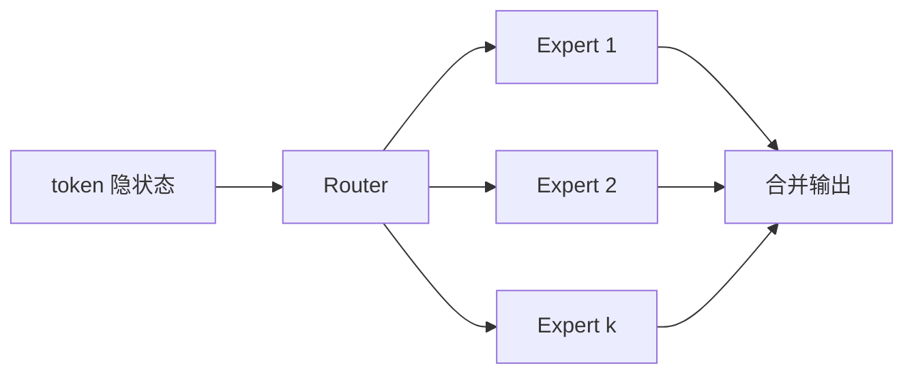

# MoE 混合专家

一句话直觉：MoE 不是每次都动用全部参数——路由只激活部分「专家」FFN，从而在参数总量很大时仍控制单 token 算力，但带来路由、显存与运维新问题。

## 直觉讲解

**MoE（Mixture of Experts，混合专家）** 在 Transformer 块里用一组专家网络（常是 FFN）替换单一 FFN；**路由器（router/gating）** 为每个 token 选择 top-k 专家执行。总参数可到数百 B 乃至更大，而**每 token 激活参数**小得多——训练与推理的算力叙事因此与「稠密同参」不同。

关键概念：

| 术语 | 含义 |
|------|------|
| Experts | 并行专家子网 |
| Gate / Router | 决定走哪些专家 |
| Top-k | 每 token 激活专家数 |
| Capacity | 专家可接 token 容量 |
| Load balancing | 防所有人挤向同一专家 |

稠密 vs MoE（直觉）：

- 稠密：实现简单、每层算力可预期。  
- MoE：同算力可撑更大容量/更强，但通信、负载、专家崩溃（collapse）要治。

## 工作示例（数字/场景）

**场景：选型「670B MoE」**  
营销说参数极大。你要问：**激活参数多少、专家数、top-k、上下文、吞吐曲线**。若激活与 70B 稠密类似，延迟可能同级，但显存装载与分片更头疼。

**场景：批推理**  
不同 token 走不同专家 → 专家计算稀疏且不均衡，需要特殊内核与并行策略。自托管复杂度↑。

**场景：微调**  
LoRA 打在哪些模块？打路由还是专家？乱改路由可能伤负载均衡。跟模型官方建议走，并小步评测。

数字示意：8 专家 top-2，每 token 约 2/8 的专家 FFN 算力（忽略共享层）；总参数却含全部专家——「大而省算」的来源。

## 面试常问取舍

1. **MoE 一定更强吗？**  
   - 不一定；看训练配方与任务。强在容量–算力权衡的设计空间。

2. **为何推理不一定便宜？**  
   - 权重总占用、跨设备通信、负载不均可能吃掉「激活少」的红利。

3. **专家是否对应人类可解释技能？**  
   - 偶尔有相关性，不可当作可靠可解释性。

4. **稠密小模型 vs 大 MoE API**  
   - 企业常先比：延迟、价、运维、可控性，而不是参数榜。

## FDE 现场怎么用

- 读模型卡：激活参数、专家配置、许可、推理建议硬件。  
- 私有化 PoC 提前让平台团队估流水线与显存，别只看 demo 效果。  
- API 场景：把 MoE 当「一种模型族」，用评测说话。  
- 成本模型用「每百万 token」实测，不信参数量反比。  
- 故障：若服务质量随时间抖，询问是否路由/负载相关（少见但需有概念）。

### 训练期特有问题（了解即可）

- 专家坍塌：路由总选少数专家——用辅助负载损失。  
- 容量溢出：token 被丢弃或溢出到别的专家——影响质量。  
- 通信：Expert parallel 在多机上的带宽压力。

### 产品沟通话术

避免：「这模型 500B 所以一定比 70B 强。」  
替换：「在我们的任务集上，延迟–质量–价格如上表。」

## 与本库其他篇的链接

- 概念：[04-Transformer直觉](./04-Transformer直觉.md)、[21-Scaling-Laws缩放律](./21-Scaling-Laws缩放律.md)、[29-企业部署模型选型](./29-企业部署模型选型.md)、[27-模型路由与级联](./27-模型路由与级联.md)  
- 面试题：[20.降低延迟和成本方法](../../09-面试题/1.LLM和AI基础/20.降低延迟和成本方法.md)

## 深入：许可与部署检查

部分 MoE 开源权重带商用条件；推理框架对专家并行支持版本差很大。PoC 第一周就要：
- 跑通目标 batch 与上下文；
- 测量 token/s 与显存；
- 确认许可。

## 课堂小结

MoE 用稀疏激活换容量。谈参数量时必问激活量与实测吞吐；交付话术用价质延迟表，不用参数崇拜。

## 补充：稠密替代方案

若 MoE 自托管痛苦，可评估：
- 更强的稠密小模型 + 路由；
- 托管 MoE API；
- 质量略低但运维简单的稠密中型模。

「非 MoE 不可」极少成立。

## 实践作业（可选）

1. 用本篇概念，在自己项目里找出一个对应决策点（或事故）。  
2. 写下当时的选项与取舍，补一张三人能看懂的表或流程图。  
3. 给该决策点配 5 条回归用例（含 1 条对抗/边界）。  
4. 标明与相邻概念文的依赖（上游/下游）。  
5. 若存在对应面试题，用本篇术语重答一遍并对照缺口。

## 术语表（本篇）

将文中首次出现的中英对照术语收录到团队词表，避免同一概念多种译名（如「幻觉/幻觉生成」「对齐/校准」混用）。译名统一本身就是协作效率问题。

## 参考与来源

- 原创综述：激活参数与交付话术。  
- Shazeer et al., *Outrageously Large Neural Networks: The Sparsely-Gated Mixture-of-Experts Layer*, 2017.  
- Switch Transformer、GLaM、Mixtral、DeepSeek-MoE 等公开技术报告。  
- 推理框架对 MoE 支持的说明文档。
