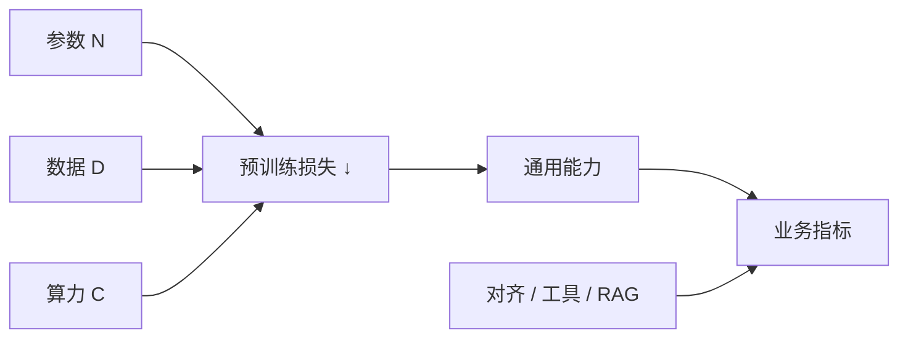

# Scaling Laws 缩放律

一句话直觉：在很宽的区间里，模型损失随参数量、数据量、算力呈可预测的幂律下降——但「更大」不等于你的业务指标最优，还受数据质量、对齐与推理预算约束。

## 直觉讲解

**Scaling Laws（缩放律）** 描述模型性能（常以交叉熵损失）与 **N（参数）**、**D（数据 token）**、**C（算力）** 之间的经验规律。Kaplan / Hoffmann（Chinchilla）等工作表明：在算力固定时，存在参数与数据的较优配比；只堆参数却数据不够会浪费。

对 FDE 的转译：

- 预训练世界：缩放律指导训练配方；  
- 应用世界：你买的是**已训好的点**上的模型，再叠加对齐、工具、RAG；  
- 业务指标（转化、工单解决率）与 pretrain loss **正相关但不等于**。

**推理侧缩放**：同一模型，增加采样次数、思考 token、工具轮次，也可能换准确率——见「推理时计算」篇，可视为另一条标度轴。

## 工作示例（数字/场景）

**场景：客户坚持「上最大模型」**  
任务是工单分类 20 类。7B–13B 级或更小专用模型已 95%，旗舰模型 96% 但贵 10×、慢 5×。缩放律不支持「无脑最大」；边际收益递减。

**场景：私有数据续训**  
只有 50M 高质量域内 token，却想把 70B「续出专家」。数据相对模型过小，易过拟合与遗忘。更应：RAG + 小幅 LoRA，或先扩数据。

**Chinchilla 直觉（极简）**：算力一定，模型太大而训练 token 不足 → 欠训；相反则小模型吃撑。具体最优比以论文与后续修正为准，现场记住「参数与数据要匹配」。

**多任务权衡表（示意）**

| 模型档 | 准确率 | 延迟 | 成本 | 适用 |
|--------|--------|------|------|------|
| Small | 88% | 优 | 优 | 分类/抽取 |
| Medium | 93% | 中 | 中 | 主力 |
| Large | 95% | 差 | 差 | 难例路由 |

## 面试常问取舍

1. **缩放是否永远成立？**  
   - 经验律有范围；数据污染、重复、质量墙、对齐目标会改变曲线。

2. **开源小模型 + 好工程 vs 闭源大模型？**  
   - 常胜在可复制的评测与总成本，而非参数崇拜。

3. **数据质量 vs 数量**  
   - 脏数据放大有害模式；缩放律假设「合适数据」。

4. **训练缩放 vs 推理缩放**  
   - 预算可花在更大模型或更多推理 token——见产品形态（快答 vs 深思）。

## FDE 现场怎么用

- 用「边际收益曲线」沟通，而不是模型排行榜。  
- 建三级模型梯队 + 路由，贴合缩放递减。  
- 数据战略：宁缺毋滥；计量可用 token 与去重。  
- 别承诺「换更大底座业务 KPI 必升 N 点」。  
- 研究新闻里的 scaling 突破，转化为「是否改变我们的价质延迟包络」。

### 常见误解

- 「参数量 = 智能」：忽略激活量（MoE）、数据、对齐。  
- 「loss 更低 = 更适合我的法务任务」：需域内评测。  
- 「缩放律已死 / 已神」：极端叙事都少信，看可复现实验。  
- 「只缩放推理不用好模型」：两者有互补也有下限。

### 与采购

把缩放思维写进 RFP：要求供应商给不同档模型在**你们数据**上的曲线，而不是只给旗舰 demo。

## 与本库其他篇的链接

- 概念：[20-MoE混合专家](./20-MoE混合专家.md)、[22-推理时计算Inference-Time-Compute](./22-推理时计算Inference-Time-Compute.md)、[27-模型路由与级联](./27-模型路由与级联.md)、[29-企业部署模型选型](./29-企业部署模型选型.md)  
- 面试题：[20.降低延迟和成本方法](../../09-面试题/1.LLM和AI基础/20.降低延迟和成本方法.md)、[11.prompt-rag微调选择](../../09-面试题/1.LLM和AI基础/11.prompt-rag微调选择.md)

## 深入：数据墙与合成数据

当高质量人类文本见顶，实验室用合成数据续命。对企业，合成数据可用于增广训练/评测，但要防「模型教模型」回声。关键金标仍应人类或可信系统生成。

## 课堂小结

缩放律解释为何更大常常更强，也解释边际递减。业务决策看你们曲线上的工作点，而不是新闻标题。

## 补充：给 CFO 的一页纸

标题：模型越大越贵，收益递减。  
图：准确率–成本曲线三点（小/中/大）。  
结论：主力中模型 + 难例升级。  
附件：金标方法与复测周期。

这比缩放律公式更能推动预算批准。

## 实践作业（可选）

1. 用本篇概念，在自己项目里找出一个对应决策点（或事故）。  
2. 写下当时的选项与取舍，补一张三人能看懂的表或流程图。  
3. 给该决策点配 5 条回归用例（含 1 条对抗/边界）。  
4. 标明与相邻概念文的依赖（上游/下游）。  
5. 若存在对应面试题，用本篇术语重答一遍并对照缺口。

## 术语表（本篇）

将文中首次出现的中英对照术语收录到团队词表，避免同一概念多种译名（如「幻觉/幻觉生成」「对齐/校准」混用）。译名统一本身就是协作效率问题。

> 阅读提示：本篇可与相邻概念文对照；现场讨论时优先画表，再陷细节。

## 参考与来源

- 原创综述：从预训练律到业务边际收益。  
- Kaplan et al., Scaling Laws for Neural Language Models, 2020.  
- Hoffmann et al., *Training Compute-Optimal Large Language Models* (Chinchilla), 2022.  
- 关于数据质量、推理时缩放的后续公开研究与实验室博客。
