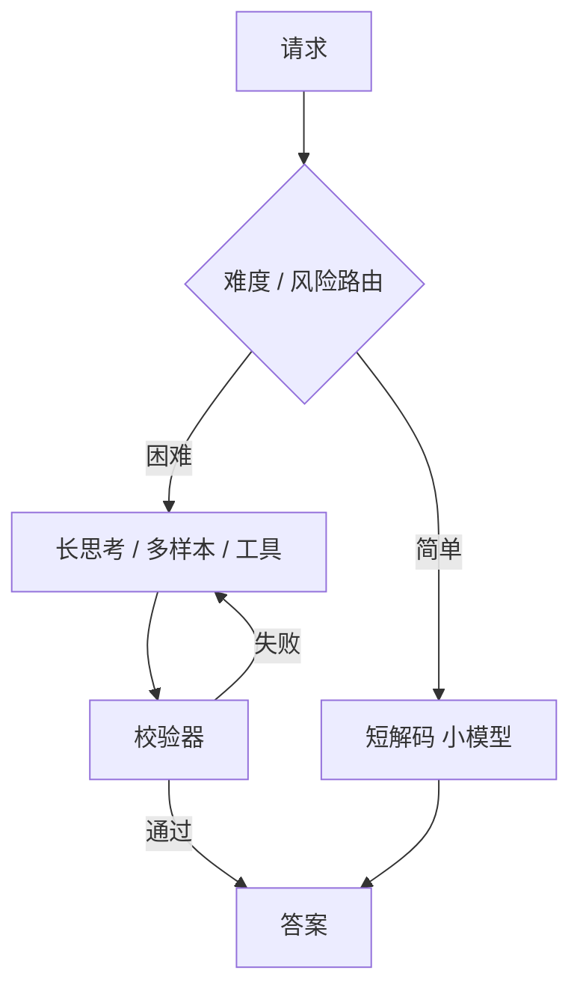

# 推理时计算 Inference-Time Compute

一句话直觉：不止「训练时更大」，推理时也可以多花算力——更长思考、多样本、搜索与工具轮次——用延迟和金钱换难题正确率。

## 直觉讲解

**Inference-Time Compute（推理时计算）** 指在权重固定后，通过增加测试期计算量提升表现。常见形态：

| 形态 | 做法 | 代价 |
|------|------|------|
| 更长 CoT / 「思考」token | 多生成中间步 | 输出更贵更慢 |
| Self-Consistency / Best-of-N | 多样本 + 投票/RM | ×N |
| 搜索 / MCTS 类 | 树搜候选步骤 | 很贵 |
| 多轮工具 | 代码执行、检索 | 轮次延迟 |
| 级联重试 | 失败升级大模型 | 尾部成本 |

这与训练缩放互补：同一产品可设「快速档 / 深思档」。

关键洞察：额外计算应花在**不确定或高价值**请求上；对所有流量开满思考，ROI 通常为负。

## 工作示例（数字/场景）

**场景：报销政策问答**  
90% 问题检索即答；10% 涉及多政策交叉。路由：简单 → 短答；复杂 → 长 CoT + 强制引用。整体费用仅增 30%，难例正确率 +12 点（示意）。

**场景：Best-of-N 代码补全**  
N=1 → 过测 40%；N=8 + 单测奖励选择 → 58%；延迟不可上交互，改为异步「生成补丁」。

**场景：思考模型 API**  
厂商按「思考 + 可见输出」计费。要在网关设思考预算上限，防单请求烧爆。

对比表：

| 策略 | 相对成本 | 适用 |
|------|----------|------|
| 温度 0 单次 | 1× | 抽取 |
| CoT 单次 | 1.5–3× | 中等推理 |
| 5× Self-Consistency | ~5× | 高价值 |
| 工具多轮 Agent | 变化大 | 需环境交互 |

## 面试常问取舍

1. **是否替代更大模型？**  
   - 有时小模型 + 多推理可逼近大模型单次；有时存在能力下限。要实测帕累托曲线。

2. **用户要不要看见思考？**  
   - 产品决策：可解释 vs 泄密/啰嗦。可内部想、外部摘要。

3. **校验器从哪来？**  
   - 单元测试、Schema、规则、交叉模型、人类。无校验的 Best-of-N 可能一起错。

4. **与 Agent 区别？**  
   - Agent 强调环境行动；推理时计算强调测试期算力分配。常交叉。

## FDE 现场怎么用

- 画准确率–成本曲线，选工作点。  
- 默认快路径，慢路径触发条件写死（置信度、意图、金额）。  
- 预算：每请求 max 思考 token / max 工具轮。  
- 观测：慢路径占比、升级率、ROI。  
- Demo 用同一难例展示「快/慢」差异，管理预期。

### 设计模式

- **投机解码**是延迟优化，不增加「思考质量」——别混。  
- **草稿模型 + 大模型验证**：另一类推理算力分配。  
- **答辩式双模型**：生成者 / 批评者轮换，注意费用。  
- **缓存**：同一难题别重复深思——键要含题意。

### 风险

- 思考文本泄露系统策略。  
- 冗长推理中的幻觉步骤被用户当真。  
- 成本失控与 DoS 式提示（「请思考一万步」）。

## 与本库其他篇的链接

- 概念：[10-思维链CoT](./10-思维链CoT.md)、[21-Scaling-Laws缩放律](./21-Scaling-Laws缩放律.md)、[27-模型路由与级联](./27-模型路由与级联.md)、[14-奖励模型Reward-Models](./14-奖励模型Reward-Models.md)  
- 面试题：[20.降低延迟和成本方法](../../09-面试题/1.LLM和AI基础/20.降低延迟和成本方法.md)、[19.反对使用智能体理由](../../09-面试题/1.LLM和AI基础/19.反对使用智能体理由.md)

## 深入：SLA 写法示例

「普通请求 P95 < 2s，使用短解码；涉及金额 > 1 万或模型自报不确定时，允许慢路径 P95 < 15s，并在 UI 展示进度。」

把推理时计算写进 SLA，比写进博客重要。

## 课堂小结

测试期算力是第三条缩放轴。路由到慢路径、设预算、配校验器，才能把钱花在刀刃上。

## 补充：慢路径触发器库

- 检索分数低  
- 自洽两次不一致  
- 用户显式要求「详细论证」  
- 金额/法律意图分类命中  
- 小模型输出无法过 Schema  

触发器要可配置、可观测、可关掉。

## 实践作业（可选）

1. 用本篇概念，在自己项目里找出一个对应决策点（或事故）。  
2. 写下当时的选项与取舍，补一张三人能看懂的表或流程图。  
3. 给该决策点配 5 条回归用例（含 1 条对抗/边界）。  
4. 标明与相邻概念文的依赖（上游/下游）。  
5. 若存在对应面试题，用本篇术语重答一遍并对照缺口。

## 术语表（本篇）

将文中首次出现的中英对照术语收录到团队词表，避免同一概念多种译名（如「幻觉/幻觉生成」「对齐/校准」混用）。译名统一本身就是协作效率问题。

## 参考与来源

- 原创综述：快慢路径与预算治理。  
- Self-Consistency、Tree of Thoughts、过程奖励等公开论文。  
- 各厂商「reasoning model」产品说明与计费文档。  
- 关于 test-time scaling 的综述性博客与文章。
