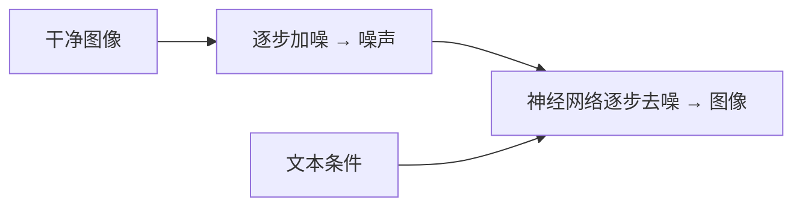

# Diffusion 扩散模型

一句话直觉：扩散模型学会「从纯噪声一步步去噪还原数据」——今天多数主流文生图背后是这条轨迹，与 LLM 的自回归下一词预测是不同的生成范式。

## 直觉讲解

**Diffusion Models（扩散模型）** 定义两条过程：

1. **前向扩散**：逐步向数据加噪声，直至近似高斯噪声；  
2. **反向去噪**：神经网络（常 U-Net 或 DiT）学习每步去掉的噪声，从噪声迭代还原样本。

条件生成（文生图）用文本嵌入作条件（交叉注意力或自适应归一化等），引导去噪方向。采样步数、引导强度（classifier-free guidance）、调度器决定质量–速度权衡。

与自回归图像（逐像素/逐 token）比：扩散在连续像素/潜空间迭代；**Latent Diffusion** 先在 VAE 潜空间扩散，降低算力，是稳定扩散一类系统的关键工程点。

LLM 也可与扩散联动：LLM 写提示、扩写、审图；或多模态统一架构——但概念上别把「ChatGPT 会画图」误认为都是 Transformer 解码像素。

## 工作示例（数字/场景）

**场景：电商商品图背景替换**  
潜空间扩散 + 蒙版 inpainting。步数 20→12 可提速，但边缘易脏——要 A/B。控制网（边缘/深度）提升结构稳定性。

**场景：广告出海本地化**  
同模型不同负面提示与种子策略；品牌色与 Logo 需 IP-Adapter / 微调 / 后合成，纯提示不稳。

**场景：与安全**  
生成违规内容、深伪、商标侵权——要安全过滤、审计与人类流程，技术采样参数解决不了法律。

示意权衡：

| 旋钮 | 增大效应 | 副作用 |
|------|----------|--------|
| 采样步数 | 常更细腻 | 更慢 |
| CFG 引导 | 更贴提示 | 过饱和、伪影 |
| 分辨率 | 更清晰 | 显存/时间↑ |
| LoRA 风格 | 品牌一致 | 过拟合、伪影 |

## 面试常问取舍

1. **扩散 vs GAN**  
   - 扩散：训练稳、质量高主流；采样慢（可蒸馏加速）。  
   - GAN：快，模式崩塌与训练不稳风险历史更突出。

2. **像素扩散 vs 潜空间**  
   - 潜空间：高效主流；VAE 可能丢细节，要看任务。

3. **为何有的系统「一步图」？**  
   - 蒸馏、一致性模型等把多步压少步——质量/多样性可能折中。

4. **企业是否该自训底座？**  
   - 极少。调适配器、控图、工作流即可；底座训练是实验室课题。

## FDE 现场怎么用

- 明确资产：提示模板、负提示、种子策略、人审。  
- 评估不只「好看」：品牌一致性、可复现、违规率。  
- 成本：GPU 秒 / 张；缓存同提示结果。  
- 管线：LLM 产提示 → 扩散出图 → 视觉质检模型 → 人工。  
- 法务：训练数据许可与输出使用权提前写清。

### 和 LLM 的边界协作

| 任务 | 更合适 |
|------|--------|
| 合同摘要 | LLM |
| 产品图生成 | Diffusion |
| 看图抽字段 | VLM / OCR |
| 故事分镜 | LLM 规划 + 扩散出帧 |

### 加速技术地图（概念）

- 更好调度器、更少步；  
- 蒸馏成小步模型；  
- 投机 / 缓存特征；  
- 蒸馏 UNet / DiT 到小骨干。  

交付时用「秒/张」与「可接受质量阈值」谈，不堆缩写。

## 与本库其他篇的链接

- 概念：[23-多模态与VLM](./23-多模态与VLM.md)、[26-自回归解码](./26-自回归解码.md)、[17-LoRA与参数高效微调](./17-LoRA与参数高效微调.md)  
- 面试题：与生成安全、幻觉类题可对照 [9.什么是LLM幻觉](../../09-面试题/1.LLM和AI基础/9.什么是LLM幻觉.md)（机制不同，治理同类）

## 深入：品牌一致性流水线

1. 锁定底座与 LoRA；
2. 控图（姿态/深度）；
3. 调色后处理；
4. 自动检测违禁/文字乱码；
5. 人工抽检。

纯靠「魔咒提示」无法稳定电商货架。

## 课堂小结

扩散是去噪生成范式，旋钮是步数、引导、分辨率与适配器。企业重点在工作流、合规与可复现，不在自训底座。

## 补充：种子与复现

广告素材要可复现：固定种子、模型版本、提示版本、LoRA 版本。法律争议时才能证明「哪次生成」。缺版本记录的「当时好看」无法审计。

## 实践作业（可选）

1. 用本篇概念，在自己项目里找出一个对应决策点（或事故）。  
2. 写下当时的选项与取舍，补一张三人能看懂的表或流程图。  
3. 给该决策点配 5 条回归用例（含 1 条对抗/边界）。  
4. 标明与相邻概念文的依赖（上游/下游）。  
5. 若存在对应面试题，用本篇术语重答一遍并对照缺口。

## 术语表（本篇）

将文中首次出现的中英对照术语收录到团队词表，避免同一概念多种译名（如「幻觉/幻觉生成」「对齐/校准」混用）。译名统一本身就是协作效率问题。

## 参考与来源

- 原创综述：文生图交付旋钮与合规。  
- Ho et al., DDPM；Song et al., Score-based；Rombach et al., Latent Diffusion.  
- Classifier-Free Guidance 相关工作。  
- Stable Diffusion / 商业图像 API 公开文档。
