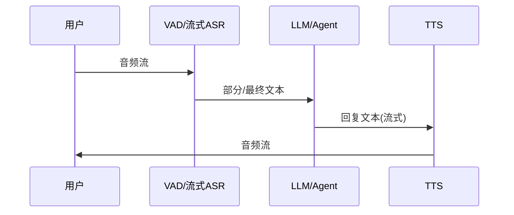

# 语音与 Voice AI

一句话直觉：Voice AI 常是「听写–理解–说话」管道；端到端模型在演进，但企业交付仍要抓住延迟、打断、口音、隐私与人机切换。

## 直觉讲解

经典管道：

1. **ASR（Automatic Speech Recognition）**：语音 → 文本；  
2. **LLM / NLU**：文本理解、对话、工具；  
3. **TTS（Text-to-Speech）**：文本 → 语音；  
4. 可选：**VAD** 语音活动检测、**说话人分离**、**情绪/语速** 特征。

也有语音原生/端到端实时模型，把中间文本隐式化，降低延迟，但企业集成、审计、插播业务逻辑有时更难。

核心体验指标：

- **端到端延迟**（用户停说到开始播报应）；  
- **抢话/打断（barge-in）**；  
- **词错率 / 实体错率**；  
- **自然度与品牌音色**；  
- **通话完成率 / 转人工率**。

## 工作示例（数字/场景）

**场景：电话客服**  
目标：首响 < 800ms 级体感。做法：流式 ASR 部分假设 + 推测性 LLM + 流式 TTS；确认关键实体（订单号）用读回校验。

**场景：会议室纪要**  
非实时：ASR → 说话人 → LLM 摘要。重点是发言人错附与幻觉待办——摘要必须可点回时间戳。

**场景：方言与噪声**  
通用 ASR 在车间噪声下实体词崩。域内热词、降噪、或人工二次确认。

成本示意：实时语音的分钟费 + LLM token 费；静音与打断策略不当会空转计费。

## 面试常问取舍

1. **管道 vs 端到端语音模型**  
   - 管道：可解释、易插业务、组件可换。  
   - 端到端：延迟与副语言（语气）潜力；生态与可控性评估中。

2. **是否一切语音都要上 LLM？**  
   - IVR 按键/固定意图可用 NLU；LLM 留给复杂对话。

3. **音色克隆？**  
   - 体验好，法律与同意风险高——默认谨慎。

4. **文本对话机器人直接「加一层语音」？**  
   - 不够。要重做轮次长度、确认策略、延迟与打断。

## FDE 现场怎么用

- 先定场景：实时电话 / 异步会议 / 嵌入式设备——架构不同。  
- 隐私：录音存留、跨境、敏感词。  
- 评测集：真实口音与噪声，不只安静朗读。  
- 转人工：置信度与用户焦躁检测。  
- 与前端：WebRTC/SIP 团队同期进项目，别只做 LLM。

### 设计要点

- **短确认**：关键槽位读回。  
- **可打断**：TTS 缓冲可清空。  
- **文本兜底**：同会话可切聊天。  
- **热词表**：产品名、地名。  
- **时间戳对齐**：摘要可追溯。  
- **情绪升级**：骂街 → 人工。

### 失败模式

- ASR 错 → LLM 一本正经办错事（放大链）。  
- TTS 念出不应播的内部思考。  
- 长独白不给用户插话窗口。  
- 忽略「嗯/啊」导致误截断。

## 与本库其他篇的链接

- 概念：[26-自回归解码](./26-自回归解码.md)、[27-模型路由与级联](./27-模型路由与级联.md)、[11-LLM为何幻觉](./11-LLM为何幻觉.md)、[23-多模态与VLM](./23-多模态与VLM.md)  
- 面试题：[20.降低延迟和成本方法](../../09-面试题/1.LLM和AI基础/20.降低延迟和成本方法.md)、[17.工具调用失败](../../09-面试题/1.LLM和AI基础/17.工具调用失败.md)

## 深入：指标仪表盘

- ASR：WER / 实体准确率
- LLM：任务完成率、工具成功率
- TTS：首字节音频时延
- 会话：打断成功率、转人工率、平均处理时长

分组件看，才能知道钱该砸在哪一段。

## 课堂小结

Voice AI 是延迟敏感的管道工程。流式、打断、确认读回与隐私，决定「能不能打电话」，模型选型只是其中一块。

## 补充：打断状态机（简）

状态：倾听 → 推断 → 说话 →（被打断）→ 停止播放 → 倾听。  
每个箭头都要测。只测「安静环境念完稿」的 Voice demo，上线必翻车。

## 实践作业（可选）

1. 用本篇概念，在自己项目里找出一个对应决策点（或事故）。  
2. 写下当时的选项与取舍，补一张三人能看懂的表或流程图。  
3. 给该决策点配 5 条回归用例（含 1 条对抗/边界）。  
4. 标明与相邻概念文的依赖（上游/下游）。  
5. 若存在对应面试题，用本篇术语重答一遍并对照缺口。

## 术语表（本篇）

将文中首次出现的中英对照术语收录到团队词表，避免同一概念多种译名（如「幻觉/幻觉生成」「对齐/校准」混用）。译名统一本身就是协作效率问题。

## 参考与来源

- 原创综述：管道指标与企业场景。  
- 主流 ASR/TTS 云文档与实时对话 API 说明。  
- 语音对话系统经典文献中的 barge-in、VAD 概念。  
- 端到端实时语音模型的厂商技术博客（跟踪用）。
