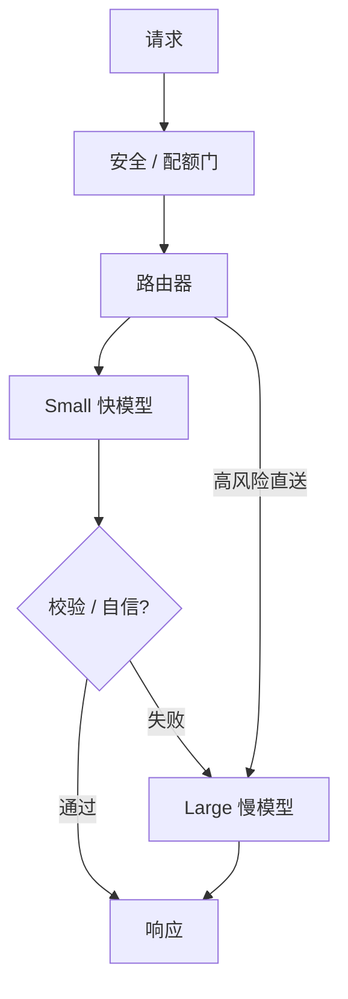

# 模型路由与级联

一句话直觉：别让旗舰模型回答所有问题——用便宜快模型打头阵，难例再升级，在质量约束下最小化平均成本与延迟。

## 直觉讲解

**Model Routing（模型路由）** 按请求特征选择模型或提示档。**Cascade（级联）** 是顺序形态：先小后大，仅当小模型不够自信或校验失败时才调用更大模型。

路由信号来源：

| 信号 | 例子 |
|------|------|
| 意图分类 | 闲聊 / 退款 / 法律 |
| 长度与复杂度启发式 | 多跳、数学关键字 |
| 小模型自信度 | 熵、拒答、自一致 |
| 业务风险 | 金额、医疗、合规 |
| 租户套餐 | SLA 档位 |
| 校验器 | Schema、单测、检索命中 |

目标函数近似：\(\min \mathbb{E}[cost]\) s.t. 质量 ≥ SLO。没有路由时，成本被最难 5% 的请求绑架。

## 工作示例（数字/场景）

**数字示意**：小模型 $0.1/1M tokens，大模型 $1/1M；90% 流量小模型解决，10% 升级。

- 无路由全大：成本基准 100%  
- 有路由：约 \(0.9\times10\% + 0.1\times100\% \approx 19\%\) 量级（再加路由本身与可能双调用）  

若升级路径会先调小再调大，那 10% 付两次——要算清楚。

**场景：编程助手**  
语法级补全 → 小/本地；架构级问题 → 大。校验：编译/测试。

**场景：错误路由**  
分类器把「投诉律师函」当成闲聊 → 小模型胡答。高风险意图要**默认升级或人工**，不能只靠省钱。

## 面试常问取舍

1. **路由模型谁来当？**  
   - 规则、轻量分类器、embedding 相似度、或同一小 LLM。复杂路由自身也有延迟与错误。

2. **级联 vs 直接大模型**  
   - 级联省平均成本，增尾部延迟与复杂度。看流量形状。

3. **用户是否感知「被降级」？**  
   - 若质量缺口明显，品牌伤。可对付费档保证模型。

4. **与 Agent 关系？**  
   - Agent 内部也可路由工具与模型；别多层无约束嵌套导致不可控花费。

## FDE 现场怎么用

- 先有评测集与费用仪表盘，再上智能路由。  
- 定义升级理由码，便于分析。  
- 影子模式：线上仍走大模型，旁路记录小模型是否本可解决。  
- 明确 SLO：准确率、P95 延迟、月费用。  
- 回滚开关：一键「全走大/全走小」。

### 路由特征工程

- 语言、是否含代码块、是否需浏览、会话轮次、检索分数。  
- 避免用易被操纵的纯用户自报「这是难题」。  
- 对抗：用户逼你升级以消耗资源——要配额。

### 级联校验器设计

好校验器：硬（正则、类型、测试）。  
弱校验器：自说「我很自信」。  

可组合：硬校验优先，软分数其次。

## 与本库其他篇的链接

- 概念：[21-Scaling-Laws缩放律](./21-Scaling-Laws缩放律.md)、[22-推理时计算Inference-Time-Compute](./22-推理时计算Inference-Time-Compute.md)、[29-企业部署模型选型](./29-企业部署模型选型.md)、[28-Prompt缓存与语义缓存](./28-Prompt缓存与语义缓存.md)  
- 面试题：[20.降低延迟和成本方法](../../09-面试题/1.LLM和AI基础/20.降低延迟和成本方法.md)、[10.分类器精确率和召回率选择](../../09-面试题/1.LLM和AI基础/10.分类器精确率和召回率选择.md)、[19.反对使用智能体理由](../../09-面试题/1.LLM和AI基础/19.反对使用智能体理由.md)

## 深入：路由器也要版本化

路由规则或分类模型一变，成本与质量一起变。发布网包含：
- 影子流量对比；
- 升级率监控；
- 分意图质量报表。

## 课堂小结

路由与级联把平均成本从「全旗舰」里解放出来。风险意图默认升级，校验器要硬，并始终留总开关。

## 补充：升级率异常告警

若升级率从 10% 漂到 40%：
- 路由阈值被改？  
- 小模型版本回退？  
- 攻击流量？  
- 校验过严？  

升级率是成本领先指标，应进值班看板。

## 实践作业（可选）

1. 用本篇概念，在自己项目里找出一个对应决策点（或事故）。  
2. 写下当时的选项与取舍，补一张三人能看懂的表或流程图。  
3. 给该决策点配 5 条回归用例（含 1 条对抗/边界）。  
4. 标明与相邻概念文的依赖（上游/下游）。  
5. 若存在对应面试题，用本篇术语重答一遍并对照缺口。

## 术语表（本篇）

将文中首次出现的中英对照术语收录到团队词表，避免同一概念多种译名（如「幻觉/幻觉生成」「对齐/校准」混用）。译名统一本身就是协作效率问题。

## 参考与来源

- 原创综述：成本–质量–风险三角。  
- 模型级联 / routing 相关学术与工业博客。  
- 各云「路由器」产品文档（概念类似）。  
- 分类阈值与精确率召回权衡（面试题互链）。
