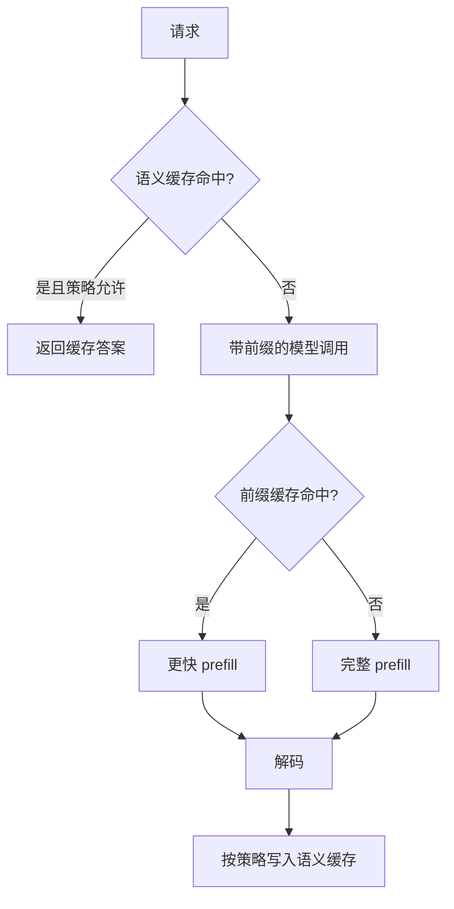

# Prompt 缓存与语义缓存

一句话直觉：缓存分两种——复用「同一前缀的计算结果/计费」叫 Prompt 缓存；复用「相似问题的答案」叫语义缓存。前者偏基础设施，后者偏产品策略，误用都会答错。

## 直觉讲解

**Prompt Caching（提示缓存 / 前缀缓存）**  
对稳定长前缀（系统提示、工具 schema、大文档）复用 KV 或厂商侧前缀状态，降低 TTFT 与输入计价。命中条件通常苛刻：**前缀字节级一致**（或按块哈希）。

**Semantic Caching（语义缓存）**  
把查询做成 embedding，近邻命中则直接返回旧答或旧中间结果。命中柔软，省全额生成，但有**错答复用**风险。



| 维度 | Prompt 缓存 | 语义缓存 |
|------|-------------|----------|
| 键 | 前缀精确 | 向量近似 |
| 错答风险 | 低（仍是现场算） | 高（可能复用旧答） |
| 主要收益 | TTFT/输入费 | 全请求费与延迟 |
| 失效 | 前缀变更 | TTL、知识更新、意图分层 |

## 工作示例（数字/场景）

**Prompt 缓存**  
系统提示 + 工具定义 = 4k token，每分钟 100 次调用。命中后输入价按厂商折扣计，TTFT 从 2.5s → 0.8s（示意）。开发者把「每日日期」塞进系统前缀最前面 → **天天全失效**。应把易变字段放后缀。

**语义缓存**  
「退货几天内可以？」与「退货期限？」应命中。  
「我的订单 ORD-1 能否退货？」与「ORD-2」**不能**仅因句式像就命中——要在键中剥离/包含实体，或对含实体查询禁用语义缓存。

**分层策略**

1. 无实体 FAQ → 语义缓存开；  
2. 含账户/订单 → 禁用或仅缓存「政策段落」；  
3. 生成后校验失败 → 不写缓存；  
4. 知识库更新 → 按文档版本甩相关键。

## 面试常问取舍

1. **能否只靠语义缓存省掉 LLM？**  
   - FAQ 可以一部分；个性化与高风险不行。

2. **阈值调高一点多省钱？**  
   - 省钱与错答正相关；按意图分阈值。

3. **Prompt 缓存是否泄漏跨租户？**  
   - 问供应商隔离；自建共享前缀要注意。

4. **和 HTTP CDN 缓存？**  
   - 可叠，但授权头与用户态不同则别乱共享。

## FDE 现场怎么用

- 提示结构：**稳定长前缀在前，变动在后**。  
- 观测：前缀命中率、语义命中率、命中后的用户差评率。  
- 写缓存前跑 Schema/安全检查。  
- 版本：`prompt_ver`、`index_ver` 进缓存键。  
- 客户沟通：分清两种缓存，避免「我们缓存了所以便宜」的含糊话。

### 实现细节

- Embedding 模型变更 = 语义缓存清空。  
- 多语言：相似度阈值可能分语言调。  
- 流式首包：语义命中可瞬间返回；统计上别和模型 TTFT 混在一个平均里不拆开。  
- 负缓存：对「未知」短时缓存防打爆，TTL 要短。

### 反模式

- 全局一个相似度阈值。  
- 缓存带 PII 的全文答案到共享 Redis 无加密。  
- 前缀里塞用户名。  
- 知识更新后不失效。

## 与本库其他篇的链接

- 概念：[16-KV-Cache](./16-KV-Cache.md)、[03-Embedding与向量表示](./03-Embedding与向量表示.md)、[09-Prompt工程](./09-Prompt工程.md)、[27-模型路由与级联](./27-模型路由与级联.md)  
- 面试题：[20.降低延迟和成本方法](../../09-面试题/1.LLM和AI基础/20.降低延迟和成本方法.md)、[1.什么是上下文窗口](../../09-面试题/1.LLM和AI基础/1.什么是上下文窗口.md)

## 深入：键设计模板

```text
semantic_key = hash(intent, locale, index_ver, normalized_question)
# 若检测到 entity → bypass semantic cache
prefix_key = hash(tenant, prompt_ver, tools_ver, stable_prefix_bytes)
```

把版本放进键，比写「记得清缓存」运维备忘录可靠。

## 课堂小结

前缀缓存省预填充；语义缓存省整次生成。前者求精确，后者控风险。分意图策略与版本化键是核心。

## 补充：缓存与合规

语义缓存可能存下含 PII 的答案。要求：
- 加密；
- TTL；
- 租户隔离；
- 用户删除权联动失效。

省下的 token 费，抵不过一次隐私事件。


> 阅读提示：本篇可与相邻概念文对照；现场讨论时优先画表，再陷细节。

## 参考与来源

- 原创综述：精确前缀 vs 语义近似的风险边界。  
- 各云 Prompt Caching 官方文档。  
- 语义缓存开源中间件思路与工程博客。  
- KV Cache / 前缀共享相关推理文献。
