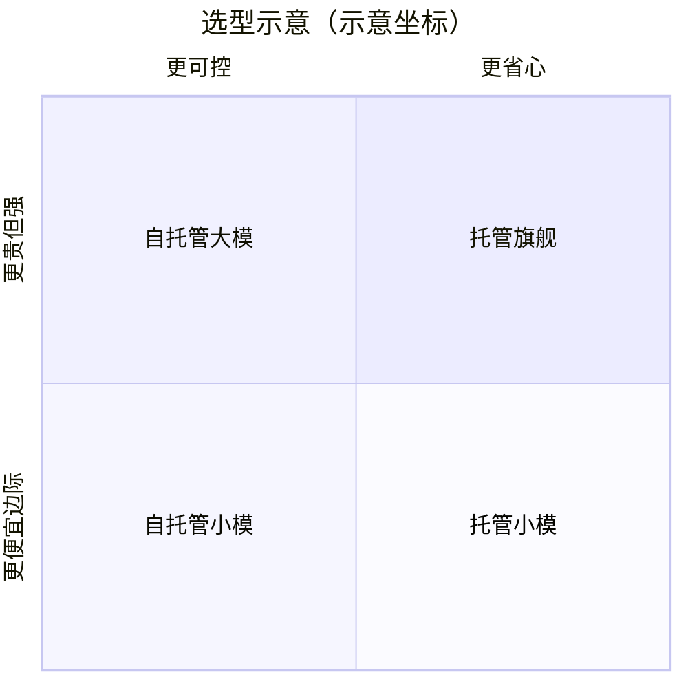

# 企业部署模型选型

一句话直觉：选型不是选参数榜第一，而是在质量、延迟、成本、合规、可控与团队能力六维上找到可上线的帕累托点，并留下换模型的退路。

## 直觉讲解

企业路径通常三条（可混合）：

| 路径 | 含义 | 典型动机 |
|------|------|----------|
| 托管 API | 调用厂商模型 | 快、省运维 |
| VPC / 专区 | 云上私有终点 | 数据边界 |
| 自托管开源 | 自己跑权重 | 可控、定制、TCO 长周期 |

评估轴：

1. **任务质量**（你们的金标，不是公开榜）  
2. **延迟与吞吐**（TTFT、P95、并发）  
3. **单价与总拥有成本**（含工程人力）  
4. **合规**（地域、行业、日志、训练 opt-out）  
5. **可控性**（版本钉扎、降级、微调）  
6. **生态**（工具调用、JSON、多模态）

（若渲染不支持 quadrant，可忽略图，以表格为准。）

## 工作示例（数字/场景）

**场景：金融只读问答**  
要求数据不出境。选：开源 14B–72B 级私有化 + RAG；或云厂商同区私有终点。旗舰公有 API 即使更强也可能过不了法务。

**场景：创业 SaaS 全球闲聊**  
托管 API + 路由小大模型，先验证市场；预留 OpenAI 兼容层便于换底座。

**场景：TCO 三年**  
自托管省 token 费，但要算：GPU、电、可靠性工程、on-call、安全补丁。流量低时 API 更便宜；稳定高流量才倾向自托管。

**PoC 协议（建议两周）**

| 日 | 产出 |
|----|------|
| 1–2 | 金标 100 条与安全用例 |
| 3–5 | 2–3 候选模型盲评 |
| 6–7 | 延迟/成本压测 |
| 8–9 | 合规问卷与日志方案 |
| 10 | 决策备忘录 |

## 面试常问取舍

1. **开源是否总更安全？**  
   - 不一定。自托管把安全责任接回家；配置错误一样泄。

2. **多模型 vs 单一厂商？**  
   - 多模型防锁死与路由优化；集成与评测成本↑。

3. **要不要等下一代模型？**  
   - 产品节奏：先可替换架构，再追新。

4. **微调底座如何选？**  
   - 许可是否允许；推理栈是否成熟；域评测是否第一。

## FDE 现场怎么用

- 输出一页「选型计分卡」，权重由业务填。  
- 抽象：内部 `Completion` 接口，厂商当适配器。  
- 钉版本：生产禁 `latest` 默漂。  
- 准备降级链：主 → 备 → 规则/人工。  
- 合同：数据是否用于训练、留存天数、事故条款。

### 计分卡模板字段

- 金标准确率 / 分任务  
- P95 延迟  
- 每 1k 请求成本  
- 工具调用成功率  
- 中文/代码/表格专项  
- 隐私合规通过与否（一票否决）  
- 工程师熟悉度  

### 反模式

- 只看 LMSYS 名次。  
- 无金标的「大家觉得聪明」。  
- 忽视输出侧 DLP。  
- 一把梭全自建平台半年不业务上线。

## 与本库其他篇的链接

- 概念：[20-MoE混合专家](./20-MoE混合专家.md)、[27-模型路由与级联](./27-模型路由与级联.md)、[12-微调vs-RAG-vs-Prompt](./12-微调vs-RAG-vs-Prompt.md)、[21-Scaling-Laws缩放律](./21-Scaling-Laws缩放律.md)  
- 面试题：[20.降低延迟和成本方法](../../09-面试题/1.LLM和AI基础/20.降低延迟和成本方法.md)、[11.prompt-rag微调选择](../../09-面试题/1.LLM和AI基础/11.prompt-rag微调选择.md)、[8.基础指令模型区别](../../09-面试题/1.LLM和AI基础/8.基础指令模型区别.md)

## 深入：退出厂商策略

合同与架构预留：
- 提示与评测可迁移；
- 抽象 API；
- 数据导出；
- 双厂商影子跑一周的能力。

锁死在单一 `latest` 模型上，是战略风险。

## 课堂小结

选型是六维优化加一票否决的合规。计分卡、钉版本、降级链，比参数榜更接近 FDE 日常。

## 参考与来源

- 原创综述：六维计分卡与 PoC 协议。  
- 模型卡、许可（Apache/Llama/限制性商用条款）公开文本。  
- 云厂商私有化/专区文档。  
- 开源推理与评测工具生态公开材料。
