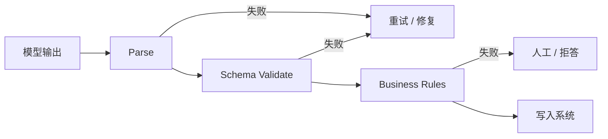

# 结构化输出与 Schema 校验

一句话直觉：把模型当成「不可靠的函数」，用 Schema 定义契约，用校验决定重试、降级或放行——结构正确只是底线，业务正确还要第二道门。

## 直觉讲解

**Structured Output（结构化输出）** 要求模型产出机器可消费的数据（JSON、XML、表格、工具参数），而非自由散文。**Schema 校验**用 JSON Schema / Pydantic / Protobuf 等检查类型、必填、枚举、范围。

分层防御：

| 层 | 手段 | 挡什么 |
|----|------|--------|
| 1 | 提示中的格式说明 | 软约束 |
| 2 | 工具调用 / JSON mode | 通道约束 |
| 3 | 约束解码 / grammar | 生成期合法 |
| 4 | 运行时 Schema validate | 终检 |
| 5 | 业务规则 / 权限 | 语义与安全 |

「修复（repair）」可用第二次模型调用「只修格式」，但要限次数，防死循环烧钱。

## 工作示例（数字/场景）

**场景：CRM 写回**  
Schema：`stage` 枚举、`amount` > 0、`close_date` ISO。  
仅提示：4% 解析失败。  
JSON mode + 校验 + 1 次修复：解析失败 <0.2%，但仍有 1% 业务错（阶段不合法跃迁）——靠业务规则挡。

**场景：嵌套过大**  
Schema 300 字段，模型漏填。应拆多步抽取或先分类再填子 Schema。

**场景：与 TypeScript 同源**  
用同一来源生成 JSON Schema 与前端类型，减少漂移。

示意错误分类看板：

| error_class | 动作 |
|-------------|------|
| parse_error | 重试/约束加强 |
| schema_error | 修 schema 或提示 |
| business_error | 规则/人工 |
| auth_error | 拒绝 |

## 面试常问取舍

1. **全走自然语言再 NLP 抽取？**  
   - 多一跳误差；能结构就结构。

2. **严格 Schema 会否逼出幻觉字段？**  
   - 会。可选字段、明确 null、允许「未知」枚举。

3. **工具调用是否还要 Schema？**  
   - 要。工具参数仍可能缺字段或类型错。

4. **流式结构化？**  
   - 可增量 parse，但提交点必须在完整合法对象之后。

## FDE 现场怎么用

- 所有写副作用的输出强制 Schema + 权限检查。  
- 指标分 class，别只报「成功率」。  
- 与面试题 JSON 破坏模式对照做用例库。  
- 版本化 Schema，兼容期双读。  
- 日志存 raw 与 parse 后，脱敏。

### Schema 设计实践

- 字段名稳定、语义单一。  
- 用枚举代替开放字符串（若可能）。  
- 日期/货币格式写死。  
- 提供 `notes` 自由文本垃圾桶，避免硬塞。  
- 例：`confidence` 0–1，供路由，不供盲信。

### 修复策略

1. 本地确定性修复（掐 markdown 围栏、修尾逗号）；  
2. 再模型修复；  
3. 换更大模型；  
4. 人工。  

每步可观测。

## 与本库其他篇的链接

- 概念：[08-约束解码Constrained-Decoding](./08-约束解码Constrained-Decoding.md)、[09-Prompt工程](./09-Prompt工程.md)、[07-Temperature-Top-p与采样](./07-Temperature-Top-p与采样.md)  
- 面试题：[18.JSON破坏模式问题](../../09-面试题/1.LLM和AI基础/18.JSON破坏模式问题.md)、[17.工具调用失败](../../09-面试题/1.LLM和AI基础/17.工具调用失败.md)

## 深入：与 IDE/代码生成同源

用 JSON Schema 生成：
- Pydantic 模型；
- TypeScript类型；
- 文档示例。

减少「后端已改、提示未改」的事故面。

## 课堂小结

结构化输出把 LLM 接进软件。Schema、约束、业务规则分层，错误分类可观测，才能敢写库。

## 补充：契约测试

CI 中用固定假模型输出（合法/非法夹具）跑校验逻辑，不依赖真实 LLM。把 Schema 当 API 合同测，才能稳定重构。

## 参考与来源

- 原创综述：分层契约与错误分类。  
- JSON Schema 标准文档。  
- 厂商 structured outputs / function calling 文档。  
- Pydantic / Zod 等校验库文档。
