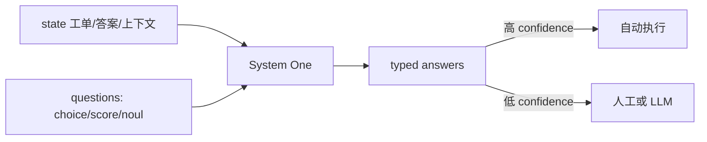

# System One 决策模型（Jev）

一句话直觉：**把「分类 / 路由 / 打分 / 是否放行」从生成式 LLM 里拆出来**——用返回**类型化决策 + 校准概率**的专用模型，而不是让大模型写一段话再正则解析。

---

## 直觉讲解

企业流水线里大量步骤其实不是「写文章」，而是**决策**：工单进哪条队列、是否触发退款审批、答案是否忠实于检索上下文、该不该升级到旗舰模型。若一律调用生成式 LLM，你会同时踩坑：

1. **结构不稳定**：偶发非法 JSON / 编造新标签  
2. **置信度不可用**：模型说「我很确定」与真实正确率不对齐  
3. **延迟与成本过高**：70–500ms 能做完的事，却付秒级生成的账  

**System One 决策模型**（TypeSafe 等产品线里的 Jev 是代表实现）专门干这件事：输入一段 `state`（文本、结构化对象或数组），加上有界问题（choice / score / noul 等），一次前向返回**锁定在你声明类型上的答案**，并附带**校准过的概率与 confidence**。TypeSafe 借用 Kahneman 隐喻：System One = 快、有界、直觉式决策；System Two = 慢、开放式推理与长文生成（交给 frontier LLM）。

| 维度 | 生成式 LLM | System One 决策模型 |
|------|------------|---------------------|
| 输出 | token 流 / 自由文本 | choice / score / 是-否概率 |
| 非法输出 | 可能 | 类型锁定，结构错误率趋近 0 |
| 延迟量级 | 秒级常见 | 约 70–500ms（产品公开口径） |
| 置信度 | 默认未校准 | 面向决策做过校准（如 RLCD） |
| 擅长 | 写作、推理、代码 | 路由、分类、评判、门禁 |

**三种常见原语（以 Jev 风格 API 为例）：**

| 原语 | 你给什么 | 你拿回什么 | 典型用途 |
|------|----------|------------|----------|
| `choice` | ≤255 个标签 + 说明 | 选中 key + 每类概率 + confidence | 工单路由、意图分类 |
| `score` | 2–10 档量规描述 | 分数 + 各档概率 | 质量打分、风险档 |
| `noul` | 是/否指令 | [0,1] 校准概率 | 护栏门禁、是否升级 |

> 注意：类型锁定 ≠「永远正确」。它保证**不会吐出你没声明的标签**，不保证标签选对。正确率仍靠评测与阈值；confidence 用来**弃权 / 升级人工 / 升级大模型**。



---

## 工作示例

### 1）客服工单路由（choice）

```json
{
  "state": { "ticket": "我被扣了两次年费，发票也打不开" },
  "questions": {
    "queue": {
      "type": "choice",
      "instructions": "工单应进哪条队列？",
      "criteria": {
        "billing": "付费、扣款、发票",
        "technical": "产品故障、打不开",
        "abuse": "骚扰/欺诈",
        "sales": "询价、升级套餐"
      }
    }
  }
}
```

返回形如：`answers.queue.choice = "billing"`，附带各类概率与 confidence。代码直接 `switch`，**零解析**。若 confidence < 0.55，转人工或再调 LLM 读完整对话。

### 2）RAG 答案门禁（noul + score）

- `faithful`（noul）：「答案是否被检索片段支持？」  
- `quality`（score）：按量规 1–5 打「可操作性」  
- 仅当 `faithful.noul ≥ 0.8` 且 `quality.score ≥ 3` 才自动回复；否则拒答或补检索。

这比「请 LLM 自我打分并输出 JSON」更稳：结构不会坏，阈值可版本化钉死。

### 3）模型路由（决策模型 vs 级联）

先用 System One 估复杂度：简单抽取 → mini 模型；多跳推理 → frontier。公开示例里甚至有专门的 model-route 接口。与本轨道「模型路由与级联」互补：**路由器本身也可以不是生成式模型**。

**量级直觉（产品公开口径，面试口述用「量级」而非死记）：** 决策调用常在亚秒；相对完整 LLM 生成可快几十到上百倍；按输入 token 计费时，输出常不计或极低——适合高 QPS 门禁。

---

## 面试常问取舍

**Q：这不就是分类器吗？为何单独成概念？**  
A：传统分类器要你自训标签空间；System One 面向**运行时声明的有界问题**，一次请求可并行多个 questions，并强调**校准概率可进策略**。面试要讲清：它解决的是「企业流水线里的决策原语」，不是又一个 LLM 聊天 API。

**Q：和约束解码 / JSON mode 比？**  
A：约束解码保证结构；仍可能选错类，且置信度未校准。System One 把「类型 + 校准 + 低延迟」打包成决策接口。复杂写作仍用 LLM + 约束解码。

**Q：何时仍必须用 LLM？**  
A：开放域写作、多步工具规划、需要引用长文推理。决策模型**不会**替你写邮件或编代码。

**Q：校准坏了会怎样？**  
A：阈值失效：该拦的没拦、该自动的全转人工。所以要**钉死模型版本**（如 `jev-1.x.x`），换版本重跑金标与阈值扫描。

| 取舍 | 全用 LLM 分类 | System One |
|------|----------------|------------|
| 结构可靠性 | 中 | 高 |
| 延迟/成本 | 高 | 低 |
| 开放生成 | 强 | 无 |
| 运维 | schema 修复多 | 阈值与版本治理 |

---

## FDE 现场怎么用

1. **拆流水线**：列出「决策点」与「生成点」；决策点优先 System One / 小分类器 / 规则。  
2. **先写策略再接模型**：`if confidence < τ → human`，τ 用金标标定，不拍脑袋。  
3. **钉版本**：生产别追 `latest`；换版当模型发布做 canary。  
4. **与 Agent 边界**：Agent 环里每一步工具选择也可以是 decision call，减少「自由发挥选错工具」。  
5. **客户话术**：强调「零结构幻觉、可审计阈值」，比吹榜单分数更贴近采购与风控。

### 反模式

- 用决策模型写长文摘要  
- 不设弃权阈值，把低 confidence 当高确信自动执行  
- 标签 criteria 写得重叠，导致概率糊成一团  
- 把「类型锁定」宣传成「不会错」

---

## 与本库其他篇的链接

- 概念：[08-约束解码Constrained-Decoding](./08-约束解码Constrained-Decoding.md)、[27-模型路由与级联](./27-模型路由与级联.md)、[30-结构化输出与Schema校验](./30-结构化输出与Schema校验.md)、[12-微调vs-RAG-vs-Prompt](./12-微调vs-RAG-vs-Prompt.md)  
- 评测：[校准与不确定性](../03-评测与ML基础/07-校准与不确定性.md)、[精确率召回率F1](../03-评测与ML基础/02-精确率召回率F1.md)  
- 面试题：[18.JSON破坏模式问题](../../09-面试题/1.LLM和AI基础/18.JSON破坏模式问题.md)、[10.分类器精确率和召回率选择](../../09-面试题/1.LLM和AI基础/10.分类器精确率和召回率选择.md)、[11.prompt-rag微调选择](../../09-面试题/1.LLM和AI基础/11.prompt-rag微调选择.md)

---

## 参考与来源

| 来源 | 链接 | 本篇用法 |
|------|------|----------|
| TypeSafe / Jev：Decision models | https://www.jevtypesafeai.com/decision-model | System One 定义与对比表 |
| Jev classifier / API | https://jevtypesafeai.com/docs | choice/score/noul 原语 |
| Kahneman *Thinking, Fast and Slow* | 公开著作 | System 1/2 隐喻（非实现细节） |
| 本文 | — | 原创综述：FDE 现场如何拆分决策点与生成点 |
