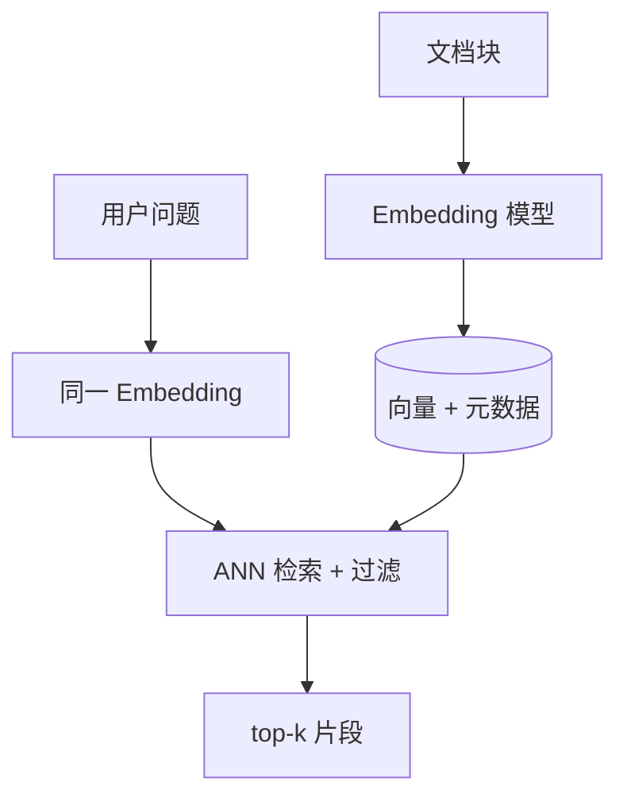

# 02 · 向量数据库（Vector Database）

## 一句话直觉

**把「意思相近」变成「距离相近」**，再用专用索引在百万级片段里快速找出邻居。

---

## 直觉讲解

文本经 embedding 模型变成固定维实数向量（如 768/1536 维）。语义相近的句子，在向量空间里往往更靠近（余弦相似度更高，或欧氏距离更小）。向量数据库（或带向量能力的搜索引擎）负责：

- **存储**：向量 + 原文片段 + 元数据  
- **索引**：ANN（近似最近邻）结构，避免每次暴力扫全库  
- **查询**：给定查询向量，返回 top-k 邻居，并支持元数据过滤  
- **运维**：增删改、重建、多租户、备份与监控

「要不要上专用向量库」取决于规模与约束：

| 方案 | 适合 | 注意 |
|------|------|------|
| 内存/FAISS 单机 | POC、十万级 | 高可用与多副本自建 |
| pgvector / ES knn | 已有 PG/ES 栈 | 超大规模需压测 |
| 托管向量库（Pinecone、Milvus 云等） | 要省运维 | 成本、合规、出境 |
| 混合搜索引擎 | 企业默认常选 | 向量 + BM25 一体 |

向量库**不等于** RAG 成功：切块差、embedding 不匹配领域、不过滤权限，库再快也答错。

---

## 工作示例

**场景**：10 万条政策与 FAQ 片段，维度 1536，日查询 2 万次。

| 项目 | 选型示例 | 理由 |
|------|----------|------|
| 距离度量 | 余弦 / 内积（与模型训练一致） | 度量与模型不匹配会掉点 |
| 索引 | HNSW 或 IVF-PQ | 召回与内存/延迟权衡 |
| 过滤 | `acl_tags CONTAINS user_roles` **预过滤** | 先裁剪候选再搜或边搜边滤 |
| 吞吐 | P95 < 80ms 检索 | 重排另算 |
| 版本 | `embed_model=text-emb-3, ver=2026-01` | 换模型必须重建 |

**容量粗算**：10 万 × 1536 × 4 bytes ≈ 0.6 GB 裸向量；加上索引与原文，常见是数 GB 量级。百万级要认真做分片与内存规划。

**写入路径**：文档更新 → 重新切块 → 删旧块 id → 写新向量。避免「只追加不失效」导致旧政策仍被检索到。

---

## 面试常问取舍

**Q：向量库和传统搜索引擎区别？**  
A：传统偏关键词与倒排；向量偏语义相似。企业常要**两者都要**（见混合检索篇）。

**Q：精确 kNN 还是 ANN？**  
A：全量精确在百万级通常太慢；生产用 ANN，用召回率@k 与延迟曲线选参数（ef、nprobe 等）。

**Q：元数据过滤放前还是放后？**  
A：权限类过滤必须在检索路径强制生效（预过滤或受支持的混合过滤）。事后用 prompt「别看无权限的」不可靠。

**Q：要不要自研向量库？**  
A：FDE 现场几乎永远不建议。选可运维、可审计、客户栈友好的方案，把时间花在语料与评测上。

| 维度 | 选轻 | 选重 |
|------|------|------|
| 规模 | <50 万块，单区域 | 多区域、十亿级 |
| 合规 | 公有云托管 | 私有化 / 专有云 |
| 查询 | 纯向量 | 向量 + 关键词 + 复杂 ACL |

---

## FDE 现场怎么用

与基础设施/数据团队对齐五件事：

1. **embedding 模型谁定、版本如何冻结**  
2. **索引重建窗口**（换模型、大面积改切块时）  
3. **多租户隔离**（按客户/部门的 collection 或 partition）  
4. **观测**：QPS、P95、空结果率、过滤后候选为 0 的比例  
5. **备份与回滚**：坏发布能回到上一索引版本  

POC 阶段可用托管或 pgvector 快速验证效果； dig 阶段再谈生产拓扑，避免第一周陷入「自建 Milvus 集群」泥潭。

---

## 与本库其他篇的链接

- `01-RAG检索增强生成`、`06-ANN近似最近邻`、`24-Embedding版本与漂移`、`25-索引新鲜度与陈旧窗口`  
- 落地：[RAG 实战精要](../../03-AI落地/RAG实战精要.md)  
- 面试：`6.什么是embedding语义搜索.md`

---

## 选型决策清单

现场会上用这张表逼出决策，而不是争论品牌：

| 问题 | 选项 A | 选项 B |
|------|--------|--------|
| 现有搜索栈？ | 已有 ES/OS → 先扩展 | 绿场 → 托管或 PG |
| 数据出境？ | 不可 → 私有化 | 可 → 托管加速 |
| 规模？ | <100 万块 → 简化 | 更大 → 分片与压测 |
| 过滤复杂度？ | 简单标签 → 任意方案 | 行级动态 ACL → 验证引擎能力 |
| 团队运维？ | 弱 → 托管 | 强 → 可自建 |

## 运维最小集

- 备份与恢复演练（季度）  
- 索引版本与 embedding 版本联表  
- 查询与写入的分离或限流  
- 慢查询日志与空结果告警  
- 容量水位：内存、磁盘、QPS  

POC 成功不等于生产就绪：把「高可用拓扑」单列里程碑，防止演示集群直接扛流量。

---

## 参考与来源

- 原创综述：向量存储在企业 RAG 中的职责边界（本篇）  
- HNSW / IVF 等 ANN 经典文献（见 ANN 专篇）  
- PostgreSQL pgvector、Elasticsearch/OpenSearch knn、Milvus 等官方文档（选型对照）
