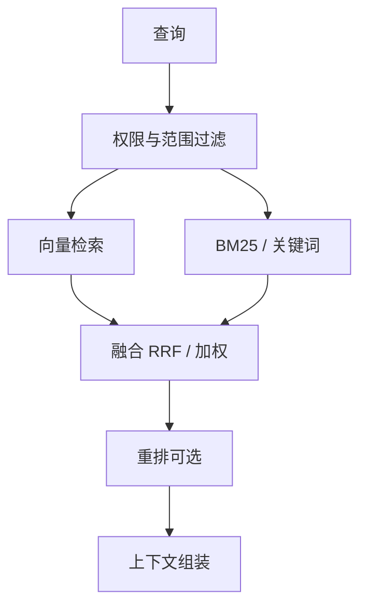

# 03 · 混合检索（Hybrid Search）

## 一句话直觉

**关键词认得准编号，向量懂意思**——企业检索默认值得两者一起用，再用融合把两路结果合成一份候选。

---

## 直觉讲解

向量检索擅长「换一种说法也能找到」：用户说「怎么把东西退回去」，文档写「七天无理由退换」，向量仍可能靠近。BM25/关键词擅长「订单号、SKU、法规条文号、报错码、合同编号」这类**必须字面命中**的串。只做向量时，专有名词被分词切碎或淹没在同义噪声里，容易漏检；只做关键词时，口语与同义改写会对不上正式公文表述。

混合检索的常见生产形态：

1. **并行双路**：同一过滤条件下，向量 top-N 与 BM25 top-N 同时取回  
2. **分数融合**：RRF（Reciprocal Rank Fusion）或归一化后加权求和  
3. **元数据预过滤**：先按权限、租户、产品线、时间窗裁剪语料，再双路搜索  
4. **可选重排**：融合后的候选再用交叉编码器精排，输出进 LLM 的 top-k  

| 融合方式 | 直觉 | 适用 | 注意 |
|----------|------|------|------|
| RRF | 主要看各路排名 | 默认稳健起点 | `k` 常取 60 |
| 加权分 | `α·vec+(1-α)·bm25` | 业务明确偏科时 | 分数量纲需归一 |
| 级联 | 先关键词收窄再向量 | 强精确约束 | 关键词空结果会断链 |
| 学习融合 | 用点击/标注训权重 | 有日志的成熟系统 | 冷启动困难 |

「混合」不是银弹：两路召回都差时，融合只是把差结果搅在一起；`α` 与各路 `N` 必须用**拆分过的评测集**调，不能拍脑袋。还要注意去重：同一 `chunk_id` 在两路都出现时只保留一条，避免上下文重复占窗口。

与「多查询改写」的关系：改写生成多个 query 再检索，是另一条提升召回的轴；可以和混合叠加，但延迟与费用会上升，需按 SLA 降级。

---

## 工作示例

**场景**：内部 IT 知识助手，语料含故障手册、报错码表、口语化 FAQ。

| 查询类型 | 仅向量常见现象 | 仅 BM25 常见现象 | 混合后 |
|----------|----------------|------------------|--------|
| `ERR-5042 怎么处理` | 泛化到「超时类」其他错误 | 精确打中码表条目 | BM25 贡献关键命中 |
| 「网络总是断断续续」 | 命中「间歇性丢包排查」 | 关键词稀疏、排序不稳 | 向量贡献主命中 |
| 「看下合同 CT-2026-088 违约金」 | 可能偏到其他违约金条款 | 锚定合同编号段落 | 双路互补 |
| 「把电脑弄得快一点」 | 命中性能优化 FAQ | 「电脑」「快」过于泛 | 融合后靠重排收干净 |

**RRF 计算直觉**：对每个文档，`score = Σ_i 1/(k + rank_i)`。若某文档在向量路 rank=1、BM25 路 rank=5，仍可能超过「只在一路排第 2」的文档。这解释了为什么混合能救出「一路很强、另一路中等」的真相关。

**评测怎么拆**：不要只报一个平均 hit@5。至少切两刀——

- **精确串子集**（编号、SKU、法条号）  
- **语义改写子集**（同义、口语、缺主语）  

再加一刀「权限过滤后仍正确」。POC 阶段每类不少于 20 题，才能决定 α 或是否上 RRF。

**延迟粗算**：双路并行时，端到端检索 ≈ max(向量, BM25) + 融合（通常 <5ms）+ 可选重排。真正的预算杀手往往是 embedding 与 rerank，不是融合函数本身。

---

## 面试常问取舍

**Q：为什么有了重排还要混合？**  
A：重排只在候选集上工作；文档若从未被召回，交叉编码器再强也看不见。混合提升的是**召回覆盖面**，重排提升的是**进入上下文的顺位**。

**Q：α 怎么定？RRF 还是加权？**  
A：没有标注时优先 RRF，少调参。有验证集时可扫 α∈[0.2,0.8]；目录型、编码型业务 α 偏低（偏关键词），咨询型口语业务 α 偏高。

**Q：两路 top-N 取多少？**  
A：常见每路 30–50，融合后截断 50–100 给重排。N 太小会伤召回，太大浪费重排与窗口。

**Q：混合是否取代 GraphRAG？**  
A：不取代。混合解决的是「字面 vs 语义」；图谱解决的是「多跳实体关系」。先混合，再按坏案例决定要不要图。

| 取舍维度 | 偏简单 | 偏效果 |
|----------|--------|--------|
| 路数 | 单向量 | 向量+BM25+多查询 |
| 融合 | RRF | 业务规则+学习排序 |
| 过滤 | 后置过滤 | 预过滤+审计 |
| 降级 | 一路失败则整失败 | 单路降级仍返回 |

---

## FDE 现场怎么用

向客户做检索对比演示时，准备**两组 query**：一组报错码/合同号，一组完全口语。现场切换「仅向量 / 仅关键词 / 混合」，把 top-5 列表投屏。客户通常在 3 分钟内自己得出「要混合」的结论，比讲余弦公式有效。

落地检查清单：

1. 搜索栈是否原生支持混合（OpenSearch、部分向量库、自建融合层）  
2. 统一 `chunk_id` / `doc_id`，融合可去重、可追溯  
3. 日志记录每路命中与最终融合分，坏案例可归因  
4. 评测集显式标注题型标签（exact / semantic / acl）  
5. 与权限团队确认：过滤在融合之前，且对两路一视同仁  

范围说明书里写清：POC 默认混合 + RRF；是否上重排单列里程碑与延迟预算。

---

## 与本库其他篇的链接

- 同目录：`01-RAG检索增强生成`、`02-向量数据库`、`12-TF-IDF与BM25`、`05-重排与两阶段检索`、`22-查询改写扩展与HyDE`  
- 落地实战：[RAG 实战精要](../../03-AI落地/RAG实战精要.md)  
- 面试对照：`docs/09-面试题/1.LLM和AI基础/13.rag搜索准确性.md`

---

## 融合实现细节

**RRF 伪代码直觉**：对每一路排序列表，累加 `1/(k+rank)`，按总分排序，再截断。  
**加权融合**：先把各路分数做 min-max 或 z-score，再乘 α。不同引擎原始分不可比，是加权翻车主因。

**去重**：融合后按 `chunk_id` 去重；近重复可用标题+前 64 字符指纹。  
**解释性**：日志里保留 `from_vector_rank`、`from_bm25_rank`，坏案例才能归因。

## 何时不要混合

- 语料纯数值表且查询几乎全是编码 → 先把关键词分析器做强  
- 延迟极端敏感且单路已达指标 → 别为架构美观加路  
- 两路共享错误切块 → 先修切块，融合救不了结构性错误

---

## 参考与来源

- 原创综述：企业 RAG 场景下混合检索的默认理由、融合方式与评测拆分（本篇）  
- Cormack, Clarke, Buettcher — Reciprocal Rank Fusion 相关工作  
- Elasticsearch / OpenSearch Hybrid Search 官方文档  
- 本库生产化思路见 [生产化清单](../../03-AI落地/生产化清单.md)
