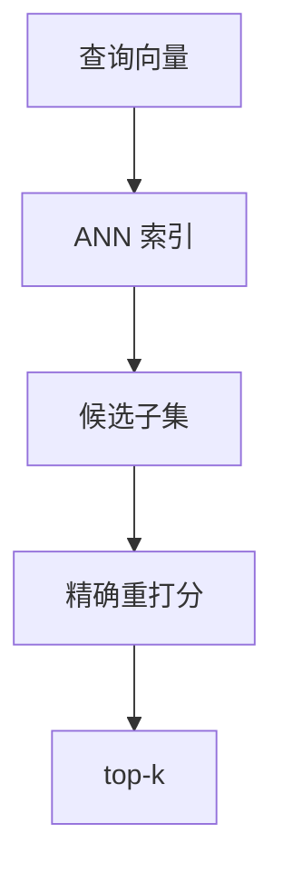

# 06 · ANN 近似最近邻（Approximate Nearest Neighbor）

## 一句话直觉

**不求每次都数学最精确，但求在毫秒级找到「几乎最近」的邻居**——用可控误差换数量级加速。

---

## 直觉讲解

精确最近邻（exact kNN）要对查询向量与库中每一个向量算距离，复杂度随库规模线性涨。百万、千万级片段时，暴力扫库无法满足交互式延迟。ANN 用索引结构把搜索限制在「很有希望」的子集上，换取近似结果。

常见家族（面试能点名即可，不必手推证明）：

| 家族 | 代表 | 直觉 | 调参关键词 |
|------|------|------|------------|
| 图方法 | HNSW | 多层近邻图上贪心走跳 | `M`, `efConstruction`, `efSearch` |
| 倒排量化 | IVF-PQ / IVF-Flat | 先找簇再在簇内比 | `nlist`, `nprobe`, 是否 PQ |
| 树 / LSH 等 | Annoy、LSH | 空间划分或哈希桶 | 树数、桶宽 |
| 磁盘/分布式 | DiskANN 等 | 内存装不下时 | 缓存与 I/O |

度量必须与 embedding 训练一致：有的模型适余弦/内积，有的适 L2。**度量选错，指数再优也歪。**  
ANN 的质量用召回率刻画：例如 Recall@10 = 近似 top-10 与精确 top-10 的重叠比例。上线前用抽样精确扫描做曲线：横轴延迟，纵轴 Recall，选满足 SLA 的工作点。

过滤（尤其 ACL）与 ANN 的交互很坑：有的引擎「先搜再滤」会导致过滤后不足 k 条；有的支持「边搜边滤」。权限场景必须验证**过滤后仍能填满 top-k**，且绝不能泄漏无权限邻居。

---

## 工作示例

**场景**：80 万政策块，维度 768，目标检索 P95 < 40ms，Recall@10 ≥ 0.95。

| 配置 | efSearch / nprobe | P95 | Recall@10 | 备注 |
|------|-------------------|-----|-----------|------|
| HNSW 保守 | ef=64 | 18ms | 0.97 | POC 常用 |
| HNSW 激进 | ef=16 | 9ms | 0.88 | 召回不够 |
| IVF nprobe=8 | 8 | 15ms | 0.91 | 需训练聚类 |
| IVF nprobe=32 | 32 | 35ms | 0.96 | 接近预算 |

**带权限过滤的坑**：用户只能看 5% 语料。若先 ANN 取 20 再滤，可能只剩 0–2 条。对策：提高候选倍数、使用支持约束的搜索、或按租户分库/分区，使「可见集」本身更小更纯。

**重建**：换 embedding、改维度、大面积改切块，都要重建 ANN。PQ 压缩省内存但损精度，合规审计场景慎用过度压缩。

**观测**：监控「空结果率」「过滤后候选不足率」「索引内存」「构建耗时」。索引构建打满 CPU 时不要与高峰查询抢同一节点。

---

## 面试常问取舍

**Q：ANN 和「向量数据库」是一回事吗？**  
A：ANN 是检索算法/索引；向量库是产品形态（存储、过滤、运维、多租户）。库内部通常实现某类 ANN。

**Q：能不能为了准一直用精确搜索？**  
A：小库（如数万）可以。规模上来后，精确搜索的 P99 会先炸。用 Recall-延迟曲线说话。

**Q：HNSW 参数怎么讲？**  
A：`efSearch` 越大越准越慢；构建期参数影响图质量与内存。现场答「按验证集扫参」比背默认值加分。

**Q：PQ 值得吗？**  
A：内存紧张、允许小幅召回损失时可开。高合规、高正确性问答可先 IVF-Flat/HNSW 全精度。

| 取舍 | 偏延迟 | 偏召回 |
|------|--------|--------|
| ef/nprobe | 小 | 大 |
| 压缩 | PQ/标量量化 | 全精度 |
| 过滤 | 后置 | 分区+约束搜索 |

---

## FDE 现场怎么用

与客户基础设施团队对齐三张图：①索引类型与内存估算；②Recall-延迟曲线；③过滤策略与多租户隔离。避免会议陷入「我们自研一个更快的图索引」。

POC 用托管或成熟库默认 HNSW 即可；把精力放在切块、权限、评测。只有当规模/成本证明默认索引不够时，再开专项调参。

上线前做一次「精确对照抽样」：抽 1k 查询暴力算 top-10，估计生产 Recall，写入验收附件。

---

## 与本库其他篇的链接

- 同目录：`02-向量数据库`、`03-混合检索Hybrid-Search`、`05-重排与两阶段检索`  
- [RAG 实战精要](../../03-AI落地/RAG实战精要.md)  
- 面试：`6.什么是embedding语义搜索.md`、`7.点积是注意力机制与嵌入向量中的相似度得分.md`

---

## 参数扫描怎么做

1. 抽 1k–5k 查询（或评测集）  
2. 对子集算精确 top-10（可暴力或高参 ANN 近似当真值）  
3. 扫 efSearch/nprobe，画 Recall–延迟曲线  
4. 选满足 P95 预算的最高 Recall 点  
5. 固化到配置，变更走评审  

## 内存粗估提醒

图索引常比裸向量更大。千万级 × 高维全精度可能逼近上百 GB 内存。谈「上亿向量」时先让基础设施报内存账单，再谈算法名词。

---

## 练习与自检

读完本篇后，尝试用自己的项目回答：

1. 若不做这一能力，失败模式是什么？  
2. 最小可行实现需要哪些组件？  
3. 上线门禁指标是哪三个？  
4. 与权限、费用、延迟如何互相牵扯？  

把答案写进决策备忘录，比只收藏文章更接近 FDE 日常。

---

## 参考与来源

- 原创综述：ANN 在企业 RAG 中的角色、指标与过滤陷阱（本篇）  
- Malkov & Yashunin — HNSW  
- Jégou et al. — Product Quantization  
- FAISS / ScaNN / 各向量库调参手册（实现向）
