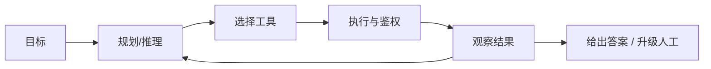

# 07 · AI Agent 与工具使用

## 一句话直觉

**模型不只负责「说」，还负责在边界内「做事」**——通过工具读系统、写系统，但自主性必须有界。

---

## 直觉讲解

Agent（智能体）在工程上通常指：**大模型 + 记忆/状态 + 工具 + 循环控制**，能把目标拆成多步并观察结果再继续。它与「单次补全」的差别不在模型品牌，而在**是否多步、是否碰外部副作用**。

三种形态务必分清（面试高频）：

| 形态 | 谁决定步骤 | 副作用 | 企业默认 |
|------|------------|--------|----------|
| 单次调用 | 开发者写死一轮 | 无或一次工具 | 简单问答 |
| 工作流 / 编排 | 状态机/图预先定义 | 可控 | **多数生产首选** |
| 自主 Agent | 模型动态规划 | 不确定 | 探索性、可逆场景 |

工具使用的核心风险不在「会不会调用 JSON」，而在：

- **权限**：是否借用超级服务账号绕过用户 ACL  
- **不可逆**：退款、删数、对外发信  
- **不可观测**：不知道调用了什么、为何调用  
- **失控循环**：重复试错烧钱或打爆 API  

因此 FDE 叙事应是：**有界自主（bounded autonomy）+ 人在回路（HITL）**，而不是「全自动员工」。

---

## 工作示例

**场景**：IT 服务台助手「帮我查一下工单 INC-8891 状态，若仍卡在供应商，就创建催办评论」。

| 步 | 动作 | 工具 | 策略 |
|----|------|------|------|
| 1 | 解析意图 | — | 工作流节点 |
| 2 | 读工单 | `get_ticket(id)` | L0 只读，自动 |
| 3 | 判断是否需催办 | 规则+模型 | 可解释理由 |
| 4 | 写评论 | `add_comment` | L1，可自动或抽检 |
| 5 | 若要改优先级 | `update_priority` | L2，强制 HITL |

**反例**：给模型一个 `run_sql(any)` 或 `shell(any)`「超级工具」。演示很爽，生产是事故。

**成本感**：自主 Agent 平均 5–15 次模型调用/任务并不罕见；要用「任务成功率 / 人工接管率 / 单任务费用」而不是单次 token 价评估。

---

## 面试常问取舍

**Q：客户说「我们要 Agent」，你怎么接？**  
A：先还原任务是否真需动态多步与写操作。多数「Agent」需求用工作流+工具调用即可，自主循环最后上。

**Q：Agent 和 RAG 什么关系？**  
A：RAG 是读知识的一种工具化能力；Agent 可能在某一步调用检索。二者正交，可组合。

**Q：如何证明该用自主而非工作流？**  
A：步骤顺序强依赖中间观察、分支爆炸、预先建模成本高于风险可控的自主探索——且动作可逆或有 HITL。

| 取舍 | 工作流 | 自主 Agent |
|------|--------|------------|
| 可预期性 | 高 | 低 |
| 覆盖长尾 | 弱 | 强 |
| 审计 | 易 | 需轨迹存储 |
| 费用 | 稳 | 尾部贵 |

---

## FDE 现场怎么用

进场用客户语言画三种形态表，让业务勾选「哪些动作能自动、哪些必须人批」。把工具分级写进范围：L0–L3。

POC 成功标准示例：

- 只读任务自动完成率 ≥ 某阈值  
- 写操作 100% 留痕  
- 高危操作 100% HITL  
- 单任务 P95 步数与费用上限  

详见同库 Agent 专文；本概念课强调「边界」而非框架品牌。

---

## 与本库其他篇的链接

- 同目录：`08-工具与函数调用`、`09-多Agent编排`、`15-Agent-vs-工作流-vs-单次调用`、`16-ReAct循环`、`20-有界自主与人在回路`  
- 落地：[Agent 与工具调用](../../03-AI落地/Agent与工具调用.md)、[Google-ADK 与多 Agent 编排](../../03-AI落地/Google-ADK与多Agent编排.md)  
- 面试：`17.工具调用失败.md`、`19.反对使用智能体理由.md`

---

## 自主性量尺

用一句话对齐客户预期：「系统可以自己查和起草，但涉及改数据、花钱、对外通信，必须按级别请示。」

| 级别 | 自主 | 例子 |
|------|------|------|
| L0 | 高 | 检索、解释 |
| L1 | 中 | 建草稿 |
| L2 | 低 | 改状态、退款 |
| L3 | 无/双人 | 删数、转账 |

## 与组织变革

Agent 项目失败经常不是模型不行，而是职责没人认：谁批、谁看审计、谁训语料。FDE 要同时交「技术架构」和「操作模型」。

---

## 参考与来源

- 原创综述：企业场景下 Agent 的形态划分与风险边界（本篇）  
- ReAct 等工具循环论文（见 ReAct 专篇）  
- 本库：[评测 Eval 与 Guardrails](../../03-AI落地/评测Eval与Guardrails.md)
