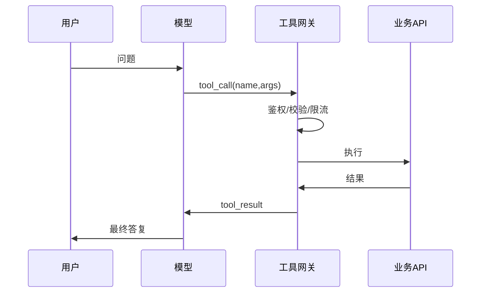

# 08 · 工具与函数调用（Tool / Function Calling）

## 一句话直觉

**让模型输出「要调用的函数名和参数」，由你的运行时真正执行**——模型负责选择，系统负责安全落地。

---

## 直觉讲解

函数调用（function calling / tool use）是模型与外部世界的标准接口：你向模型登记一组工具的 JSON Schema（名称、描述、参数类型与约束），模型在需要时返回结构化调用请求，而不是假装「已经查过库」。

关键分层：

| 层 | 职责 | 绝不能甩给模型 |
|----|------|----------------|
| 模型 | 选工具、填参、解读结果 | 直接持有生产密钥胡来 |
| 工具网关 | 鉴权、鉴权、限流、schema 校验 | — |
| 业务 API | 真实读写 | — |

好的工具描述本身就是提示词工程：说清「何时用、何时不用、参数单位、失败时返回什么」。坏的描述导致模型乱调或漏调。

失败模式（高频）：参数类型错、必填缺失、幻觉出不存在的工具、忽略工具错误继续编造、JSON 截断。对策：严格 schema、可修复重试、把错误信息**结构化返回模型**、超过 N 次升级人工。

---

## 工作示例

**示例工具定义（概念）**：

- `get_order(order_id: string)` — 只读；`order_id` 匹配 `^ORD-\d{8}$`  
- `create_draft_ticket(title, body)` — L1 写；返回 draft_id  
- `refund(order_id, amount)` — L2；网关忽略模型直接执行，只接受「已审批令牌」  

**一次成功轨迹**：用户问订单物流 → 模型调 `get_order` → 网关校验身份仅能看自己的单 → 返回 JSON → 模型用自然语言总结并给出运单号。

**一次失败轨迹**：模型把 `amount` 填成字符串 `"五十"` → 网关 400 → 返回 `error_code=INVALID_TYPE` → 模型改参重试或追问用户。

**并行调用**：互相独立的只读工具可并行，缩短回合；有依赖的必须串行（先查余额再支付）。

---

## 面试常问取舍

**Q：工具是越多越好吗？**  
A：不是。工具太多会选错；应按场景分包，或由路由先选工具集。

**Q：要不要让模型写 SQL/脚本？**  
A：默认不要开放任意代码执行。Text-to-SQL 需只读账号、表白名单、行级权限与审计（见第 30 篇）。

**Q：流式输出下如何函数调用？**  
A：工具调用缓冲至完整再执行；对用户可先发「正在查询订单…」状态，避免半截 JSON 暴露。

| 取舍 | 松 | 紧 |
|------|----|----|
| 参数校验 | 靠模型 | 网关 JSON Schema |
| 写操作 | 自动 | HITL + 幂等键 |
| 错误 | 吞掉 | 结构化回灌模型 |

---

## FDE 现场怎么用

现场把「工具清单」当成产品表面积来评审：每个工具写清级别、幂等、超时、审计字段。禁止演示用超级工具进入主干代码。

与安全团队对齐：令牌委托模型（用户身份下行）、密钥只在网关、出站白名单。评测集要包含「不该调工具」「参数缺失」「下游 500」三类。

---

## 与本库其他篇的链接

- 同目录：`07-AI-Agent与工具使用`、`14-MCP模型上下文协议`、`18-权限感知RAG`、`30-Text-to-SQL`  
- [Agent 与工具调用](../../03-AI落地/Agent与工具调用.md)  
- 面试：`17.工具调用失败.md`、`18.JSON破坏模式问题.md`

---

## Schema 设计清单

- 名称稳定、动词清晰：`get_order` 优于 `do_it`  
- 参数枚举化，少自由字符串  
- 描述中写反例：「不要用此工具查询其他用户的订单」  
- 返回体含 `error_code` 与可恢复建议  
- 大结果分页：`page_token`，防一次塞爆窗口  

## 幂等与重试

写工具必须支持幂等键（客户端生成）。网关重试只对明确幂等或只读开放。模型侧「失败就再调一次」若无约束，会造成双工单、双退款。

---

## 练习与自检

读完本篇后，尝试用自己的项目回答：

1. 若不做这一能力，失败模式是什么？  
2. 最小可行实现需要哪些组件？  
3. 上线门禁指标是哪三个？  
4. 与权限、费用、延迟如何互相牵扯？  

把答案写进决策备忘录，比只收藏文章更接近 FDE 日常。

---

## 参考与来源

- 原创综述：函数调用的分层职责与企业失败模式（本篇）  
- OpenAI / Anthropic / 各厂商 tool use 官方文档  
- MCP 专篇见 `14-MCP模型上下文协议`
