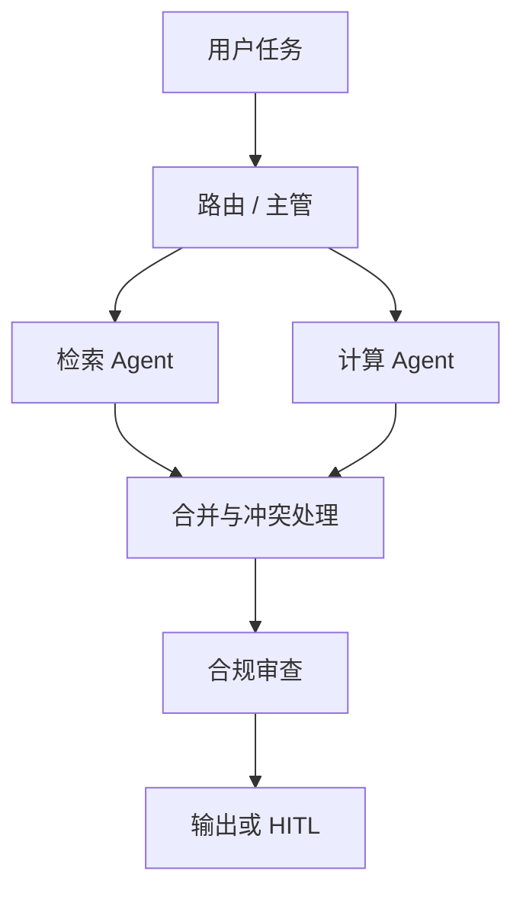

# 09 · 多 Agent 编排（Multi-Agent Orchestration）

## 一句话直觉

**把复杂任务拆给多个专职角色，由编排器汇总**——但多一个 Agent 就多一份失败模式与费用。

---

## 直觉讲解

当单一提示词既要检索、又要计算、还要写邮件、再做合规检查时，上下文会又脏又长。多 Agent 把职责拆成「研究员 / 写手 / 审查员 / 路由」等角色，通过编排协议传递中间结果。

常见拓扑：

| 拓扑 | 结构 | 适合 | 风险 |
|------|------|------|------|
| 流水线 | A→B→C | 步骤稳定 | 前面错后面放大 |
| 主管-专家 | Router + Workers | 多技能门户 | 路由错分 |
| 辩论 / 评审 | 生成+批判 | 高风险文本 | 延迟与费用高 |
| 并行汇总 | 多路只读再合并 | 调研 | 合并冲突 |



编排可以用工作流引擎（更可控）或让「主管 Agent」动态分派（更灵活更飘）。企业默认：**静态图 + 显式节点**，动态分派仅用于低危子任务。

失败模式：角色互相推诿、重复劳动、共享上下文爆炸、评审 Agent 形式主义通过、死循环调用。必须有**全局步数/费用熔断**与轨迹存储。

---

## 工作示例

**场景**：投标助手。

1. 路由识别「需要合规审查」  
2. 检索 Agent 拉历史标书条款（权限过滤）  
3. 起草 Agent 生成初稿（不直接外发）  
4. 审查 Agent 按清单打分，输出风险点  
5. 人批后才能进入「导出」节点  

**对比单 Agent**：单上下文塞「全部知识+全部规则」会导致遗漏检查项；多 Agent 让检查清单成为硬节点，但总 token ≈ 各段之和，费用常 ×2–×4。

**合并策略**：规定中间件格式（JSON 主张列表 + 引用），禁止「散文传话」导致信息丢失。

---

## 面试常问取舍

**Q：多 Agent 是否总比单 Agent 强？**  
A：不一定。任务可单上下文完成时，多 Agent 只是买复杂度。用评测证明拆分收益。

**Q：如何避免审查员当好人？**  
A：审查用固定清单+强制输出风险数组；抽检人工；关键项规则引擎而非 LLM。

**Q：与微服务类比？**  
A：有点像，但「服务」是非确定性的。更要契约测试与轨迹回放。

| 取舍 | 单 Agent | 多 Agent |
|------|----------|----------|
| 延迟 | 低 | 高 |
| 可维护 | 提示臃肿 | 图复杂 |
| 专项质量 | 一般 | 可提升 |
| 费用 | 低 | 高 |

---

## FDE 现场怎么用

客户一开口「我们要 multi-agent」时，先要一张**任务拓扑草图**和成功指标。能画成固定流水线的，不要做成自由社团。

范围里写清：哪些角色、中间 JSON schema、最大跳数、费用上限、HITL 点。参考本库 ADK/编排文做技术选型，但概念上先钉边界。

---

## 与本库其他篇的链接

- 同目录：`07-AI-Agent与工具使用`、`15-Agent-vs-工作流-vs-单次调用`、`17-Agent轨迹评测`、`23-Agent框架与失败模式`、`26-A2A智能体互操作`  
- [Google-ADK 与多 Agent 编排](../../03-AI落地/Google-ADK与多Agent编排.md)  
- [Agent 与工具调用](../../03-AI落地/Agent与工具调用.md)

---

## 通信契约

多 Agent 之间禁止只传散文。最小契约：

```text
goal, constraints, evidence[], claims[], open_questions[],
risk_level, needs_hitl: boolean
```

审查员输出必须是可机器检查的结构（风险列表），否则无法做轨迹断言。

## 成本治理

为整图设 `max_llm_calls` 与 `max_cost_usd`。并行专家数目有上限。演示可以炫，生产要熔断。

---

## 练习与自检

读完本篇后，尝试用自己的项目回答：

1. 若不做这一能力，失败模式是什么？  
2. 最小可行实现需要哪些组件？  
3. 上线门禁指标是哪三个？  
4. 与权限、费用、延迟如何互相牵扯？  

把答案写进决策备忘录，比只收藏文章更接近 FDE 日常。

---

## 参考与来源

- 原创综述：多 Agent 拓扑选型与企业默认（本篇）  
- 各编排框架文档（LangGraph、ADK 等）作实现参考  
- 本库生产篇与评测篇
