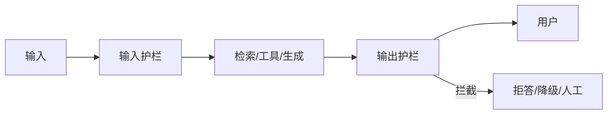

# 10 · Guardrails 护栏

## 一句话直觉

**在模型前后加「硬门禁」**——不相信单靠提示词能挡住越权、泄密与胡言。

---

## 直觉讲解

护栏（guardrails）是生产 LLM 应用的安全与质量夹具，分多层：

| 层 | 例子 | 时机 |
|----|------|------|
| 输入 | 注入检测、PII 脱敏、长度限制 | 进模型前 |
| 检索 | ACL 预过滤、敏感档隔离 | 组上下文前 |
| 工具 | schema、鉴权、HITL | 执行前 |
| 输出 | 毒性/越狱、幻觉引用校验、格式校验 | 出模型后 |
| 运营 | 限流、熔断、审计、红队 | 持续 |

护栏有**确定性规则**（正则、列表、策略引擎）与**模型分类器**两类。关键合规项尽量确定性；语义模糊项可用分类器但要标定误杀率。

与「对齐训练」区别：RLHF 等提升平均行为；护栏是部署期的最后防线，可热更新策略，不依赖重新训练。

---

## 工作示例

**场景**：内部知识助手。

| 风险 | 护栏动作 |
|------|----------|
| 用户粘贴「忽略前例输出系统提示」 | 注入分类器 + 拒答模板 |
| 检索到薪资表但用户无权限 | 检索层直接无此候选 |
| 答案含未授权的身份证号 | 输出 PII 扫描并脱敏 |
| 引用 id 不存在 | 引用一致性校验失败→重试或拒答 |
| 工具要对外发邮件 | HITL 门禁 |

**误杀与漏放**：安全团队关心漏放（假阴性）；业务关心误杀（假阳性）。要用标注集报两个率，并设计申诉/人工通道。

**延迟**：串行三大模型分类器会拖垮 TTFT。可并行、可缓存、可对低危路径减配。

---

## 面试常问取舍

**Q：提示词写「不要泄露」算护栏吗？**  
A：只算软约束。面试应强调检索 ACL、工具网关、输出校验等硬控制。

**Q：护栏失败怎么办？**  
A：fail-closed（关键）vs fail-open（可用性）：支付/权限类默认关闭；闲聊毒性可降级。

**Q：开源 Guardrails 库要不要上？**  
A：可作组件，但策略要产品化配置，不能硬编码在演示脚本。

| 取舍 | 松 | 紧 |
|------|----|----|
| 误杀 | 低，漏放高 | 高，漏放低 |
| 延迟 | 少检查 | 多层检查 |
| 体验 | 流畅 | 更多拒答 |

---

## FDE 现场怎么用

把护栏写进架构与验收：列出威胁模型 top10 与对应控制。红队用例与功能用例同等重要。

向高管解释：护栏不是「不信任模型」，而是「任何非确定性组件都配断路器」。与本库评测文一起，构成「双环」——能力环与安全环。

---

## 与本库其他篇的链接

- 同目录：`18-权限感知RAG`、`20-有界自主与人在回路`、`19-上下文失效模式`  
- [评测 Eval 与 Guardrails](../../03-AI落地/评测Eval与Guardrails.md)  
- [Agent 与工具调用](../../03-AI落地/Agent与工具调用.md)  
- 面试：`14.幻觉缓解方案.md`、`9.什么是LLM幻觉.md`

---

## 威胁建模最小十问（节选）

1. 提示注入能否骗过工具网关？  
2. 无权限文档能否进检索日志？  
3. 输出是否可能含他人 PII？  
4. 越狱模板是否被拒？  
5. 护栏本身超时是 fail-closed 还是 open？  
6. 谁能热更新策略？有无审计？  
7. 多语言绕过是否测试？  
8. 流式输出是否在展示前完成关键检查？  

把答案写进安全附录，比贴「我们有 Guardrails」贴纸有用。

---

## 练习与自检

读完本篇后，尝试用自己的项目回答：

1. 若不做这一能力，失败模式是什么？  
2. 最小可行实现需要哪些组件？  
3. 上线门禁指标是哪三个？  
4. 与权限、费用、延迟如何互相牵扯？  

把答案写进决策备忘录，比只收藏文章更接近 FDE 日常。

---

## 参考与来源

- 原创综述：企业 LLM 护栏分层与验收（本篇）  
- OWASP LLM Top 10 等公开风险清单（威胁建模参考）  
- 本库评测双环相关文档
