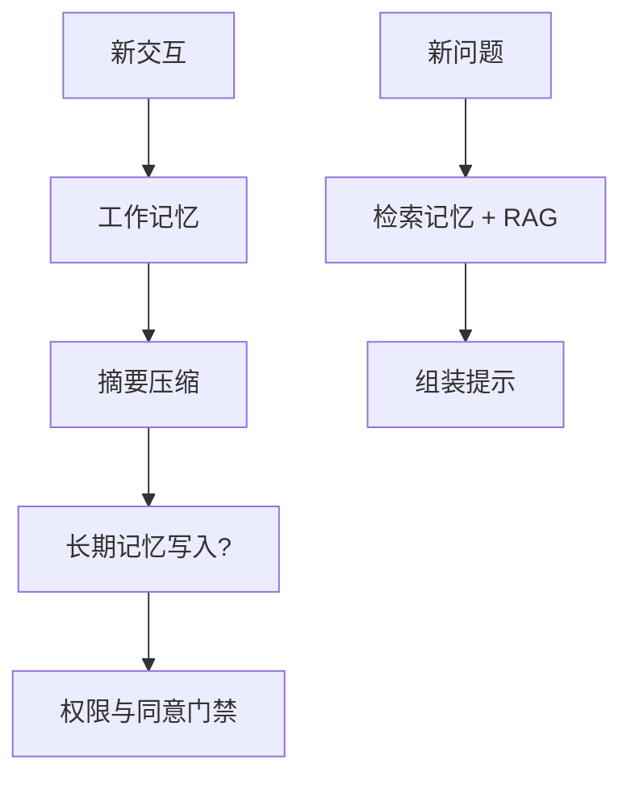

# 11 · Agent 记忆（Memory）

## 一句话直觉

**记住该记的，忘掉该忘的**——记忆是分层缓存，不是把全部历史永远塞进窗口。

---

## 直觉讲解

Agent 记忆解决「跨回合、跨会话、跨用户任务」的状态保持。不要把它等同于「聊天记录全量重放」。工程上通常分层：

| 层 | 内容 | 寿命 | 实现 |
|----|------|------|------|
| 工作记忆 | 当前任务轨迹、中间变量 | 任务级 | 状态机 / scratchpad |
| 会话记忆 | 本会话摘要与偏好 | 会话级 | 摘要滚动 |
| 长期记忆 | 用户偏好、项目事实 | 长期 | 向量/KV + 权限 |
| 实体记忆 | 账户、资产、工单真源 | 以业务库为准 | **工具读真源** |

危险做法：把对话原文无限追加进上下文——又贵又会触发「上下文失效」（见第 19 篇）；把未授权的他人偏好写入长期记忆；用记忆代替业务系统真源（订单状态应以订单库为准）。

写入策略要保守：默认摘要；高价值结构化事实才入库；支持删除/导出（隐私合规）。

---

## 工作示例

**场景**：企业差旅助手。

- 工作记忆：当前草稿行程、待确认航班号  
- 会话摘要：「用户偏好上午出发、经济舱」  
- 长期记忆：常驻城市、成本中心代码（用户同意后）  
- 真源：HR 政策与差旅系统 API，不靠记忆猜报销上限  

**摘要滚动算法（示意）**：窗口将满时，把最旧回合压成 200 字摘要，保留近 4 回合原文 + 任务 JSON 状态。评测「摘要后是否仍能续办」。

**记忆检索**：长期记忆也要 ACL——销售 A 的客户偏好不能被销售 B 的 Agent 取到。

---

## 面试常问取舍

**Q：记忆和 RAG 区别？**  
A：RAG 多是共享知识库；记忆偏用户/任务私有状态。技术都可能用向量，但产品语义与权限不同。

**Q：要不要向量化全部聊天？**  
A：慎做。噪音大、隐私重。优先结构化状态 + 选择性摘要。

**Q：如何评测记忆？**  
A：跨会话复问、干扰项插入、权限对穿、摘要后关键槽位是否保留。

| 取舍 | 少记 | 多记 |
|------|------|------|
| 隐私风险 | 低 | 高 |
| 个性化 | 弱 | 强 |
| 成本 | 低 | 检索与存储涨 |
| 错误粘性 | 低 | 错记忆会反复污染 |

---

## FDE 现场怎么用

与法务/安全确认记忆的同意、保留周期、删除权。产品上提供「忘记我」与「查看已记内容」。

技术范围写清：哪些字段进长期记忆、谁可写、谁可读、如何失效。演示慎用「全历史向量化」噱头。

---

## 与本库其他篇的链接

- 同目录：`13-FDE-Agent上下文窗口管理`、`19-上下文失效模式`、`18-权限感知RAG`  
- [Agent 与工具调用](../../03-AI落地/Agent与工具调用.md)  
- 面试：`1.什么是上下文窗口.md`、`12.超出上下文窗口.md`

---

## 记忆写入策略

**默认不写**。满足以下再写长期记忆：

- 用户显式说「记住」或设置页确认  
- 事实可验证且低敏感  
- 有过期时间（如 180 天）  
- 可导出可删除  

## 记忆与真源冲突

若记忆说「地址是 A」，CRM 说是 B，以 CRM 为准并纠正记忆。提示中写明优先级，避免「忠诚于错误记忆」。

---

## 练习与自检

读完本篇后，尝试用自己的项目回答：

1. 若不做这一能力，失败模式是什么？  
2. 最小可行实现需要哪些组件？  
3. 上线门禁指标是哪三个？  
4. 与权限、费用、延迟如何互相牵扯？  

把答案写进决策备忘录，比只收藏文章更接近 FDE 日常。

---

## 参考与来源

- 原创综述：Agent 记忆分层与企业合规要点（本篇）  
- 会话摘要与记忆检索的公开工程实践  
- 本库上下文窗口相关面试题
