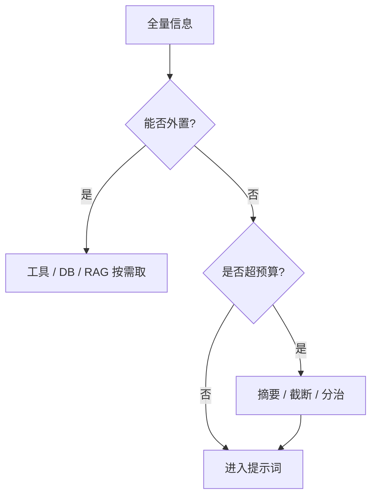

# 13 · FDE / Agent 上下文窗口管理

## 一句话直觉

**窗口是稀缺的注意力预算**——该进的进，该摘要的摘要，该外置的外置到工具与检索。

---

## 直觉讲解

上下文窗口（context window）是模型一次能吞下的 token 上限。Agent 场景更容易炸窗：系统提示 + 工具 schema + 检索片段 + 历史轨迹 + 用户话 + 输出预留。管理窗口是 FDE 的日常手艺，不是边角料。

预算分配建议（示意）：

| 槽位 | 比例感 | 策略 |
|------|--------|------|
| 系统与安全策略 | 固定、尽量短 | 缓存友好前缀 |
| 工具描述 | 按需加载 | 路由后只挂相关工具 |
| 检索证据 | 可控 top-k | 重排后截断 |
| 轨迹 / 历史 | 滚动摘要 | 保留状态 JSON |
| 用户当前输入 | 完整 | 过长先拆任务 |
| 输出预留 | 明确 max_tokens | 防撑爆 |

原则：**真源外置**——订单状态不要靠历史记忆；**证据可引用**——检索块带 id；**前缀稳定**——利好提示缓存；**失败可降级**——超窗时先丢最不相关证据而非静默截断系统策略。

---

## 工作示例

**案例**：排查 Agent 轨迹 12 步，每步工具返回 2k token 原文，窗口 128k 也被塞满，且早期关键报错被挤出。

治理：

1. 工具返回改摘要 + 指针（`result_ref`），需要时再 `get_result_slice`  
2. 每 4 步做一次状态检查点 JSON（假设、已确认、下一步）  
3. 检索证据最多 6 块，单块 >800 token 先压缩  
4. 监控 `context_tokens` 与「截断事件」  

**数字感**：同一任务，粗糙轨迹 90k 输入 token；治理后 22k，费用与 TTFT 明显下降，成功率反而上升（更少噪声）。

---

## 面试常问取舍

**Q：窗口越长是否越不需要 RAG？**  
A：长窗能塞更多，但不保证「用得好」，且贵。RAG 仍是相关性过滤器。见长上下文 vs RAG 的面试题。

**Q：截断策略？**  
A：绝不可截断安全策略与权限结论；优先截断重复工具原文与旧聊天。

**Q：摘要会丢事实怎么办？**  
A：结构化槽位（订单号、金额、截止日）强制保留；摘要只压叙述。

| 取舍 | 多塞 | 严管 |
|------|------|------|
| 实现 | 简单 | 要工程 |
| 费用 | 高 | 低 |
| 正确性 | 噪声干扰 | 通常更好 |

---

## FDE 现场怎么用

在 POC 仪表盘加「平均输入 token / 截断率 / 缓存命中率」。客户问为什么慢或贵时，先甩窗口剖析，再谈换模型。

与面试题「超出上下文窗口」话术对齐：分治、摘要、检索、外置工具四板斧。

---

## 与本库其他篇的链接

- 同目录：`11-Agent记忆`、`19-上下文失效模式`、`01-RAG检索增强生成`  
- 面试：`1.什么是上下文窗口.md`、`12.超出上下文窗口.md`、`20.降低延迟和成本方法.md`  
- [Agent 与工具调用](../../03-AI落地/Agent与工具调用.md)

---

## 提示缓存友好布局

把不变的长前缀（政策、工具总述、安全规则）放前面，可变的用户问题与检索块放后面，有利于服务商前缀缓存，降 TTFT 与费用。动态内容插入前缀中部会「打穿」缓存。

## 分治模式

超大任务拆成：子问题列表 → 分别检索作答 → 汇总。比单次塞 100 页更稳。Agent 步数会增加，但每步上下文更干净。

---

## 练习与自检

读完本篇后，尝试用自己的项目回答：

1. 若不做这一能力，失败模式是什么？  
2. 最小可行实现需要哪些组件？  
3. 上线门禁指标是哪三个？  
4. 与权限、费用、延迟如何互相牵扯？  

把答案写进决策备忘录，比只收藏文章更接近 FDE 日常。

---

## 对照速记

本篇核心可以压成三句话，便于面试或客户沟通临场调用：

1. **问题本质**：本主题要解决的失败是什么。  
2. **默认做法**：企业场景下通常先怎么做。  
3. **升级信号**：什么指标/坏案例出现才加重方案。  

结合上文表格与示例，把这三句话改写成你客户行业的语言；若写不出来，说明概念尚未内化，应回到「工作示例」一节重做一遍角色扮演。

## 落地检查清单

- 是否写清责任人与数据/工具边界  
- 是否有可回归的评测或断言  
- 是否有延迟、费用、权限的明确取舍  
- 是否有失败降级与审计  
- 是否与本库相邻篇目的术语一致  

完成清单后再进入下一概念，避免「篇篇都读过、现场一张嘴却接不上」。

---

## 参考与来源

- 原创综述：Agent 场景的上下文预算与外置原则（本篇）  
- 提示缓存与 KV 相关公开文档（见基础课 KV-Cache 篇若已建立）  
- 本库延迟与成本面试题
