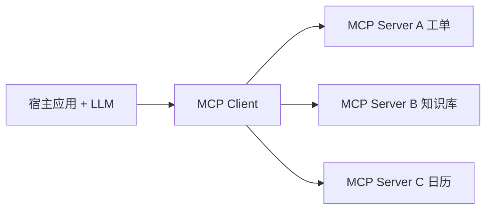

# 14 · MCP 模型上下文协议（Model Context Protocol）

## 一句话直觉

**给 LLM 应用一套「USB-C 式」的工具与资源插口**——让宿主、工具服务器用标准协议对话，而不是每个模型一套私有插件格式。

---

## 直觉讲解

MCP（Model Context Protocol）是一种开放协议，旨在标准化 AI 应用（宿主）与外部上下文源（工具、资源、提示模板）之间的连接方式。直觉上：模型侧不必为每一个 SaaS 写死私有 function 格式；工具侧可以做成 MCP Server，一次实现，多宿主复用。

核心概念（把握职责即可）：

| 概念 | 含义 | 例子 |
|------|------|------|
| Host | 编排 LLM 的应用 | IDE、桌面助手、企业网关 |
| Client | 宿主内连 Server 的连接器 | 会话内 MCP 客户端 |
| Server | 暴露能力的进程/服务 | 数据库只读、工单、网盘 |
| Tools | 可调用动作 | `create_issue` |
| Resources | 可读资源 | `doc://policies/hr` |
| Prompts | 可复用提示模板 | 评审清单 |

MCP **不自动解决权限与合规**：它规范的是连接与描述，企业仍要做鉴权、审计、HITL、数据出境评估。把它当成「更好的插头」，不是「安全免检通行证」。

---

## 工作示例

**场景**：FDE 给客户做内部助手，需要 Jira + Confluence + 自研权限库。

- 自研权限检索做成 MCP Server（资源+检索工具）  
- Jira 用官方/社区 MCP Server，但经企业网关换票  
- 宿主统一记审计日志：server、tool、args 摘要、user_id、latency  

**对比「纯私有 function calling」**：私有 schema 也能干活；MCP 的价值在**生态复用与宿主可切换**。若客户锁定单一大模型网关且工具少，强推 MCP 可能过度设计。

**失败模式**：Server 工具描述含糊导致乱调；把高危写操作直接暴露；本地 stdio Server 在生产扩缩容困难——企业更偏 SSE/HTTP 远程 Server + 网关。

---

## 面试常问取舍

**Q：MCP 和函数调用什么关系？**  
A：函数调用是模型-运行时的能力；MCP 是运行时-工具生态的协议。二者常配合：宿主把 MCP 工具翻译成模型可见的 tools 列表。

**Q：和 LangChain Tool 有何不同？**  
A：框架工具是库内抽象；MCP 强调跨宿主标准。可以并存。

**Q：要不要所有企业工具 MCP 化？**  
A：看复用与多宿主需求。核心高危链路可先网关 API，再逐步 MCP 封装。

| 取舍 | 私有工具 | MCP |
|------|----------|-----|
| 上线速度 | 快 | 视现成 Server |
| 复用 | 低 | 高 |
| 治理 | 自建 | 仍需自建网关 |

---

## FDE 现场怎么用

评估客户是否已有 MCP 生态（IDE 插件、内部 Server）。架构上坚持「MCP Server 背后仍是最小权限 API」。演示可用本地 Server，生产必须谈认证、网络分区、密钥与审计。

把「是否采用 MCP」写成架构决策记录（ADR）：上下文是多宿主复用还是单一应用。

---

## 与本库其他篇的链接

- 同目录：`08-工具与函数调用`、`26-A2A智能体互操作`、`28-AG-UI协议`  
- [Agent 与工具调用](../../03-AI落地/Agent与工具调用.md)

---

## 企业落地形态

| 形态 | 说明 |
|------|------|
| 本地 stdio Server | 开发机友好，生产难治理 |
| 远程 Server + 网关 | 推荐：认证、审计、限流集中 |
| 内部市场 | 多团队发布 Server，需评审与分级 |

## 描述质量即安全

MCP 工具描述若写成「可以做任何事」，模型会当真。描述与注解应含权限与副作用声明；网关再强制检查一遍。

---

## 练习与自检

读完本篇后，尝试用自己的项目回答：

1. 若不做这一能力，失败模式是什么？  
2. 最小可行实现需要哪些组件？  
3. 上线门禁指标是哪三个？  
4. 与权限、费用、延迟如何互相牵扯？  

把答案写进决策备忘录，比只收藏文章更接近 FDE 日常。

---

## 对照速记

本篇核心可以压成三句话，便于面试或客户沟通临场调用：

1. **问题本质**：本主题要解决的失败是什么。  
2. **默认做法**：企业场景下通常先怎么做。  
3. **升级信号**：什么指标/坏案例出现才加重方案。  

结合上文表格与示例，把这三句话改写成你客户行业的语言；若写不出来，说明概念尚未内化，应回到「工作示例」一节重做一遍角色扮演。

## 落地检查清单

- 是否写清责任人与数据/工具边界  
- 是否有可回归的评测或断言  
- 是否有延迟、费用、权限的明确取舍  
- 是否有失败降级与审计  
- 是否与本库相邻篇目的术语一致  

完成清单后再进入下一概念，避免「篇篇都读过、现场一张嘴却接不上」。

---

## 参考与来源

- 原创综述：MCP 在企业集成中的定位与边界（本篇）  
- Model Context Protocol 官方规范与文档（概念以官方为准）  
- 各宿主（IDE/助手）的 MCP 集成说明
