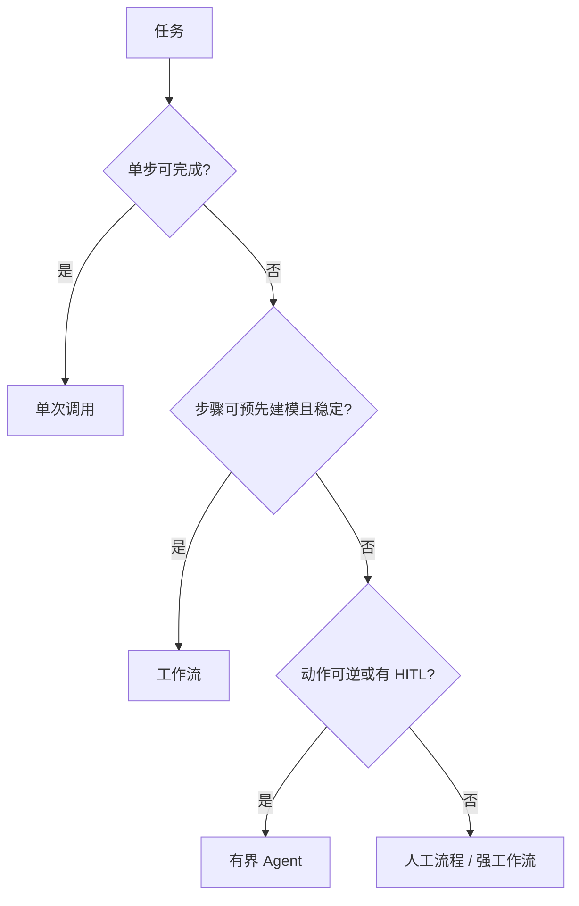

# 15 · Agent vs 工作流 vs 单次调用

## 一句话直觉

**按「步骤确定性」和「副作用风险」选形态**——能一次搞定的别绕圈，能画成流程图的别放养。

---

## 直觉讲解

这是 FDE 架构口述题的分水岭。三种形态：

1. **单次调用（One-shot）**：一次模型推理（可带一次或不带工具），输出即结束  
2. **工作流（Workflow）**：预定义节点与转移条件，模型在节点内做事，流向由代码/规则主导  
3. **Agent（自主循环）**：模型根据观察反复决策下一步，直到停或被熔断  

| 维度 | 单次 | 工作流 | Agent |
|------|------|--------|-------|
| 延迟可预期 | 高 | 高 | 低 |
| 长尾覆盖 | 低 | 中 | 高 |
| 审计 | 易 | 易 | 需轨迹 |
| 费用尾部 | 瘦 | 中 | 肥 |
| 典型 | 分类、摘要、单次检索问答 | 开户、理赔初审、提单 | 调研、多源排查 |

混合很常见：**工作流里嵌单次节点，个别节点内短 Agent 循环**。

---

## 工作示例

**案例对照**：

| 需求原话 | 更好形态 | 理由 |
|----------|----------|------|
| 「把这封投诉邮件分类」 | 单次 | 无外部依赖 |
| 「回答制度问题并引用」 | 工作流：鉴权→检索→生成→校验 | 步骤稳定 |
| 「根据监控与工单查根因并开票」 | 工作流为主，排查子步短循环 | 写操作要卡点 |
| 「在十个站点找可引用的竞品论点」 | 有界 Agent | 分支多、只读 |

**成本对比（示意）**：单次 $0.01；工作流 3 节点 $0.03；放养 Agent 平均 $0.15、P95 $0.80。合同里要写费用上限与熔断。

---

## 面试常问取舍

**Q：客户就要 Agent 品牌故事怎么办？**  
A：对外可称智能助手，对内架构仍按上表。用 POC 指标说话。

**Q：工作流会不会太死？**  
A：死是特性。可用「人工改道」「规则开关」「小范围动态子图」增弹性。

**Q：如何在面试 2 分钟讲清？**  
A：先画确定性 vs 风险二维，再给一个企业例子落点。

| 取舍 | 偏 Agent | 偏工作流 |
|------|----------|----------|
| 创新演示 | 炫 | 朴素 |
| 生产事故面 | 大 | 小 |
| 可测试性 | 难 | 易 |

---

## FDE 现场怎么用

立项评审强制填写「形态选择」一栏与否决项。发现访谈时收集：步骤是否稳定、写操作级别、可接受的人工点。把结论写进决策备忘录模板。

---

## 与本库其他篇的链接

- 同目录：`07-AI-Agent与工具使用`、`09-多Agent编排`、`16-ReAct循环`、`20-有界自主与人在回路`、`23-Agent框架与失败模式`  
- [Agent 与工具调用](../../03-AI落地/Agent与工具调用.md)  
- [架构决策树](../../03-AI落地/架构决策树.md)  
- 面试：`19.反对使用智能体理由.md`

---

## 决策话术模板

> 这个任务步骤是否稳定？写操作风险到哪一级？失败是否可逆？若三者都「稳定/高风险/不可逆」，选工作流+HITL；若步骤随观察剧烈变化且只读，才评估短 Agent 循环。

把这套话术练熟，比背框架名更像 FDE。

## 反模式

- 用 Agent 包一层其实是固定 ETL  
- 用单次调用硬撑多步事务  
- 为了演示自主而去掉审批

---

## 练习与自检

读完本篇后，尝试用自己的项目回答：

1. 若不做这一能力，失败模式是什么？  
2. 最小可行实现需要哪些组件？  
3. 上线门禁指标是哪三个？  
4. 与权限、费用、延迟如何互相牵扯？  

把答案写进决策备忘录，比只收藏文章更接近 FDE 日常。

---

## 参考与来源

- 原创综述：三种形态的决策树与企业默认（本篇）  
- 本库架构决策树与 Agent 落地文  
- 行业事故案例（公开报导）作反面教材时引用
