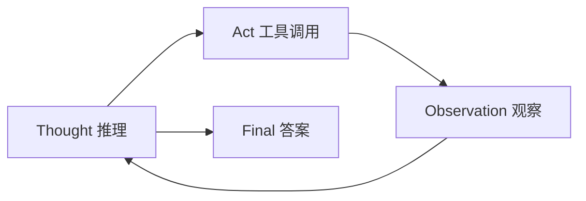

# 16 · ReAct 循环（Reason + Act）

## 一句话直觉

**先想一步、再动手、再看结果，然后继续想**——用显式「推理轨迹 + 行动」把工具使用变成可观察循环。

---

## 直觉讲解

ReAct（Reasoning + Acting）把 Agent 的一步拆成可记录的结构：模型产出思考（Thought），选择行动（Act / tool call），获得观察（Observation），再进入下一轮，直到给出最终答案（Final）。它不是唯一实现，但是面试与设计讨论里的共同语言。

和「隐藏链式思维后直接调工具」相比，ReAct 强调**可观察的中间理由**，便于调试与审计；但也带来更长轨迹、更多 token、以及「表演式思考」（理由漂亮但行动错）。

生产实现要注意：

| 点 | 建议 |
|----|------|
| 思考外露 | 对用户可隐藏，对日志可保留（注意敏感信息） |
| 停止条件 | 最大步数、最大费用、目标达成检测 |
| 工具错误 | Observation 里给结构化错误，而非空白 |
| 与工作流 | 可在工作流某节点内跑短 ReAct，而不是全局放养 |

ReAct 解决的是「怎么循环」，不自动解决权限、HITL、评测——那些要另加。

---

## 工作示例

**任务**：「查库存 SKU-118，若低于 20 就创建补货草稿」。

| 轮 | Thought（摘要） | Act | Observation |
|----|-----------------|-----|-------------|
| 1 | 需先读库存 | `get_stock("SKU-118")` | `{qty: 12}` |
| 2 | 低于 20，应建草稿 | `create_restock_draft(...)` | `{draft_id: D91}` |
| 3 | 完成 | Final | 告知用户草稿号 |

**失败轮**：模型 Thought 正确但 Act 参数写错 SKU → Observation 404 → 下一轮纠正或澄清。若无步数熔断，可能死循环查同一个错码。

**评测**：不仅看最终对错，还看是否多余调用、是否跳过 HITL、是否在观察不足时幻觉库存数字。

---

## 面试常问取舍

**Q：ReAct 一定要输出 Thought 文本吗？**  
A：概念上要有推理-行动交替；实现上可用内部 scratchpad，不一定展示给终端用户。

**Q：和 Plan-and-Execute 区别？**  
A：后者先做较长计划再执行；ReAct 更即时交织。复杂任务可「先粗计划，再 ReAct 执行」。

**Q：为什么有人反对 Agent？**  
A：循环放大费用与不确定性。见「反对使用智能体」面试题——ReAct 是机制，不是必须上生产的理由。

| 取舍 | 短循环 | 长循环 |
|------|--------|--------|
| 能力 | 有限 | 更强探索 |
| 风险 | 低 | 高 |
| 费用 | 可控 | 尾部爆炸 |

---

## FDE 现场怎么用

演示时打开「轨迹面板」给客户看 Thought/Act/Obs，建立信任；上线默认折叠思考，仅审计可见。

把最大步数写进配置（如 6）与合同费用条款。超过则转人工并保留轨迹。

---

## 与本库其他篇的链接

- 同目录：`07-AI-Agent与工具使用`、`15-Agent-vs-工作流-vs-单次调用`、`17-Agent轨迹评测`、`20-有界自主与人在回路`  
- [Agent 与工具调用](../../03-AI落地/Agent与工具调用.md)  
- 面试：`19.反对使用智能体理由.md`、`17.工具调用失败.md`

---

## 轨迹存储字段建议

`trace_id, step, thought_redacted, tool, args_digest, observation_digest, latency_ms, cost, decision`

思考原文可能含敏感数据，默认脱敏存储。调试时按需提升明细级别。

## 与 Plan-Execute 组合

长任务：先产出 5 步计划（可给人改）→ 每步短 ReAct → 步间检查点。计划被人改过的版本要入审计。

---

## 练习与自检

读完本篇后，尝试用自己的项目回答：

1. 若不做这一能力，失败模式是什么？  
2. 最小可行实现需要哪些组件？  
3. 上线门禁指标是哪三个？  
4. 与权限、费用、延迟如何互相牵扯？  

把答案写进决策备忘录，比只收藏文章更接近 FDE 日常。

---

## 对照速记

本篇核心可以压成三句话，便于面试或客户沟通临场调用：

1. **问题本质**：本主题要解决的失败是什么。  
2. **默认做法**：企业场景下通常先怎么做。  
3. **升级信号**：什么指标/坏案例出现才加重方案。  

结合上文表格与示例，把这三句话改写成你客户行业的语言；若写不出来，说明概念尚未内化，应回到「工作示例」一节重做一遍角色扮演。

## 落地检查清单

- 是否写清责任人与数据/工具边界  
- 是否有可回归的评测或断言  
- 是否有延迟、费用、权限的明确取舍  
- 是否有失败降级与审计  
- 是否与本库相邻篇目的术语一致  

完成清单后再进入下一概念，避免「篇篇都读过、现场一张嘴却接不上」。

---

## 参考与来源

- 原创综述：ReAct 作为企业 Agent 循环的教学模型与生产约束（本篇）  
- Yao et al., ReAct: Synergizing Reasoning and Acting in Language Models  
- 各框架对 ReAct 风格 Agent 的实现文档
